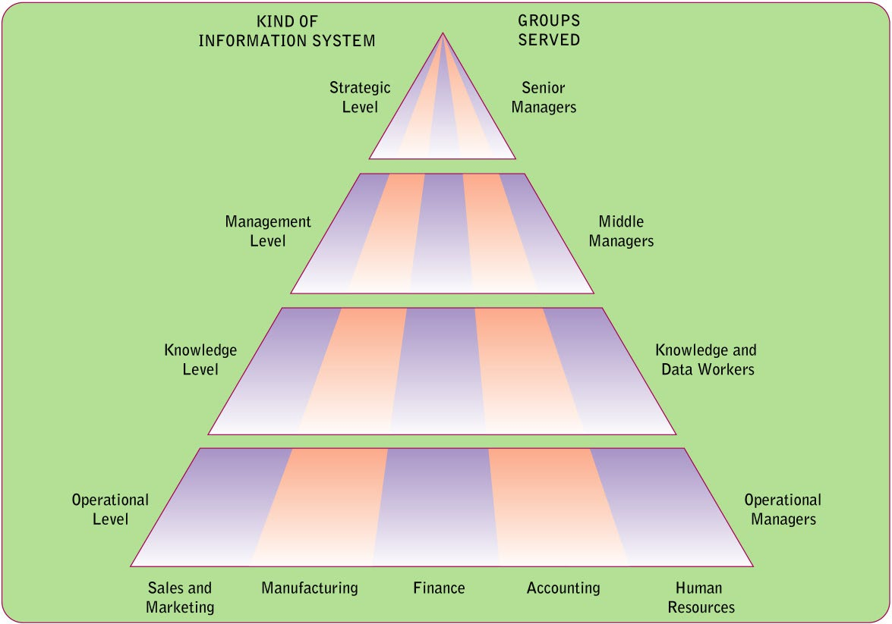
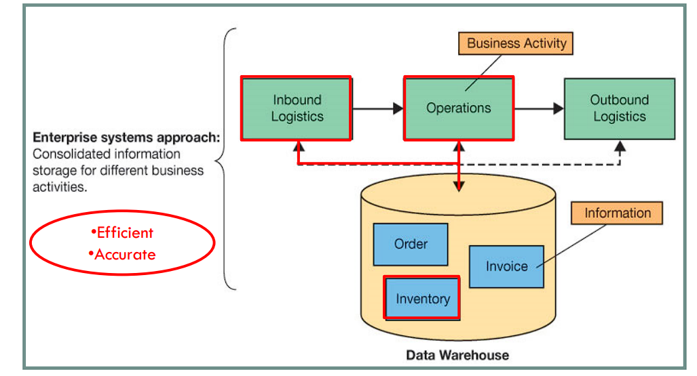
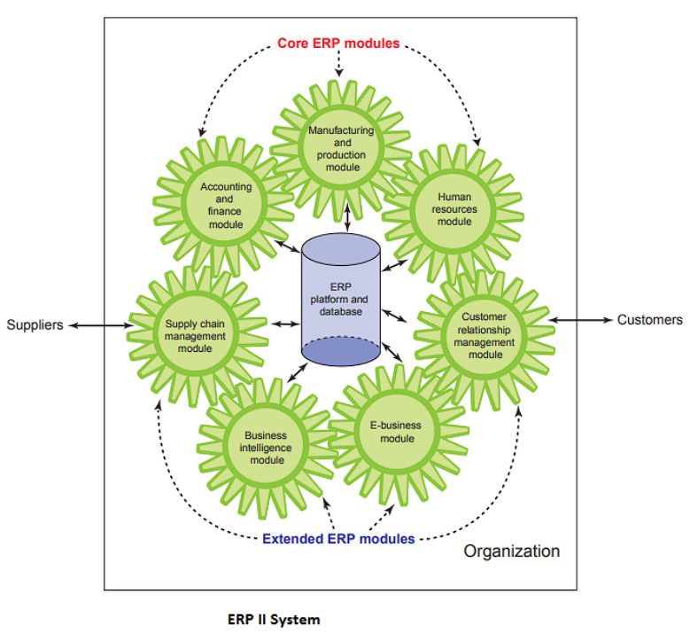
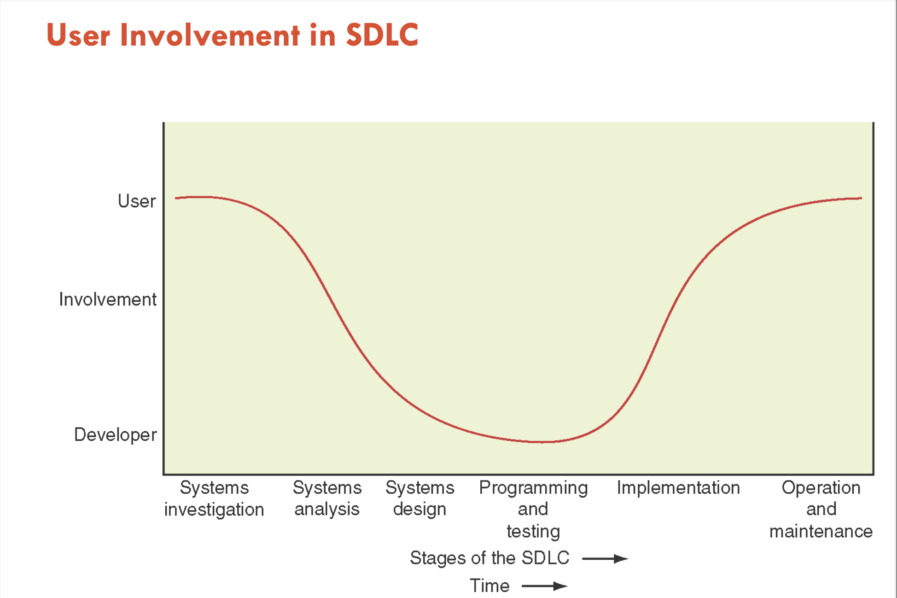
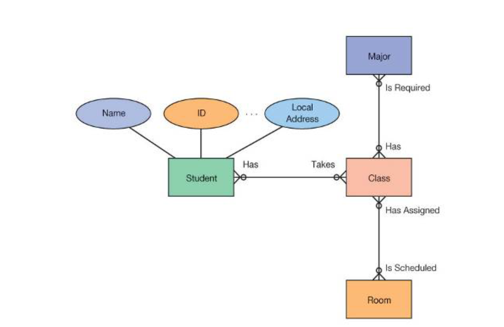
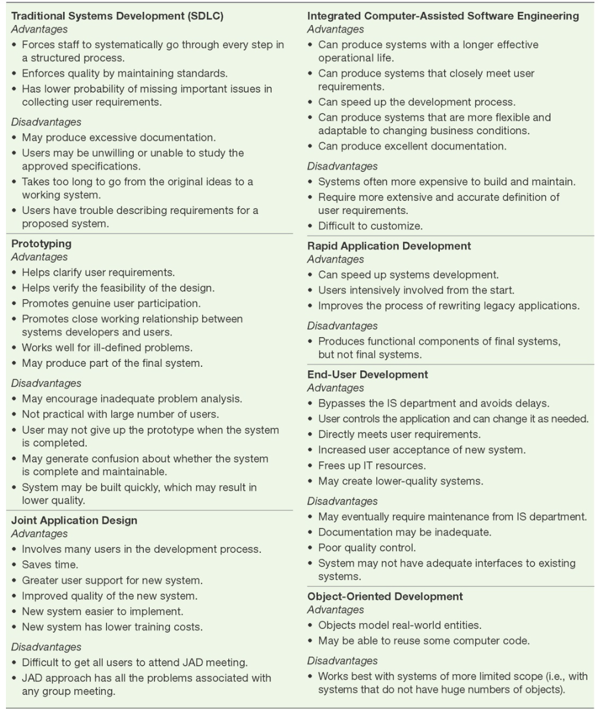
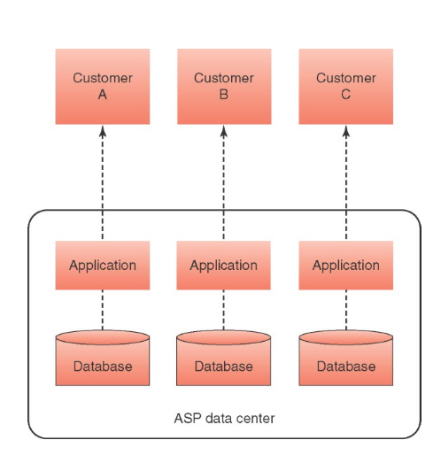
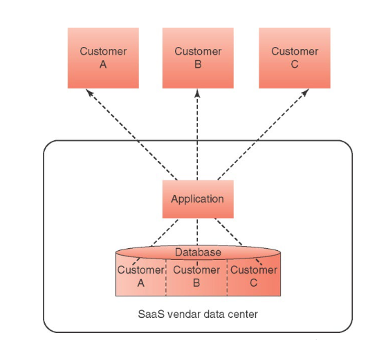
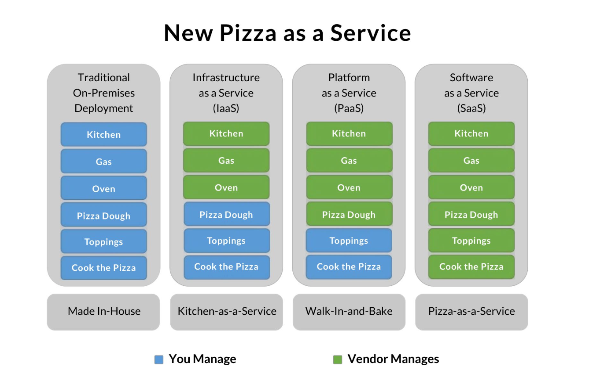
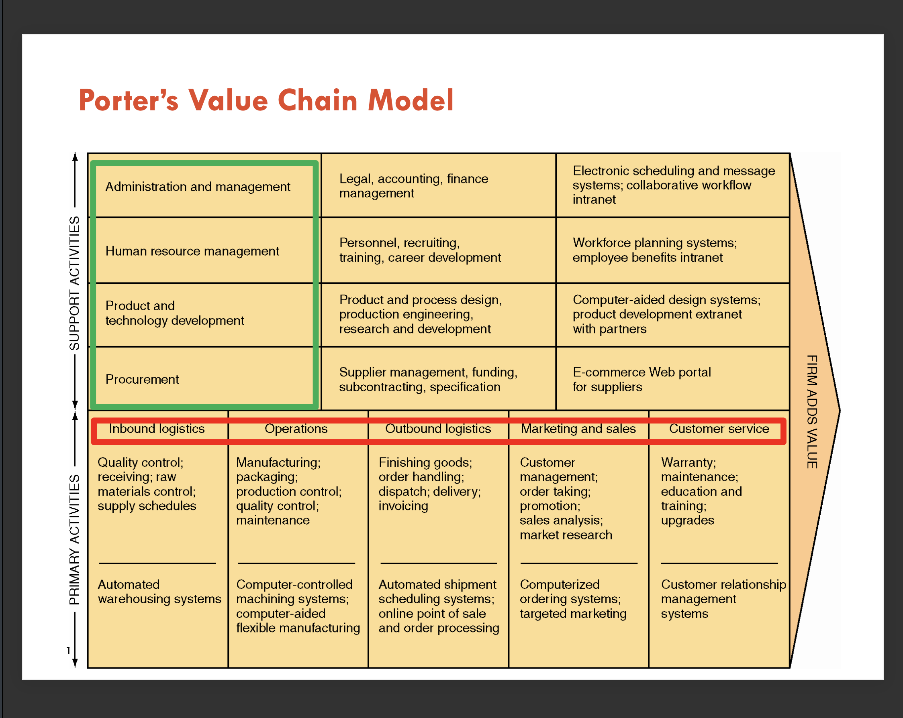

# Week1 Introduction to Information Systems

## 1 System

* A ‘system’ is set of inter-related components (parts) or subsystems.
* For **teleological** systems, a ‘system’ is made up of inter-related components that work together to achieve the overall objectives of the whole system

## 2 System Approach (System thinking)

* Definition

> The systems approach or systems thinking is a method of analysing or thinking about complex systems from the perspective of the total system, the goals of the overall system, the individual components or subsystems, and the inter- relationships and inter-dependencies between the components.

## 3 Systems Theory

* It is the transdisciplinary study of the abstract organization of complex phenomena, independent of their substance, type, or temporal scale of existence.

* It investigates both the principles common to all complex entities, and the models (usually mathematical) that can be used to represent them.

## 4 Structure of a system

* Overall objective represented as concrete measure(s) of performance
* Inputs and Resources
* Process(es)
* Feedback Mechanisms
* Outputs
* System Boundary
* System Environment


## 5 Data, Information, Knowledge, and Wisdom

* Data
  * Raw material
  * Representation of facts
  * Maybe numeric, text, etc.
  * Is usually processed further
  * Context free
* Information
  * Processed data
  * In a specific context. Contextual indications, such as a label, are needed to turn data into information
  * Meaningful and useful to the user
* Knowledge
  * Ability to understand information, form opinions, and make decisions or predictions
  * Knowledge is a body of governing procedures, such as guidelines or rules, that are used to organize or manipulate data to make it suitable for a given task.


## 6 Information Systems

> Information Systems **collects**, **processes**, **stores**, **analyzes**, and **disseminates** information for **a specific purpose**

* IS as a discipline
  * Combines the technical and behavioral approach
  * Social-technical system
* IS as a product
  * Seen from users’ point of view, e.g. Billing System, web auction system
  * Consists of different elements, e.g., IT, procedures, content

## 7 Components of Information Systems

* Hardware
  * A device such as a processor, monitor, keyboard, or printer
* Software
  * A program or collection of programs that enable the hardware to process data
* Database
  * A collection of related files or tables containing data
* Network
  * A connecting system that permits different computers to share resources
* Procedures
  * The set of instructions for combining the above components in order to process information and generate the desired output
* People
  * Individuals who use the hardware and software, interface with it, or utilize the output

## 8 Socio-technical systems

* Most ISs have a technical component and a social (human/organisational/societal) component which interact with each other in multiple ways.
* Optimising the technical component without improving the social component is known to produce poor outcomes and results.


## 9 Categories of Information Systems

* Management Support Systems
* Operations Support Systems

## 10 IS and Organisational levels

| Kind of IS  | Groups served|
| ----------- | ----------- |
| Strategic Level      | Senior Managers            |
| Management Level     | Middle Managers            |
| Knowledge Level      | Knowledge and Data Workers |
| Operational Level    | Operational Managers       |




## 11 Class Exercise

* Q1: An IS is a collection of (select all that apply from the list below) that are organised for a specific purpose or outcome in an organisational context.
  * Applications
  * Infrastructure
  * Processes
  * Policies
  * People
  * Database
  * Ideas

* Q2: Consider that you were hired as a strategist to suggest an IS strategy for the entirety of University of Sydney to help and enable the move to online classes throughout the university, what are the different Information Systems that you would recommend (and why)?
  * IS Security
  * Business Intelligence
  * E-Commerce
  * Knowledge management system
  * Collaboration system
  * Supply chain management system
  * Customer relationship management system
  * Content management system
# Week 10 Enterprise Systems #

## 1. IS within an organisation ##


H, I, J are IT infrastructure.

Transcation Processing Systems:

- Supports the monitoring, collection, storage, and processing of data.

Functional Area IS(FAIS):

- Explain the purpose of transaction processing systems (TPS)
- Describe the types of support information systems can provide for each functional area of the organization.

Enterprise Resourse Planning(ERP) Systems:

- Core components
- Describe the business processes supported by ERP systems
- ERP implementation strategies
- Identify the benefits and drawbacks to businesses of implementing an ERP system.

Enterprise Approach:

- Business process management
- Business process improvement (BPI) and business process reengineering (BPR)

## 2. Transaction Processing Systems ##

**Q:** What is **Transaction Processing Systems**?

- TPS is an Information system that supports the monitoring, collection, storage, and processing of data from the organization’s basic business transactions, each of which generates data.
- The TPSs are inputs for the functional area information systems and business intelligence systems, as well as business operations such as customer relationship management, knowledge management, and e-commerce.

Key Function of TPS:

- Handle large volumes of data
- Avoid errors
- Handle large variations in volume (peak times)
- Avoid downtime
- Never lose results
- Maintain privacy and security

Two Basic Ways of Data Processing:

- Batch Processing
  Processes data in batches at fixed periodic intervals.
- Online Transaction Processing(OLTP)
  Processes data after transactions occur, frequently in real time.

## 3. Functional Area Information Systems ##

- Systems that provide information to managers (usually mid-level) in the functional areas in order to support managerial tasks of planning, organizing and controlling operations.
- Supports one particular area or department to increase internal effectiveness and efficiency.
  - HR systems
  - Accounting systems
  - Marketing systems
  - Production systems
- Developed independently of one another resulting in “information silos”
  - Do not communicate well with one another
  - Inefficiency in business processes that involve more than one functional area

## 4. Activities Suported by FAIS ##

- Accounting and Finance
- Marketing and Sales
- Production and Operations Management
- Human Resources Management

FAIS in Porter’s Value Chain Model


## 5. Enterprise Resource Planning Systems ##

ERP system is an Information System that takes a business process view of the overall organization to tightly integrate planning, management, and use of all of an organization’s resources, employing a common software platform and database.

Design to correct a lack of communication among FAIS:

- emphasis has since shifted from "resources" and "planning" to "enterprise".
- Allow accurate, up-to-date information to be shared throughout an organization.

**Objectives**:
Tightly integrate the functional areas of the organization and enable information to flow seamlessly across them:

- Change in one functional area are immediately reflected in all other pertinent functional areas.
- Provide the information necessary to control the business processes of the organisation.

Major ERP vendors:

- SAP
- Oracle
- Microsoft

**ERP II Systems**:

- ERP System
  - Originally developed to facilitate business processes associated with manufacturing.
  - Did not extend to other functional areas.

- ERP II System
  - Evolved to include administrative, sales, marketing and human resources processes.
  - Employ an enterprise-wide approach to ERP that uses the web and connects all facts of the value chain.

## 6. Evolution of Enterprise Systems ##


## 7. Legacy Systems Approach ##

Also called **Stand-Alone Systems Approach**.

- Systems that focus on the specific needs of individual departments.
- Not designed to communicate with other systems in the organisation.

Given that old stand-alone systems were not necessarily designed to communicate with other applications beyond departmental boundaries, they are typically either fast approaching or beyond the end of their useful life within the organization and are referred to as legacy systems.

Each department has its own system(s)

- Inefficient processes
- Potential for inaccuracies

## 8. Enterprise System Approach ##

Integrated suite of business applications for virtually every department, process, and industry, allowing companies to integrate information across operations on a company-wide basis using one large database.



## 9. ERP Core Components ##

- **Financial Management**
  - Support accounting, financial reporting, performance management, corporate governance.
- **Operations Management**
  - Simplify, standardize, and automate business processes for inbound/outbound logistics, product development, manufacturing, sales and service.
- **Human Resource Management**
  - Support employee recruitment, assignment tracking, performance reviews, payroll, regulatory requirements.

## 10. Core and Extended ERP Components ##

- Core Components: support internal activities
- Extended components: support external activities



## 11. Three Main Business Processes Supported by ERP ##

- **Production Process**
  - A cross-functional process in which a company produces physical goods.
  - Originates and ends in the warehouse department (need product and eception of finished goods), but involves the production department as well.

- **Procurement Process**
  - A cross-functional business process that originates when a company needs to acquire goods or services from external sources, and it concludes when the company receives and pays for them.
  - Originates in the warehouse department (need to buy) and ends in the accounting (send payment).

- **Order Fulfillment Process**
  - A cross-functional business process that originates when the company receives a customer order, and it concludes when it receives a payment from the customer.
  - Originates in the sales department (customer request to buy) and ends in the accounting department (receive payment).

## 12. Reports Generated by FAIS and ERP Systems ##

- **Routine reports**
  - Produced at scheduled intervals
  - Range from hourly quality control reports to daily reports on absenteeism rates

- **Ad-hoc (on-demand) reports**
  - Drill-down reports
    - Display a greater level of detail
  - Key indicator reports
    - Summarize the performance of critical activities
  - Comparative reports
    - Compare the performances of different business units or different times

- **Exception reports**
  - Include only information that falls outside certain threshold

## 13. Implementing ERP Systems ##

- **On-Premise ERP Implementation**
  - Vanilla approach
    - Implements a standard ERP package, using the package’s built-in configuration options
    - Quicker implementation
    - Limited adaptation to the organization’s specific processes
  - Custom Approach
    - Implements a more customized ERP system by developing ERP functions designed specifically for that firm
    - Conforms to the organization’s particular characteristics and processes
    - Expensive and risky
  - Best of Breed Approach
    - Mix and match core ERP modules (e.g. financial management, HRM) as well as other specialized software (e.g. manufacturing, warehousing, distribution) from different software providers to best fit the organization’s unique internal processes and value chains.
- **Packaged Software(Vanilla Approach)**
  - Written by third-party vendors
  - Used by many different organizations
  - Useful for standardized, repetitive tasks
  - Cost effective
- **Custom Software(Custom Approach)**
  - Developed exclusively for a specific organization
  - Designed for particular business needs
  - Higher development costs
- **SaaS (Software as a Service) ERP Implementation**
  - Utilizes software-as-a-service (SaaS) to acquire cloud-based ERP systems
  - Rents the software from ERP vendor who offers its products over the Internet sing the SaaS model
  - The ERP cloud vendor is responsible for software updates, security, and availability
  - **Advantages**
    - Anywhere access
    - Avoid the initial hardware and software investment
    - Solutions are scalable
  - **Disadvantages**
    - Security
    - Reliability and availability
    - Loss of control over strategic IT resources

## 14. Enterprise Application Integration System ##

**Enterprise Application Integration System**:s

- A system that integrates existing systems by providing layers of software (middleware) that connect applications together
- **Functions**
  - Data integration
    - Ensures that information in multiple applications is kept consistent
  - Communication between systems
    - Extracts and implements business policies or rules from applications
  - Access to system interfaces
    - Provides a single consistent interface to different applications
- Allows existing applications to communicate and share data
  - Enabling organizations to utilize existing applications
  - Eliminating many of the problems caused by isolated information systems (e.g. FAIS)
- Eliminating many of the problems caused by isolated information systems (e.g. FAIS)

## 15. Business Process Reengineering ##

<!-- create a graph which the Enterprise Application Integration can includes Internet Portals, e-Commerce, CRM, Business Intelligence, Third-Party Software, Financials system, wear house, Legacy Systems -->


## 16. Benefits of ERP Systems ##

Benefits:

- **Organizational flexibility and agility**
  - ERP systems integrate organizational resources, and make organizations more flexible, agile, and adaptive
  - Respond quickly to changing business conditions and capitalize on new business opportunities
- **Decision support**
  - ERP systems provide essential information on business performance across functional areas
  - Improves managers’ ability to make better and more timely decisions
- **Quality and efficiency**
  - ERP systems integrate organizational resources, resulting in significant improvements in production, distribution, customer service, and other business processes

Limitations of ERP Systems
**Limitations**:

- Business processes in ERP software are often predefined by the best practices that the ERP vendor has developed
  - High problem for companies with well-established procedures
- ERP systems can be extremely complex, expensive, and time-consuming to implement
  - Costs and risk of failure in implementing a new ERP system are substantial

**Cost of Implementing ERP**:


## 17. Case/Scenario Analysis - IoT and ERP Integration ##

<https://itbrief.com.au/story/australian-uptake-of-enterprise-iot-is-on-the-rise>

<https://itbrief.com.au/story/australian-businesses-leading-the-way-for-iot>

IFS Study: 84% of Industrial Companies Face Gap Between IoT and ERP
([prnewswire.com](https://www.prnewswire.com/news-releases/ifs-study-84-of-industrial-companies-face-gap-between-iot-and-erp-300526759.html))

Based on the information from the articles provided, here are the answers to your questions:

**Q1: What are the benefits of integrating IoT with ERP?**
Integrating IoT with ERP systems offers several benefits to businesses:

1. **Increased Efficiency and Productivity**: IoT devices generate a large amount of data, which, when integrated with ERP systems, can provide actionable insights that enhance efficiency and productivity. Vendors should demonstrate how IoT and their data analytics solution can improve a customer's efficiency and productivity, ideally with use cases.

2. **Improved Decision Making**: IoT data, when consumed in ERP software, can aid in strategic decision-making and operations. This data can be used for corporate business intelligence or to monitor performance against service level agreements.

3. **Enhanced Product or Service Lines**: IoT data can also be used to add new or enhanced product or service lines, increase enterprise agility, and realize the growth and revenue benefits of digital transformation.

4. **Condition-Based Maintenance**: One of the most common use cases for IoT in industrial settings is condition-based maintenance. This helps increase uptime, providing additional capacity for increased revenue, and avoids unplanned downtime that can interrupt production schedules causing missed shipment dates and customer satisfaction issues. When integrated with demand and scheduling systems in ERP, IoT becomes a revenue-enhancement tool improving the top line.

**Q2: What must companies do to realize benefits of integrating IoT and ERP?**
Companies need to address several factors to realize the benefits of integrating IoT with ERP:

1. **Address Security and Infrastructure Issues**: Companies must resolve wider issues around security and infrastructure to deploy commercial-scale IoT systems. This includes dealing with data integration issues and capturing enough data for the analytics to be meaningful.

2. **Focus on Specific Business Problems**: Companies should not deploy IoT technology for the sake of it. They should instead focus on how IoT solutions can improve productivity and efficiency to solve specific business problems.

3. **Ensure Robust Planning and Maintenance Systems**: Companies must have robust planning and maintenance systems capable of making real-time decisions using IoT-sourced data.

4. **Use of IoT-Enabled Enterprise Applications**: There is a need for more IoT-enabled enterprise applications designed to put data from networks of connected devices into the context of the business.

**Q3: What are the gaps between IoT and ERP integration?**
The main gap identified between IoT and ERP integration is the disconnect between data from connected devices and strategic decision-making and operations. The study found that only 16 percent of industrial companies in North America consume IoT data in ERP software, meaning 84 percent face a disconnect. This limits the digital transformation potential of IoT.

Another gap is that many existing planning and maintenance systems may not be robust enough to make real-time decisions using IoT-sourced data. Companies often find that their incumbent software is not able to administer and use IoT data to achieve the gains they want to realize.

Finally, the data suggests a need for more IoT-enabled enterprise applications designed to put data from networks of connected devices into the context of the business.

## 18. Best Practices-Based Software ##

Most enterprise system vendors build best practices into their applications:

- To provide guidelines for management to identify business processes in need of change.
- Implementations and future updates will be smoother if companies change their business processes to fit the enterprise system

Q: Is following the best practices always the best strategy?
A: If companies have competitive advantage from unique business processes, forcing best practices may actually hurt.

## 19. Business Process Management ##

**Business Process Management (BPM)**: A systematic, structured improvement approach by all or part of an organization whereby.

- People critically examine, rethink, and redesign business processes in order to achieve dramatic improvements in one or more performance measures such as quality, cycle time or cost.

BPM Steps:

1. Develop a vision for the organization that specifies business objectives.
2. Identify critical processes that are to be redesigned
3. Understand and measure existing processes as a baseline
4. Identify ways IS can be used for improvement
5. Design and implement a prototype of the new processes

- Business Process Reengineering(BPR)
  - The fundamental rethinking and radical redesign of business processes to achieve dramatic improvements in critical, contemporary measures of performance, such as cost, quality, service, and speed.
- Business Process Improvement (BPI)
  - Less radical, less disruptive, more incremental than BPR.

**Example:** Business Process Reengineering (BPR)

- **The original process:**
  - A sales representative called in with a request for financing. An operator in the central office wrote down the request.
  - The request was then dispatched to credit department to check the customer’s credit status.
  - The business practices department modified the standard loan covenant in response to the request.
  - The pricing department determined the appropriate interest rate.
  - The administration department turned all the information into a quote letter which was then delivered to the sales representative by FedEx.
- **Problems with the original process**
  - The entire process took 6 days on average (up to 2 weeks). Customers could be influenced by other computer vendor or simply called the deal off.
  - When the sales representative called, no one could tell where the request was and when it could be done.
- **Solution 1:**
  - Install a control desk to answer the status of the request.
  - The request was returned to the control desk after each step, logged the competition, and forwarded to the next step.
    - Sophisticated queuing theory and linear programming used to balance workloads and staff.
    - Performance standards were introduced for each department.
- **Problems: Automating and improving the process**
  - Process time got worse, even though each department achieved almost 100% compliance on its performance.
  - The actual work only took 1.5 hours (90 minutes).
  - The remaining time was wasted on handling the forms off from one department to the next.
- **Solution 2: Reengineer the process**
  - Replaced the specialists (credit checkers, pricers, etc.) with generalists (deal structurers) to process the entire request from beginning to end.
  - Decision support systems were developed to guide deal structurers and provide rapid access to all key information.
- **Results**
  - Process time reduced by 90% (from 6 days to 4 hours).
  - No increase in head count (even a small head count reduction).

**BPR Challenges**:
**What are the underlying costs for the implementation of the radical change?**

- People need intensive training for their new skills and their styles (the ways in which they think and behave, their attitudes, what they believe is important about their work).

**What are the implications of the radical change to the organization, especially the human issues?**

- Organizations are communities of people and cannot be treated as machines.
- People may resist the change and fear losing their jobs.
- Inspirations and cultures may therefore be destroyed during reengineering.
- Reengineering requires people to take more responsibilities and to learn and change constantly. These may contradict the majority people who seek for stability for their lives.

**Even company provides intensive training, can people change their styles?**

- People may feel uncomfortable to change the new styles.
- They used to think the purpose of their work is to perform the same task over and over again.
- The first concern now is creating value for the customer and taking responsibility for the performance of an entire process.

**The Enabling Role of IT in BPR**:

- IT (ERP) plays a crucial role in BPR and is an essential enabler
  - IT is often misused to only computerize old tasks.
- IT allows organizations to break conventional rules/assumptions of processes which may not be valid anymore.
- IT should be used to implement the business processes, not to drive the processes.# Week 11 #

## 1. IS Planning Process ##

**Orgainsational Strategic Plan**:


- Identifies the firm's overall mission, goals, and objectives that follow from that mission, and the broad steps required to reach these goals.

**IT Architecture**:

- Outlines the way an organisation should utilize its information resources to accomplish its mission.

- Technical aspects encompassed
  - Hardware and Operating Systems, networks, databases, applications, and programming languages, data management systems, and application software.

- Managerial aspects encompassed
  - How IT department will be managed
  - How the functional area managers will be involved in the IT decision making process
  - How IT decisions will be made and prioritized among competing demands for resources.

## 2. IS Planning ##

**IT Stragetic Plan**:

- A set of long-range goals that describe the IT infrastructure and identify the major IT initiatives needed to achieve the organization’s goals.
- A good IT strategic plan must meet three **objectives**:
  - Aligns with the business strategic plan
  - Provides for an IT architecture that seamlessly networks users, applications, and databases
  - Allocates IS development resources efficiently among competing projects. So the projects can be completed on time and within budget and still have the required functionality.

- **IT Steering Committee**
  - Comprised of group of managers and staff representing various organisational units
    - To establish IT priorities
    - To ensure that the IS function is meeting the needs of the enterprise.

**IS Operational Plan**:

Consists of a clear set of projects that the IS department and the functional area managers will execute in support of the IT strategic plan.

- Mission: the mission of the IS function
- IS Environment: the summary of information needs of the functional areas and of the organisation as a whole
- Objectives of IS Function: The best current estimate of the goals of the IS function.
- Constraints: Technological, financial, personnel, and other resource limitations on the IS function.
- Applications Portfolio: A prioritized inventory of present applications and a detailed plan of projects to be developed or continued during the current year.
- Resource Allocation and Project Management: A listing of how, when and who is going to do that.
  
## 3. Decision Structure and Systems ##

- **Nature of Decisions**:
  - Operational: Executing specific tasks efficiently and effectively.
  - Managerial: Acquiring and allocating resources efficiently and effectively in accomplishing organisational goals.
  - Strategic: Long-term goals and policies for growth and resource allocation.

## 4. Making the Business Case for an IS ##

Making the business case for an IS:

- Faith.
- Fear.
- Facts.
  
## 5. Justifying IT Investments ##

- An IS must be implemented in order to gain or sustain a competitive advantage over rivals, or simply to stay in business.
- Based on Faith:
  - Arguments based on beliefs about organizational strategy competitive advantage, industry forces, customer perceptions, market share, and so on.
- Based on Fear:
  - Arguments based on the notion that if the system is not implemented, the firm will lose out to the competition, or, worse, go out of business.
- Based on Facts:
  - Arguments based on data, quantitative analysis, and/or indisputable factors.

## 6. Cost-Benefit Analysis ##

Assessing the Costs:

- Challenging in allocating fixed costs among different IT projects:
  - Costs that remain the same regardless of any change in the company’s activity level.
  - Include infrastructure costs and costs associated with IT services and IT management (e.g., salary of IT director).
- Challenge in anticipating costs for maintaining, debugging, and improving systems after installed.

Assessing the Benefits:

- Difficulty in quantifying intangible benefits (e.g., improved customer or partner relations, improved decision making, etc.).

Methods:

- Net Present Value (NPV)
  - Convert future values of benefits to their present-value equivalent by “discounting” them at the organization’s costs of funds.
  - Compare the present value of the future benefits to the cost required to achieve those benefits to determine whether the benefits exceed the costs.

- Return on Investment (ROI)
  - Measures management’s effectiveness in generating profits with its available assets.
  - Divide the net income generated by the average assets invested.
  - The high the percentage the better.
- Break-Even Analysis
  - Determine the point at which the cumulative dollar value of the benefits equals the investment made.

## 7. IS Development and Acquisition Decisions ##

- How much computer code does the company want to write?
  - Use a totally prewritten application (write no code)
  - Customize a prewritten application (write some code)
  - Customize an entire application (write all new code)
- How will the company pay for the application?
  - Prewritten applications: buy or lease
  - Totally custom applications: internal funding
- Where will the application run?
  - Run the application on its own platform
  - Run the application on someone else’s platform (e.g., SaaS vendor)
- Where will the application originate?
  - Prewritten applications: open source or proprietary
  - Custom applications: in-house or outsource

## 8. IS Development and Acquisition Strategy ##

In-house development:

- System Development Life Cycle(SDLC)
  - A structured framework for developing new systems or changing existing systems.
  - A set of activities used to build an information system.
  - A set of techniques and tools to aid in the development process.
  - A guide to help the project manager and team plan, schedule, and control the project.

External Acquisition:

- Off-the-shelf (proprietary) software
- Open source software
- Application Service Provider (ASP) and Software as a Service (SaaS)
- Outsourcing

## 9. In-House Development ##

Traditional Method:

- System Development Life Cycle(SDLC)

Alternative Methods and Tools:

- Prototyping
- End-user development
- Joint Application Development (JAD)
- Integrated Computer-Assisted Software Engineering (CASE) Tools
- Rapid Application Development (RAD)
- Object-Oriented Development

## 10. SDLC ##

- The traditional systems development method that organizations use for large-scale IT projects.
- A structured framework that consists of sequential processes by which information systems are developed.
  - System Investigation
  - System Analysis
  - System Design
  - System implementation
  - System Maintenance

## 11. User Involvement in SDLC ##

- User involvement is critical to the success of an information system.


## 12. System Investigation ##

- Address the business problem or opportunity that the new system will address by means of the feasibility study.
- Tasks:
  - Technical Feasibility
    - Whether the company can develop and/or acquire the hardware, software, and communications components needed to solve the business problem.
    - Whether the organisation can use its existing technology to achieve the project's performances objectives.
  - Economic Feasibility
    - Whether the project is an acceptable financial risk.
    - Whether the organisation has the necessary time and money to successfully complete the project.
  - Behavior Feasibility
    - Human issues of the systems development project.
- Deliverables:
  - Feasibility Report
- "Go/No-Go" Decision by the steering committee or top management.
  - Do nothing and continue to use the existing system unchanged
  - Modify or enhance the existing sysem
  - Develop a new system

## 13. System Analysis ##

Examines the business problem that the organization plans to solve with an information system.

Tasks:

- Gathers information about the existing system in order to determine the requirements for the proposed system
  - Interviews, questionnaires, observation, document analysis, etc.
  - Document analysis
  - Joint Application Design (JAD)
  - Modeling Data(current system)
    - Entity Relationship Diagram (ERD)
  - Modeling processes and logic(current system)
    - Data Flow Diagram (DFD)

- Deliverables:
  - System Requirements Document(functional requirements)
  - System Proposal
  
## 14. Joint Application Design (JAD) ##


## 15.Data Model ##



## 16. Process Model ##


## 17. Examples of System Requirement ##

- User Interface Requirements
  - Automatic entry of product data and easy-to-use data entry screens for Web customers.
- Processing Requirements
  - Fast, automatic calculation sales totals and shipping costs
- Storage Requirements
  - Fast retrieval and update of data from product, pricing, and customer databases.
- Control Requirements
  - Signals for data entry errors and quick e-mails confirming orders.

## 18. System Design ##

- Describe how the systems will resolve the business problem
- Tasks:
  - System outputs, inputs, user interfaces.
  - Hardware, software, databases, telecommunications, etc.
  - Data and process models(new system)
- Deliverables:
  - Technical system specifications.

## 19. Example of System Specification ##

| System Specification | Examples |
| :---: | :---: |
| User interface specification | Use personalized screens that welcome repeat Web customers and that make product recommendations. |
| Database Specifications | Develop databases that use object/relational database management software to organize access to all customer and inventory data and to multimedia product information. |
| Software specifications | Acquire an e-commerce software engine to process all e-commerce transactions with fast responses, i.e., retrieve necessary product data and compute all sales amounts in less than one second. |
| Hardware and network specifications | Install redundant networked Web servers and sufficient high-bandwidth telecommunications lines to host the company e-commerce website. |
| Personnel specifications | Hire an e-commerce manager and specialists and a webmaster and Web designer to plan, develop, and manage e-commerce operations. |

## 20. Testing Type ##

| Testing Type | Focus | Performed By |
| :---: | :---: | :---: |
| Developmental | Testing the correctness of individual modules and the integration of multiple modules | Programmer |
| Alpha | Testing of oerall system to see whether it meets design requirements | Software Tester |
| Beta | Testing of the capabilities of the system in the user environment with actual data | Actual system users |

## 21. Systems Implementation ##

- Transforms the system design into a working information system.
- Tasks:
  - Programming and testing
    - Translates the design specifications into computer code.
    - Checks to see if the computer code will produce the expected and desired results and detects errors.
  - System Conversion
    - Converts from the old system to the new system.
  - Documentation
    - User and reference guides
    - User training manuals and tutorials
    - Installation procedures and troubleshooting suggestions
  - Training and support
    - Different types of training and support require different levels of investment by the organisation.
- Deliverables:
  - Operational system

## 22. Conversion Strategies ##

(a) Parallel: old and new systems are used at same time.
(b) Direct: Old systems is discontinued and new system is used.
(c) Phased: New system is implemented in phases.
(d) Pilot (Single Location): Entire system is used in one location.

## 23. Training Options ##

Least expensive : self-paced training and tutorials.
Most expensive : classroom training and one-on-one training.

|Training Option|Description|
|:---:|:---:|
|Tutorial|One person taught at one time by a trainer or by paper-based exercises|
|Course|Several people taught at one time by a trainer|
|Computer-aided instruction| One people taught at one time by a computer|
| Interactive training manual| Combination of tutorial and computer-aided instruction|
|Resident expert| Expert on call to assist users as needed|
|Software help components| Built-in system components designed to train users and trouble-shoot problems|
|External training| Training provided by outside vendors or consultants|

## 24. System Maintenance ##

Maintaining the system and adding new functions when needed.
Maintenance process parallels the process used for the initial development of the information system.

- Obtain maintenance request
  - Debugging, updating existing functions,
adding new functions
- Transform requests into changes
- Design changes
- Implement changes

The largest part of the system development effort occurs.
Deliverables:

- Updated system

## 25. Maintaince Types ##

| Maintenance Type | Description |
| :---: | :---: |
| Corrective | Making changes to an information system to repair flaws in the design, coding or implementation. |
| Adaptive | Making changes to an information system to evolve its functionality to accommodate changing business needs or to migrate it to a different operating environment. |
| Perfective | Making enhancements to improve processing performance or interface usability or adding desired but not necessarily required system features(in other words, "bells and whistles"). |
| Preventive | Making changes to reduce the chance of future system failure. |

## 26. System Development Life Cycle (SDLC) ##

Advantages:

- Forces staff to systematically go through every step in a structured process
- Enforcesqualitybymaintaining standards
- Has lower probability of missing important issues in collecting user requirements.

Disadvantages:

- May produce excessive documentation
- Users may be unwilling or unable to studytheapprovedspecifications
- Takes too long to go from the original ideas to a working system
- Users have trouble describing requirements for a proposed system

## 27. Alternative Methods and Tools ##

- Joint Application Design (JAD)
  - A group-based tool for collecting user requirements and creating system designs
- Prototyping
  - An approach that defines an initial list of user requirements,builds a model (prototype) of the system, and then refines the systems in several iterations based on users’ feedback.
- Computer Aided Software Engineering (CASE)
  - A group of tools that automate many of the tasks in the SDLC.
    - Upper CASE tools: Automate early stages of SDLC
    - Lower CASE tools: Automate later stages of SDLC
    - Integrated CASE tools: provide links between upper CASE and lower CASE tools.
- RAD (Rapid Application Development)
  - A method that combines JAD, prototyping, and integrated CASE tools to compress the time required to design and implement information systems.
- Agile Development
  - A software development methodology that delivers functionality in rapid iterations, measured in weeks, requiring frequent communication, development, testing, and delivery.
- End-User Development
  - An approach in which the organisation's end users develop their own applications with assistance from the IT department.
- Object-Oriented Development
  - A software development methodology that begins with aspects of the real world that must be modelled to perform a task and that organises work around the data, or objects, rather than the processes.



## 28. Steps in External Acquisition ##

- Systems investigation
- System Analysis
- Development of RFP (Request for Proposal)
  - A document that is used to tell vendors what your requirements are and to invite them to to provide information about how they might be able to meet those requirements.
- Proposal Evaluation
- Vendor Selection

## 29. Off-the-Shelf Software ##

- Advantages
  - Many different types of off-the-shelf software are available.
  - Software can be tried out before purchase.
  - The compnay can save much time by purchasing off-the-shelf software rather than developing its own.
  - The company can know what it is getting before it invests in the software.
  - The company is not the first and only user of the software.
  - Purchased software may eliminate the need to hire and train new employees.
- Disadvantages
  - Software may not meet all of the company's needs.
  - Software may be difficult to integrate with existing systems, or it may require huge business process changes.
  - The company will not have control over software improvements.
  - Purchased software can be difficult to integrate with existing systems.
  - Vendors may discontinue support for the software.
  - Software is controlled by another company with its own priorities and goals.
  - Intimate knowledge in the purchasing company is lacking about how the software works.

## 30. Leasing Application Software ##

Application Service Provider (ASP)

- A vendor who assembles the software needed by enterprises and then packages it with services such as development tools, database management, backup, security, and maintenance.


Software as a Service (SaaS)

- A method of delivery software in which a vendor hosts the application and provides it as a service to customers over a network, typically the Internet.


**Leasing Options..?**

- Infrastructure as a Service (IaaS)
  - e.g. Amazon Web Services (AWS)
  - e.g. Microsoft Azure
  - e.g. Google Cloud Platform (GCP)
  - e.g. IBM Cloud
  - e.g. Oracle Cloud Infrastructure (OCI)
- Platform as a Service (PaaS)
  - e.g. AWS Elastic Beanstalk
  - e.g. AWS Lambda
  - e.g. Google App Engine

***You Manage vs Other Manages***
| Service | On-Premises | IaaS | PaaS | SaaS |
| :---: | :---: | :---: | :---: | :---: |
| Application| You Manage | You Manage | You Manage | Other Manages |
| Data| You Manage | You Manage | You Manage | Other Manages |
| Runtime| You Manage | You Manage | Other Manages | Other Manages |
| Middleware| You Manage | You Manage | Other Manages | Other Manages |
| O/S| You Manage | You Manage | Other Manages | Other Manages |
| Virtualization| You Manage | Other Manages | Other Manages | Other Manages |
| Servers| You Manage | Other Manages | Other Manages | Other Manages |
| Storage| You Manage | Other Manages | Other Manages | Other Manages |
| Networking| You Manage | Other Manages | Other Manages | Other Manages |

New Pizza as a Service (PaaS) Model


## 31. Outsourcing ##

Outsourcing:

- Use of outside contractors or external organisations to acquire IT services.
- Contracting out a business process(e.g. software development, call center operations) to a third-party service provider.

Off-shoring:

- Relocation of business processes to lower-cost locations overseas.

## 32. Why Outsourcing? ##

- Cost and quality concerns
  - Higher quality systems as a lower cost.
- Problems in IS performance
  - Lack of IS responsiveness
  - Lack of IS expertise
  - Lack of IS reliability
- Supplier pressure
  - Vendors are pushing outsourcing
- Simplifying, Downsizing, and Reengineering
  - Focus on only the “core competencies”
- Financial Factors
  - Strengthen the balance sheets by liquidating IT assets; use IT services more wisely
- Organizational Culture
  - External service provider often bring enough clout to streamline IS operations as needed
- Internal Irritants
  - Eliminate tension between end uses and the IS staff

## 33. Material - ICT Procurement ##

[ICT Procurement](https://www.dta.gov.au/help-and-advice/ict-procurement/ict-procurement-taskforce-report)

The taskforce’s role was to:

- Identify existing procurement barriers
- Look for opportunities to streamline ICT procurement
- Look for ways to make it easier for start-ups and small and medium businesses to compete for government ICT contracts

**Learnings from the taskforce:**
The Report of the ICT Procurement Taskforce made a range of diverse recommendations. Some of the key findings and recommendations include:

1. **Developing ICT specific procurement principles:** The report highlighted the importance of tailored procurement principles for the ICT sector. This acknowledges the unique challenges and dynamics of ICT procurement.

2. **Simplifying procurement practices:** The report recommended simplification of procurement practices to enhance understanding and minimize complexity, which can often be a barrier for smaller vendors.

3. **Encouraging Innovation:** The taskforce suggested encouraging alternative solutions and innovative ideas. This could be done by asking the right questions about what success looks like and managing risk.

4. **Outcome-focused procurement:** The report promoted focusing on qualitative outcomes rather than quantitative measures. This means that procurement should be based on what the agency needs to achieve, not just on specific deliverables.

5. **Minimizing cybersecurity risks:** The taskforce recognized the potential threats in the ICT field and recommended strategies to minimize these risks.

6. **Building strategic partnerships:** The report recommended building strategic partnerships with significant ICT vendor relationships, emphasizing the importance of long-term, collaborative relationships with vendors.

7. **Contract management simplification:** The report recommended simplifying contract management strategies, allowing flexibility in the level of effort and involvement needed in a project.

8. **Industry Collaboration:** Encouraging vendors to collaborate with SMEs, explaining expectations, and measuring collaboration success.

9. **E-procurement:** Incorporating electronic contracting, like the digital marketplace, was also recommended.

Additionally, the government announced a cap on IT contracts at a maximum value of $100 million or three years’ duration. This cap aims to prevent too much dependence on a single vendor and encourage a more diverse vendor ecosystem.

The report also emphasized the importance of recognizing the risk of failure in contracts and incorporating a process that motivates early detection of risks with pre-agreed flexibility to change direction to mitigate and manage risks. This includes allowing for low-risk experimentation stages and using collaborative approaches to developmental tasks or stages.

**Learing from Task Response**
In response to the ICT Procurement Taskforce Report, the government outlined a number of key actions and strategies:

1. **Annual Targets and Contract Caps**: The government announced that it would set annual targets for ICT procurement, including an annual cap for agencies on ICT contracts. This cap was set at a maximum value of $100 million or a duration of three years. The introduction of this cap is aimed at giving small and medium-sized businesses (SMBs) more opportunities to bid for smaller components of larger projects.

2. **Increased Spending with SMBs**: The government is targeting an increase of 10 per cent of its annual $6.5 billion IT spend towards smaller operators. This is expected to provide exciting opportunities for SMEs and allow government agencies to bring in new and innovative services.

3. **Reduction of IT Panels**: The government also announced a reduction in the number of IT panels to make it easier for smaller entities to supply services, thereby actively encouraging small innovators to offer their ideas.

4. **Public Dashboard of ICT Projects and Spending**: The taskforce recommended the creation of a public dashboard for ICT projects and spending. However, the government chose to launch a dashboard that is only accessible to the government and its agencies.

These actions reflect the government's commitment to address the barriers identified by the taskforce, such as devolved decision-making, a focus on compliance, fear of failure, and outdated practices. By implementing these measures, the government aims to streamline its ICT procurement processes, foster innovation, and create a more inclusive and competitive environment for businesses of all sizes.# Week2 Competitive Advantage

## 1 Definition

* An edge over competitors in attracting customers and defending against
competitive forces
* An advantage can be in terms of cost, quality, or speed; leads to control of
a market and to larger-than-average profits
* Questions
  * Q1: How long can you have competitive advantage/s?
  * Q2: How many competitive advantages do you need for your business?\
  * Q3: How can you make competitive advantage/s sustainable?
  * Q4: How can IS help you gain sustainable competitive advantage/s? (e.g., strategic IS and alignment?)

## 2 Information systems can be used in three ways to add value to an organisation

* Automating
  * Task can be completed faster, cheaper, more accurately, with greater consistency
* Learning
  * Learn about processes
  * Improve processes
* Strategising
  * Enable firm to gain or sustain competitive advantage

## 3 Five General Organizational (Competitive) Strategies

* Cost Leadership
  * Offer the best prices on goods and/or services
* Differentiation
  * Provide better products and/or services than competitors
* Broad Market
  * Aim broadly at many different types of customers
* Niche Market
  * Focus on a particular segment of consumers
* Best-Cost Provider
  * Offer products or services of reasonably good quality at competitive prices

## 4 Industry Analysis

## 5 Porter’s Five Forces Model

Five forces that shape competition and strategy

* Threat of new entrants
* Bargaining power of suppliers
* Bargaining power of buyers
* Threat of substitutes
* Rivalry among existing competitors

## 6 Threat of New Entrants

* The threat that new competitors will enter your market is high when entry is easy and low when there are significant barriers to entry.
* There are many types of **entry barriers**. Consider, for example, legal requirements such as admission to the bar to practice law or a license to serve liquor, where only a certain number of licenses are available.

### 6.1 Creating Barriers to Entry

* Supply-side economies of scale
* Network effects (Demand-side economies of scale)
* Customer switching costs
* Capital requirements
* Unequal access to distribution channels
* Restrictive government policy

## 7 Bargaining power of suppliers

* Supplier power is high when buyers have few choices from whom to buy and low when buyers have many choices.

## 8 Bargaining power of buyers

* Buyer power is high when buyers have many choices from whom to buy and low when buyers have few choices.
* For example, in the past, there were few locations where students could purchase textbooks (typically, one or two campus bookstores). In this situation, students had low buyer power. Today, the Web provides students with access to a multitude of potential suppliers as well as detailed information about textbooks. As a result, student buyer power has increased dramatically.

## 9 Rivalry Among Existing Competitors

* Rivalry takes many different forms:
  * Price discount
  * New product introduction
  * Advertising
  * Service improvement
* The threat from rivalry is high when there is intense competition among many firms in an industry. The threat is low when the competition is among fewer firms and is not as intense.

## 10 Case Study

 This part use Qantas Airline as an example:

 * What are the potential new entrants?
   * Foreign Carriers
   * Regional carrier start-ups
 * What is the bargaining power of suppliers?
   * Aircraft manufacturers(e.g. Boeing, Aribus).
   * Labour Unions
   * Food service companies
   * Fuel Companies
   * Airports
   * ...
 * What is the bargaining power of buyers?
   * Travel Agents
   * Business Travelers
   * Pleasure Travelers
   * Cargo and Mail
 * What are the substitute products of services?
   * Alternate Travel Services
     * Fast Trains 
     * Boats
   * Private Transportation
   * Video conderencing
 * What are the rivalries?
   * Low-cost regional airlines (Jetstar Airways)
   * Low-cost international airlines
   * Airlines providing better services

## 11 Use of IS to Combat Competitive Forces

|Competitive Force|Implication for Firm|Potential Use of Information Systems|
|-----------------|--------------------|------------------------------------|
|Rivals within your industry|Competition in price, product, distribution, service|Reduce cost, use the internet to increase service|
|New entrants|Reduced prices and market share|Inventory control to manage excess capacity, Internet to differentiate products|
|Customers' bargaining power|Reduced prices, demand for better quality and service|CRM to improve service, Computer-Aided Design/Computer-Aided Manufacturing (CAD/CAM)|
|Suppliers' bargaining power|Increased costs and reduced quality|Use internet to work with new distant suppliers|
|Threat of substitue products|Decreased market share, customer loss|Better assess customer needs, use CAD to design better products|

## 12 Porter’s Value Chain Model
  
* Firm Analysis
  * Analyzes the activities of a firm and identify how information systems can be used to develop a competitive advantage
  * Strategy execution(**how to compete**)
* Value Chain
  * A sequence of activities(processes) through which the organization's inputs are transformed into more valuable outputs.



### 12.1 Inbound Logistics

* Activities
  * Quality control
  * receiving
  * raw material control
  * supply schedules
* IS
  * Automated warehousing systems

### 12.2 Operations

* Activities
  * Manufacturing
  * packaging
  * production control
  * quality control
  * maintenance
* IS
  * Computer-controlled machining systems
  * Computer-aided flexible manufacturing

### 12.3 Outbound Logistics

* Activities
  * Finishing goods
  * order handling
  * dispatch
  * delivery
  * invoicing
* IS
  * Automated shipment
  * Scheduling systems
  * Online point of sale and order processing

### 12.4 Marketing and sales

* Activities
  * Customer management
  * Order taking
  * Promotion
  * Sales Analysis
  * Market research
* IS
  * Computerized ordering systems
  * targeted marketing

### 12.5 Customer service

* Activities
  * Warranty
  * Maintenance
  * Education and training
  * Upgrades
* IS
  * Customer relationship management system

## 13 IS and the Value Chain

* The value chain provides a useful framework to perform high-level analysis of a firm from the perspective of competitive strategy
* Draw a generic value chain for the firm and identify individual activities that add value
* Evaluate the contribution of each activity to the value of the product/servcice

Q: Can IS used to add value?
A: IS can be used to revamp the value chain:

* Reengineer core business processes, e.g., digitise the product or process, bypass the middleman
* Concentrate on core competencies by establishing alliances with partners, e.g., use logistic company for transport

## 14 IS and Platform Business

- Platform is used to characterise product, services, firm or institutions that mediate transaction between two or more group of agents
- A platform is a business model that creates value by facilitating exchanges between two or more interdependent groups, usually consumers and producers.
  - Value is appreciated by interaction

### A Digital Platform
Video Creators --- Youtube.com --- Video Viewers

Drivers --- Uber --- Riders


## 15 The Move from Product to Platform

* From internal optimisation to external interaction
* From a focus on customer value to a focus on ecosystem value

|Product|Platform|
|-------|--------|
|Value is created upstream|Value is co-created on the spot|
|Customers are acquired|Users can become customers|
|Products are designed to meet specifications|Products emerge through interaction|
|Value is given by consumption|Value is appreciated by interaction|

* Goal shifts from control, entry barriers, and differentiation to more creating and facilitating valuable market exchanges

## 16 Competitive Threats for Platform Business

* An established platform with superior network effects that uses its relationships with customers to enter your industry.
* A competitors may target the customers who repeatedly purchase goods/ services from a business with a distinctive new offering that leverages network effects.

## 17 Impact of Internet on industry structures

* **Dampens bargaining power of channels**
  * Internet provides companies with new, more direct avenues to customers
* **Boosts an industry's effciency in various ways**
  * expanding the overall size of market by improving its position relative to traditional substitutes
* **Increases buyer bargaining power**
  * internet provides buyers with easier access to information about products and services
* **Reduces barriers to entry**
  * mitigates the need for fixed investments such as established sales force and channels
* **Create new substitutes**
  * enables new approaches to meeting needs
* **Intensifies rivalry among competitors**
  * expands geographic reach
* **Reconfiguring of existing industries**
  * information and communciation intensive industries
  * distance learning, catalog retailers
* **Impacts will vary on industries**
  * depends on existing industry structure
  * can't draw general conclusions about the impact of the internet on long-term industry profitability
# Week3 IS infrastructure, services, and ethics

## 1 Managing IS Infrastructure

### 1.1 Challenges

* Rapid obsolescence and short IT cycles
* Big data and rapidly increasing storage needs
* Demand fluctuations
* Increasing energy needs

### 1.2 Issues

* How to integrate user's mobile devices into org's IS infrastructure
* When and how to upgrade the hardware and software infrastructure
* How to quickly sacle the IS infrastructure accordingly

### 1.3 Increasingly Faster IT Cycles and Consumerization

* Moore’s Law
    > Number of transistors on a chip would double about every two years
* Manufacturers release new devices every 6-12 months

### 1.4 Increasing Obsolescence

* New hardware enables more powerful software
* Powerful software requires new hardware
* Planned Obsolescence
  * Product is designed to last for a certain life span
  * Hardware are not built to be serviceable
  * Software support may cease (e.g., Windows XP)

### 1.5 Big Data and Rapidly Increasing Storage Needs

* Organizations collect and analyze vast amounts of data for business intelligence and other purposes (e.g., legal compliance)
* Vicious circle between enhanced capabilities of data and communications infrastructure and new applications

### 1.6 Demand Fluctuations

* Fluctuating demands for computing resources
  * Seasonal fluctuations (e.g., Christmas)
  * Monthly fluctuations (e.g., month-end spikes)
* Too few resources at some times or too many idle resources most of the time
  * Up to 70% of IS infrastructure is utilized at only 20% of its capacity
* Not easy to make quick changes to the IS infrastructure based on changing needs
* Especially difficult for new entrants
  * Not able to forecast demand
  * May not have the resources to quickly meet the increases in demand

### 1.7 Increasing Energy Needs

* More powerful hardware consumes more energy and generates more heat
  * More heat requires more energy for cooling
* Power and cooling can be a significant cost factor
  * A typical server rack consumes 15 to 17 kilowatts (power for $\gt$ 10 homes)

### 1.8 Cloud Computing

* refers to both the applications delivered as services over the internet and the hardware and systems software in the data centres that provides those services.

### 1.9 How Cloud Computing changing Management

* As cloud technology improves
  * A common repository for the collection and analysis of new data
  * The place where an increasing number of artificial intelligence operations, like image and speech recognition, are conducted.
  * Easier for companies to
    * Create products and services within the cloud
    * Model new products or marketing campaigns as cloud-based software prototypes.
* Change product design and customer experience
  * Enable closer collaboration between the corporate IT department and other business units, including sales, finance and forecasting
  * Foster more customer interaction, even to a point of jointly developing products with their consumers.
* New ways of writing and deploying software
  * Traditional software approach
    * Often has a series of relationships, called dependencies, with other lines of code, requiring big rewrites for even trivial changes
  * “Cloud native” software approach
    * Stresses ease of use and low-impact alteration of components of any given software application
    * Massive applications are subdivided into a series of “microservices” that can be tweaked with little effect on a running piece of software
    * E.g., Kubernetes
* Encourage new types of faster-acting organizational designs (“cloud native” organizations”)
  * More flexible work structure
  * IT moves from a cost center to a value enabler

## 2 Network Neutrality

* The principle that all Internet data should be treated the same
  * Internet backbone carriers should forward all data packets on a first-come, first-serve basis, allowing anyone to freely communicate with any application or content without interference from a third party
  * Prohibit network owners from discriminating against particular applications and content providers
* Examples
  * Network owners charge Web sites and application providers more for premium (i.e., higher speed) service (access tiering)
  * Network owners block competing products offered over the network (blocking)
* Opponents
  * Network providers (telecommunications and cable companies)
  * Most equitable method by which they can finance the necessary investments in their network infrastructures
  * Provide more competition among network platform
* Proponents
  * Content providers (e.g., Apple, Google, Netflix)
  * Guarantees a level playing field for all Web sites and Internet technologies
  * A neutral network encourages everyone to innovate without permission from the phone and cable companies or other authorities, and has helped to create many new businesses

## 3 Computing Ethics

### 3.1 Ethics

* A set of moral principles
* The art & science for determining good & bad, right & wrong
* Culturally/socially determined
* Evolve over time in a society to enhance coexistence

### 3.2 Computing ethics

* Deals with computer-related moral dilemmas & defines ethical principles for computer users & professionals
* Scenario Analysis
  * Using pirated software in a developing country
    > A group of USYD students volunteered for a community development project in a developing country, where they intended to teach a school of 30 young children how to use computers. Through various donations, the school had 10 computers but had only one copy & license of the windows OS CD. Is it right for the students to install the OS on these 10 computers?
  * Facebook selling data to make money
    > Facebook has decided to sell various types of data it has collected on users to 3rd party companies. Is it right for them to do this?
  * USYD monitoring network traffic
    > USYD Computer center is deliberating a new policy where they will monitor all network traffic on the university’s wired/wireless networks. You have been asked if you think this is wrong.

### 3.3 Legal vs. Ethical

* **Law** is a system of rules that are enforced through social institutions to govern behavior.
* Ethical breaches may not necessarily be criminal breaches & thus may not lead to criminal punishment.
* scenarios
  * When a customer makes online purchases, the website protects his privacy.
    * Legal & Ethical
  * An employee calls in sick to work when he/she is not really sick.
    * Legal & Not Ethical
  * Sell customer data to other companies without their permission.
    * Not Legal & Not Ethical
  * Leak information on company’s intranet to the media to stop an illegal activity that is occurring in the company.
    * Not Legal & Ethical

### 3.4 Ethical Frameworks

* The Utilitarian Approach  
  * An ethical action is the one that produces the greatest good and does the least harm.
* The Rights Approach
  * An ethical action is the one that best protects and respect the moral rights of the affected parties.
* The Fairness Approach
  * An ethical action that treat all human beings equally, or, if unequally, then fairly, based on some defensible standard.
* The Common Good Approach
  * Assumes a society comprising individuals whose own good is inseparably linked to the good of the community.
  * Community members are bound by the pursuit of common values and goals.

### 3.5 Ethical Decision-Making Frameworks

1. Recognize the ethical issue
   * Could this decision or situation damage someone or some group?
   * Does this decision involve a choice between a good and bad alternative?
   * Does this issue involve more than legal considerations? If so, in what way?
2. Get the facts
   * What are the relevant facts of situation?
   * Do I have sufficient information to make a decision?
   * Which individuals and/or groups have an important stake in the outcome?
   * Have I consulted all relevant persons and groups?
3. Evaluate alternative actions
   * What option will produce the most good and do the least harm **(the utilitarian approach)**
   * Which option best respects the rights of all stakeholders **(the right approach)**
   * Which option treats people equally or proportionately **(The fairness approach)**
   * Which option best serve the community as a whole, and not just some members? **(The common good approach)**
4. Make a decision and test it
   * Considering all the approaches, which option best addresses the situation?
5. Act and reflect on the outcome of your decision
   * How can I implement my decision with the greatest care and attention to the concerns of all stakeholders?
   * How did my decision turn out, and what did I learn from this specific situation?

## 4 Ethics and Information Technologies

* Major ethical issues:
  * Privacy
    * Involve collecting, storing, and disseminating information about individuals
  * Accuracy
    * Involve the authenticity, fidelity, and correctness of information that is collected and processed.
  * Property
    * Involve the ownership and value of information
  * Accessibility
    * Resolve around who should have access to information and whether a fee should be paid for this access

### 4.1 Privacy

* The moral right of individuals to be left alone, free from surveillance or interference from other individuals or organization
* Information privacy
  * Certain information should not be collected at all
  * Individuals to control the use of whatever information is collected about them
* IT and Privacy
  * Infringement of privacy exists prior to the Information Age
  * Increasing demand for privacy
  * ICT has made it easier for privacy abuse
    * How much personal info is collected by commercial Websites and how it will be used
    * How much personal info is collected by government authorities and how they use it
* Fair Information Principles (FIP)
  * A set of principles that governs the collection & use of information about individuals
  * Based on the notion of “Mutuality of Interest” between the Record Holder and the Individual
  * 5 Principles
    1. Notice/Awareness
       * Web sites must disclose their information practices before collecting data
       * E.g., Privacy Notice
    2. Choice
       * There must be a choice regime in place allowing consumers to choose how their information will be used for secondary purpose other than supporting the transaction
       * E.g., “We do not sell, trade, or rent your personal information but we may do so in the future with trusted third parties, and you can tell us not to do so by sending an email to …”
    3. Access/Participation
       * Customer should be able to review & contest the accuracy & completeness of data collected about them in a timely, inexpensive process
       * E.g., Right to delete or edit inaccurate information
    4. Security
       * Data collectors must take responsible steps to assure that consumer information is accurate & secure from unauthorized use
       * E.g., “All of our data are protected against unauthorized access”
    5. Enforcement
       * There must be in place a mechanism to enforce FIP principles
       * E.g., Law enforcement

### 4.2 Accuracy

* Who is responsible for the authenticity, fidelity, and accuracy of the information collected?
* How can we ensure that the information will be processed properly and presented accurately to users?
* How can we ensure that errors in databases, data transmissions, and data processing are accidental and not intentional?
* Who is to be held accountable for errors in information, and how should the injured parties be compensated?

### 4.3 Property

* Question:
  * Who owns the information?
  * What are the just and fair prices for its exchange?
  * How should we handle software piracy (Copying and copyrighted software?)
  * Under what circumstance can one use proprietary databases?
  * Can corporate computers be used for private purposes?
  * How should experts who contribute their knowledge to create expert systems be compensated?
  * How should access to information channels be allocated?
* Example:
  * Terms and Conditions
  > ‘Instagram does not claim ownership of any content that you post on or through the service’ (Instagram 2013)
  >
  > ‘You hereby grant to Instagram a non-exclusive, fully paid and royalty-free, transferable, sub-licensable, worldwide licenced to use the content that you post on or through the service (Instagram 2013)
  * This means that
    * Instagram, although does not won or claim ownership of your content, has the right to store and use your content which has been uploaded as they see fit.
    * Essentially this means that you still "own" your content but you are granting Instagram all the same rights you have in how you deal with it.
    * The content is generally used for, but not limited to:
      * Promotions
      * Advertising
      * Commercial use

### 4.4 Accessibility

* Questions
  * Who is allowed to access information?
  * How much should companies charge for permitting access to information?
  * How can access to computers provided for employees with disabilities?
  * Who will be provided with equipment needed for accessing information?
  * What information does a person or an organization have a right to obtain, under what conditions, and with what safeguards?

### 4.5 Profiling

> Creation of digital images that characterize online individual and group behavior

* Anonymous profiles
  * Identify people as belonging to highly specific and targeted groups
* Personal profiles
  * Add personal identifiers

### 4.6 Legal and Ethical Issues Specific to the Internet

* Fraud on the Internet
  * e.g., Stock promoters falsely spread positive rumors about the prospects of the companies they touted in order to boot the companies.
* Cybersquatting
  * Registering domain names in the hope of selling them later at a higher price
* Internet Tax: Should online purchases be taxed?
  * Whether, and where, should online sellers pay taxes (e.g. sales taxes)?
  * The location of the seller? The location of the server?
  * Taxation for online transactions is still in development stages
  * Complications - different states/countries have different laws
  * How about in Australia or other parts of the world?
* Profiling
* Personal information collected by E-Commerce Sites
  * **Personally identifiable information (PII)**
  * **Anonymous information**
  * Almost all e-commerce companies collect PII and use cookies to track clickstream behavior
* Industry Self-Regulation
  * Safe harbor: Private, self-regulating policy and enforcement mechanism that meets objectives of government regulations and legislation, but does not involve government regulation or enforcement
  * Example: Privacy seal programs such as TRUSTe Internet privacy protection program
* Governance
  * Primary questions:
    * Who will control Internet and e-commerce
    * What elements will be controlled and how
* Other
  * Electronic Surveillance
    * Tracking People’s activities with the aid of information technology
    * Can be conducted by employers, the government, and other institutions.

### 4.7 ACM Code of Ethics

* Association for Computing Machinery (ACM)
* ACM code of ethics is considered to be among the most innovative & far-reaching (http://www.acm.org/constitution/code.html)
* Adherence to the code is largely voluntary
* “If a member does not follow this code by engaging in gross misconduct, membership in ACM may be terminated.”

### 4.8 Class Discussion / Scenario Analysis

#### 4.8.1 Ethics and Information Technology – Class Discussion

> Leikessa Jones owns her own consulting business, and has several people working for her. Leikessa is currently designing a database management system for the personnel office of ToyTimeInc., a mid-sized company that makes toys. Leikessa has involved ToyTimeInc management in the design process from the start of the project.
>
> It is now time to decide about the kind and degree of security to build into the system. Leikessa has described several options to the client. The client has decided to opt for the least secure system because the system is going to cost more than was initially planned, and the least secure option is the cheapest security option. Leikessa knows that the database includes sensitive information, such as performance evaluations, medical records, and salaries. With weak security, she fears that enterprising ToyTimeInc employees will be able to easily access this sensitive data. Furthermore, she fears that the system will be an easy target for external hackers. Leikessa strongly feels that the system should be more secure than it would be if the least secure option is selected. Ms. Jones has tried to explain the risks to ToyTimeInc, but the CEO, the CIO, and the Director of Personnel are all convinced that the cheapest security is what they want.
> Discuss whether Jones should refuse to build the system with the least secure option.

#### 4.8.2 

<a href="https://www.oaic.gov.au/engage-with-us/research/australian-community-attitudes-to-privacy-survey-2020-landing-page/2020-australian-community-attitudes-to-privacy-survey">2020 Australian Community Attitudes to Privacy Survey</a>

* Q1: Discuss why your group has chosen that section and what did you learn from it. You can use bullet points or numbering in
your group response.
# Week4 E-business and e-commerce

## 1 The Internet

* is the global system of interconnected computer networks that use the Internet protocol suite (TCP/IP) to link devices worldwide.
* Physical connection of millions of networks, computers, network devices, and related infrastructures
* The WWW (World Wide Web)
  * Content: Consists of Websites and Web pages

## 2 E-Commerce vs. E-Business

### 2.1 Electronic Business (E-Business)

* A much broader concept than e-commerce
* Also includes internal processes: production, inventory management, risk management, knowledge management, etc.


### 2.2 Electronic Commerce (E-Commerce)

* Conducting business electronically
  * Sharing business information
  * Maintaining business relationships
  * Performing business transactions
* Outward-facing processes

### 2.3 Unique Features of E-Commerce

|EC Features|Description|Example|
|-----------|-----------|-------|
|Global Reach|Products and services can be marketed over vast distances|Almost anyone can access Amazon.com|
|Integration|Web sites can be linked to corporate databases to provide real-time access to personalized information|Customers can check account balances at commonwealth netbank|
|Mass customization|Firms can tailor their products and services to meet a customer’s particular needs.|Customers can build their own PC on www.dell.com|
|Interactive communication|Companies can communicate with customers, improving the image of responsiveness.|Customers can receive real-time online support (e.g. Apple.com)|
|Universal Standards|The technical standards for conducting e-commerce are the universal standards (Internet Standards).|
|Richness|Video, audio, text, etc|
|Information Density|Reduces information costs and raise quality|
|Disintermediation|Cutting out the “middleman” and reaching customers more directly and efficiently|Customers can purchase shoes from Adidas website directly instead of going to retail stores|

#### 2.3.1 Integration

* Realtime
* Personalized

#### 2.3.2 Disintermediation

* Cutting out the middlemen and reaching customers more directly and efficiently
* Costs:
  * Developing quality website
  * Maintaining product information
  * Marketing Expenses
  * Competing with the rest of the providers for customer’s attention

#### 2.3.3 Reintermediation

* Reintroducing middlemen in order to reduce the chaos brought on by disintermediation
* Example: Amazon.com, Ebay.com
* Benefits: (from GPT-4)
  1. **Improved customer service**: Reintermediation can help e-commerce businesses deliver better customer service by providing personalized assistance, such as through product recommendations or guided shopping experiences. This added value can improve customer satisfaction and potentially increase sales.
  2. **Enhanced trust and credibility**: By working with reputable intermediaries, e-commerce businesses can improve their credibility and trustworthiness. Intermediaries may offer additional security measures, authentication services, or dispute resolution options, which can help reduce fraud and create a safer environment for online transactions.
  3. **Expertise and specialization**: Intermediaries can bring domain-specific expertise and specialized services to the e-commerce ecosystem. This can help e-commerce businesses streamline their operations, access new markets, or improve their marketing and sales strategies.
  4. **Reduced complexity**: E-commerce businesses may rely on intermediaries to simplify complex processes, such as international shipping, customs clearance, or tax compliance. By outsourcing these tasks, businesses can focus on their core competencies and enhance their overall efficiency.
  5. **Better market segmentation and targeting**: Intermediaries can help e-commerce businesses segment their markets more effectively and tailor their offerings to specific customer groups. This can lead to better-targeted marketing efforts and increased sales conversions.
  6. **Greater price transparency**: Intermediaries, such as price comparison websites or online marketplaces, can contribute to greater price transparency in the e-commerce industry. This can help consumers make informed purchasing decisions and foster healthy competition among online retailers.
  7. **Enhanced product discovery**: Reintermediation can make it easier for consumers to discover new products and services. By aggregating offerings from various sellers, intermediaries can create a more convenient and efficient shopping experience.
  8. **Risk management**: Intermediaries can help manage risk for e-commerce businesses by providing services like payment processing, fraud detection, and insurance. This can improve the overall stability and security of the e-commerce ecosystem.

## 3 Forms of E-Commerce

* Dimensions
  * Product
  * Process
  * Delivery Method
* Forms
  * Traditional Commerce
  * Partial E-Commerce
  * Pure E-Commerce
* Scenarios:
  * Purchasing a book from Amazon?
  * Purchasing an e-book from Amazon?

### 3.1 Forms of E-Commerce Options for Business

* Brick-and-mortar business
  * Only physical presence
  * Choose not to perform any e-commerce functions
* Click-and-mortar business
  * Both physical presence and Web presence
  * E-Commerce functions
  * E.g., Coles Click & Collect
  * Shoppers can return products locally
* Click-and-order business/Pure play
  * Only interact with customers over the Internet
  * E.g., Amazon


## 4 Most Common Types of E-Commerce

* Business-to-consumer (B2C)
  * Example: Amazon.com
* Business-to-business (B2B)
  * Example: MyBoeingFleet, ChemConnect
* Consumer-to-consumer (C2C)
  * Example: eBay
* E-Governement / Government-to-citizens (G2C)
  * Example: Centrelink
* M-Commerce

## 5 EC Revenue Models

|Revenue Type|Description|Who is Doing This?|
|------------|-----------|------------------|
|Traditional sales|A consumer buys a product/service from the Web site|Chemistwarehouse.com, iTunes.com|
|Web advertising|Fees are generated from advertisers in exchange for advertisement|Facebook. com, Answers.com|
|Affiliate marketing|Paying businesses that bring or refer customers to another business|Amazon.com’s Associates Program|
|Subscription|Users pay a monthly or yearly recurring fee for the product/service|Netflix.com, World of Warcraft, Linkedin Premium|
|Licensing|Users pay a fee for using protected intellectual property|Symantec, Norton|
|Transaction fees/Brokerage|A commission is paid to the business for aiding in the transaction|PayPal.com, eBay.com, Groupon.com|

## 6 B2C E-Commerce

### 6.1 Stages of B2C E-Commerce

* E-information
  * dissemination of promotional and marketing material
  * global customers can access timely information, 24/7/365
  * reduces cost and time needed to disseminate printed materials
  * no transactional capabilities
* E-integration
  * Customers can access dynamic customised information (such as bank statements)
  * no transactional capabilities
* E-transaction
  * Customers get real-time access to information about products and services
  * Customers can make purchases and payments and conduct banking or investment transactions

### 6.2 Definitions

* Retailers: A sales intermediary that operates between manufacturers and customers
* E-tailers: Retailers that sell over the Internet
* Retailers and e-tailers implies sales of products/ services to individual customers (i.e. B2C EC) as opposed to corporate customers (i.e. B2B EC) although many e-tailers now sell to both markets.
* Why do manufacturers need retailers? (Class Discussion 1) Answer from GPT-4:
  1. Access to customers: Retailers serve as the primary point of contact between manufacturers and end consumers. They provide manufacturers with access to a broad customer base, ensuring their products reach the intended audience.
  2. Market coverage: Retailers have an established presence in various geographical locations, allowing manufacturers to distribute their products more widely. This market coverage helps manufacturers reach more customers and expand their business.
  3. Customer experience: Retailers are experienced in providing a positive customer experience, including product presentation, customer service, and after-sales support. This can be crucial in building brand loyalty and ensuring customer satisfaction.
  4. Inventory management: Retailers manage inventory, ensuring that products are stocked and available for consumers to purchase. This relieves manufacturers of the burden of managing stock levels and allows them to focus on production.
  5. Marketing and promotion: Retailers often engage in marketing and promotional activities that help create awareness and demand for the products they carry. This can include in-store displays, advertising, and special promotions, which ultimately benefit the manufacturers as well.
  6. Risk sharing: By working with retailers, manufacturers can share some of the risks associated with selling products, such as inventory obsolescence, price fluctuations, and demand variability. This can help manufacturers mitigate potential losses and maintain stability.
  7. Feedback and market insights: Retailers have direct contact with customers, allowing them to gather valuable feedback and market insights. They can share this information with manufacturers, who can then use it to improve their products or develop new offerings based on customer preferences and trends.
  8. Value-added services: Retailers often provide value-added services, such as product assembly, installation, and warranties, which can enhance the overall customer experience and increase the likelihood of repeat purchases.
  
### 6.3 Benefits of e-tailing

* Product: With no store size and shelf space restrictions, companies can sell a far wider variety of goods.
* Place: Internet storefronts are available on almost every computer connected to the Internet.
* Price: The efficiency of online retailers, with high volumes and low overhead allow for very competitive pricing.

### 6.4 Drawbacks of e-tailing

* Product delivery: Additional time for products to be delivered
* Direct product experience: Lack of sensory information

### 6.5 Some innovative e-tailing models

* Auction: Prices are determined dynamically by competitive bidding
* Name Your Own Price (e.g. Priceline)
  * A special type of reverse auction originally pioneered by Priceline
  * A buyer specifies a price and a product or service, and sellers accept bids
  * Sellers' brands are not revealed to customers prior to the consummation of a transaction
  * Enables sellers to sell products and services at discounted prices without cannibalizing  their own retail sales and without competing with their own distributors
* Group Buying (e.g. Groupon)

## 7 Long Tail Strategy

* Cater to niche markets in addition to (or instead of) purely selling mainstream products


爆款产品走量，小众定制产品高利润

## 8 Attracting and Retaining Online Customers

* The website should offer something unique
* The website must motivate people to visit, to stay and to return
  * Reviews
  * Community
  * Recommendation
* You must advertise your presence on the web
  * Website address
  * QR codes
* You should learn from your website: Web analytics
  * E.g the length of the visits, page views, common entry and exit pages and etc.
* Why do you re-visit the e-commerce website? (Answer from GPT-4)
  1. **User experience**: A well-designed, user-friendly website that offers seamless navigation, quick load times, and intuitive search functionality can encourage customers to revisit the site.
  2. **Product variety and availability**: Offering a wide range of products and maintaining consistent stock levels can attract customers to return, knowing they will find what they are looking for.
  3. **Personalization**: Tailored product recommendations, personalized offers, and customized content based on user preferences and browsing history can create a more engaging shopping experience, leading to repeat visits.
  4. **Competitive pricing**: Attractive prices, discounts, and special promotions can entice customers to revisit an e-commerce website for potential savings and deals.
  5. **Customer service**: Prompt and efficient customer support, including easy returns and refunds, can foster trust and encourage customers to come back for future purchases.
  6. **Loyalty programs**: Offering rewards and incentives through loyalty programs can encourage repeat visits as customers seek to accumulate points or redeem rewards.
  7. **Exclusive or unique products**: E-commerce websites that offer exclusive items or niche products not readily available elsewhere can attract a loyal customer base interested in those specific items.
  8. **Quality content**: Providing useful and engaging content, such as product reviews, expert advice, or informative blog posts, can keep customers coming back for more information and advice.
  9. **Trust and security**: Ensuring that customers feel safe and secure when shopping on an e-commerce website can increase the likelihood of them returning. This includes secure payment processing, protection of personal information, and a clear privacy policy.
  10. **Easy checkout process**: A simple, streamlined checkout process that minimizes friction and offers multiple payment options can encourage customers to complete their purchases and return for future transactions.
  11. **Timely and reliable shipping**: Fast, reliable, and affordable shipping options can increase customer satisfaction and encourage repeat visits.
  12. **Social proof and testimonials**: Positive reviews, ratings, and testimonials can build trust and credibility, leading to customers revisiting the e-commerce website based on the positive experiences of others.

## 9 Business-to-Business(B2B) E-Commerce

* Transactions conducted between different businesses, not involving the end consumer
* Both the sellers and the buyers are business organizations
  * Companies attempt to electronically automate trading or communication processes in order to improve them
  * B2B transactions require proprietary information (such as orders for parts) to be communicated to an organization's business partners
* Electronic Marketplaces (E-Marketplaces)
  * Online markets in which buyers and sellers exchange goods or services electronically
  * Private E-Marketplaces
    * Sell-side e-marketplace
    * Buy-side e-marketplace
  * Public E-Marketplaces (Exchanges)
    * Many sellers and many buyers
    * Vertical exchanges
    * Horizontal exchanges
    * Functional exchanges
* Key Drivers
  * Aavailability of secure broadband Internet platform and private and public B2B e-marketplaces
  * Need for collaborations between suppliers and buyers
  * Ability to save money, reduce delays and improve collaborations
  * Emergence of effective technologies for intra- and inter- organizational integration
* Class Exercise 2:
  * E-commerce has been rapidly growing over the years. In your opinion, what can be the most significant reason?
  * Answer: (GPT-4)
    1. The COVID-19 pandemic: The global pandemic has significantly accelerated the growth of e-commerce, as lockdowns and social distancing measures have forced people to rely on online shopping for their needs. This shift in consumer behavior is likely to have lasting effects, even as the pandemic subsides.
    2. Internet penetration and accessibility: The widespread adoption of the internet and the increase in the number of people with access to it have played a crucial role in e-commerce growth. As more people come online, the potential customer base for e-commerce businesses expands.
    3. Technology advancements: Innovations in technology, including smartphones, mobile applications, and high-speed internet, have made it easier for people to shop online anytime and anywhere. These advancements have created a more convenient and accessible shopping experience for consumers.
    4. Improved payment options: The introduction of secure online payment methods, digital wallets, and easy-to-use payment gateways have simplified the process of making transactions online, thus encouraging more people to shop on e-commerce platforms.
    5. Convenience and time-saving: Online shopping provides a level of convenience unmatched by brick-and-mortar stores, as customers can browse and shop from the comfort of their homes or on-the-go, without having to visit physical stores or deal with crowds.
    6. Price comparison and competitive pricing: E-commerce platforms enable customers to easily compare prices and find the best deals, often leading to lower prices and better value for money. This has been a significant factor in attracting customers to shop online.
    7. Wide product selection and availability: Online shopping platforms offer a vast range of products, often surpassing the selection available in physical stores. This allows customers to find niche products or items that may not be available locally, further driving the growth of e-commerce.

## 10 Class Exercise 3 - Scenario Analysis

* Millions of online customers changing their behavior at the same time to opt for more time saving and convenience puts a considerable strain on e-commerce and online retailers today.
* How they choose to react will define the future of e-commerce. Many are choosing to remove the friction that stands in the way of turning occasional customers into the most loyal. And they're starting with securing online identities and protecting accounts from takeover control.
* Once state by state stay at home orders are lifted, e-commerce sales may stabilize at a lower growth rate than they are today.
* Yet, the behavioral changes are already in motion to completely change the retailing landscape and commerce overall for years to come.
* What can be the e-commerce challenges in the brief scenario provided, and how would your business contribute to it?

Answer (GPT-4 and Google Doc)

https://docs.google.com/document/d/1SGgB2n-WGYO8eVuXbrVmZUgXiI8R_fo0k2vuVs9jrT4/edit

* Challenges:

  * **Scalability**: The sudden increase in online customers seeking time-saving and convenience puts pressure on e-commerce platforms to scale up their operations, including website infrastructure, logistics, and customer support.

  * **Security**: As more customers shop online, the risk of cyberattacks and account takeovers increases, necessitating stronger security measures to protect user data and maintain trust.

  * **Customer retention**: With increased competition in the e-commerce space, retaining customers and building loyalty becomes more critical.

  * **Omnichannel experience**: As the retail landscape changes, customers expect a seamless shopping experience across both online and offline channels.

  * **Personalization**: Catering to the diverse needs and preferences of millions of customers requires advanced personalization strategies and technologies.

  * **Last-mile delivery**: Ensuring timely and cost-effective delivery to customers while maintaining service quality can be challenging due to the increased demand for online shopping.

* How would your business contribute to it:

  * **Invest in infrastructure**: Strengthen and scale the website, order management, and logistics infrastructure to handle the surge in customer traffic and demand efficiently.

  * **Enhance security measures**: Implement robust security protocols, such as multi-factor authentication, data encryption, and continuous monitoring, to protect user accounts and sensitive data from cyberattacks and account takeovers.

  * **Develop customer loyalty programs**: Offer incentives, personalized promotions, and exclusive deals to encourage repeat purchases and build long-term customer relationships.

  * **Create an omnichannel strategy**: Integrate online and offline channels to provide a seamless and consistent shopping experience for customers, including options for in-store pickup, returns, and exchanges.

  * **Leverage AI and data analytics**: Utilize customer data and advanced algorithms to provide personalized product recommendations, offers, and content, enhancing the customer experience and driving engagement.

  * **Optimize last-mile delivery**: Partner with reliable and efficient delivery providers or invest in building a robust in-house delivery network. Explore options for delivery automation, such as drones or autonomous vehicles, to improve efficiency and reduce costs.

  * **Focus on customer service**: Provide responsive and empathetic customer support to address concerns, inquiries, and issues promptly. Implement self-service options and chatbots to handle common queries and improve overall support efficiency.
# Week5 Mobile Commerce

## 1 Mobile Computing and Mobile Commerce

### 1.1 Mobile Computing

#### 1.1.1 Two characteristics that differentiate it from traditional computing

1. Mobility
2. Broad reach

#### 1.1.2 Five value-added attributes that break the barriers of geography and time

* Ubiquity
* Convenience
* Instant connectivity
* Personalisation
* Localisation

### 1.2 Pervasive and Ubiquitous Computing


* Invisible “everywhere computing” that is embedded in the objects around us
* Radio Frequency Identification (RFID)
  > A wireless technology that allows manufacturers to attach tags with antennas and computer chips on goods and then track their movement through radio signals
* Wireless Sensor Networks (WSNs)
  > Networks of inter-connected, battery powered, wireless sensors placed in the physical environment
* The Internet of Things (IoT)
  > is the network of physical objects, devices, vehicles, buildings and other items which are embedded with electronics, software, sensors, and network connectivity, which enables these objects to collect and exchange data.
  * Examples:
    * The Smart Home
    * Healthcare
    * Automotive
    * Supply Chain Management
    * Environmental Monitoring
    * Infrastructure Management
    * Energy Management
    * Agriculture
    * Transportation

### 1.3 Mobile Commerce

* E-Commerce transactions that are conducted in a wireless environment, especially via the Internet.
* Driving Factors
  * Widespread availability of mobile devices
  * Declining prices
  * Bandwidth improvement
* Various Applications

### 1.4 Mobile Commerce Application

* Financial services
  * Mobile banking
  * Mobile Money Transfers,
  * Contactless payment
  * Bill Payments
  * etc.
* Intra-business applications
  * Mobile devices are becoming an integral part of workflow applications.
  * E.g. Use mobile services to assist in dispatch functions.
* Obtaining and Utilising information
* Telemetry applications
  * Data gathered from remote sensors
  * E.g. Doctors monitor patients and control medical equipment from a distance; Technicians identify maintenance problems in equipment
* Location-based services (LBS)
  * M-commerce B2C applications include location-based services
  * Provide information that is specific to a given location
  * Key LBS Areas
    * Location
    * Mapping
    * Navigation
    * Tracking
  * A key driver to location-based m-commerce (l-commerce)
  * Examples:
    * request the nearest business or service, such as an ATM or a restaurant; receive alerts, such as a warning of a traffic jam or an accident; and find a friend.
    * Wireless carriers can provide location-based services such as locating taxis, service personnel, doctors, and rental equipment; scheduling fleets; tracking objects such as packages and train boxcars; finding information such as navigation, weather, traffic, and room schedules; targeting advertising; and automating airport check-ins
    * Marketers can use this technology to integrate the current locations and preferences of mobile users. They can then send user-specific advertising messages concerning nearby shops, malls, and restaurants to consumers’ wireless devices.

### 1.5 Growth of mobile commerce

* Mobile commerce will drive almost 50% of those e-commerce sales in 2022.
* The consumer is ready to accept the mobile device as a mechanism to purchase products more readily today than in previous years.
* Influencing factors include more data storage, unlimited data plans, ease of use and consumer confidence with data protection.

### 1.6 Advantages of m-commerce (GPT-4 Answer)

1. Convenience: Mobile commerce allows consumers to shop from anywhere, at any time. They can browse, compare, and purchase products or services with just a few taps on their mobile devices.

2. Personalization: Mobile commerce enables businesses to offer personalized shopping experiences based on user preferences, search history, and location, leading to higher customer satisfaction and increased sales.

3. Location-based services: M-commerce allows businesses to provide location-based offers and promotions, which can attract customers and drive sales. This also enables customers to find nearby stores and services easily.

4. Faster transactions: Mobile payment options like digital wallets and contactless payments make transactions quicker and more convenient for customers.

5. Increased customer engagement: Mobile apps and social media integration allow businesses to engage with customers in real-time, offering promotions, updates, and customer service.

6. Better data collection: Mobile commerce provides businesses with valuable data about customer preferences, behavior, and demographics, enabling them to make informed decisions and optimize their marketing strategies.

7. Cost-effective: M-commerce can help businesses reduce overhead costs, such as physical store maintenance, and streamline inventory management.

8. Wider reach: Mobile commerce expands businesses' reach to customers globally, helping them tap into new markets and customer segments.

9. Easy comparison shopping: Mobile commerce makes it simple for consumers to compare prices, product features, and reviews across different retailers, enabling them to make informed decisions and get the best deals.

### 1.7 Critical thinking exercise

#### 1.7.1 Which e-commerce type is mostly utilised in m-commerce? (B2C, B2B, C2C, G2C?)

* Google Doc Answer
B2C

#### 1.7.2 What are the impacts of m-banking on the banking industry?

* Google Doc Answer
  1. Mobile banking will prompt banks to upgrade and optimize their own payment services, increase technology investment and enhance user experience.
  2. Made it more convenient for customers to access their account, reduced need for physical branches, and new features available to customers such as being able to view their account balance in real time.
* GPT-4 Answer
  1. Increased accessibility: M-banking has made financial services more accessible to a wider population, including those in remote areas and people with limited access to traditional banking services.
  2. Improved customer experience: By offering 24/7 access to banking services and real-time information, mobile banking has significantly improved the overall customer experience.
  3. Cost reduction: M-banking has helped banks reduce costs associated with maintaining physical branches, staff, and infrastructure. This allows banks to offer more competitive services and pass on savings to their customers.
  4. Enhanced security: Mobile banking apps typically have advanced security measures, such as biometric authentication and encryption, which help protect customer data and reduce the risk of fraud.
  5. Digital transformation: The rise of mobile banking has accelerated the digital transformation of the banking industry, pushing traditional banks to invest in innovative technologies and digital solutions to remain competitive.
  6. Increased competition: M-banking has spurred competition among banks, as well as non-banking financial institutions and fintech companies, which offer innovative and user-friendly mobile banking solutions.
  7. Personalization: Mobile banking allows banks to collect valuable

#### 1.7.3 How do m-banking impact people and the community?

* Google Doc Answer
  1. By reducing the time cost, it brings productivity to the community. But it may affect people’s purchasing habits, because it is so easy to pay using phones. And it can increase the chance of being defrauded.
  2. Better user experience: m-banking allows banks to offer more user-friendly user interfaces and more personalized user services to customers.
  3. More accessibility to financial services
  4. Increased convenience and accessibility, faster transaction,better money management. Better security with encrypted transaction making people relying on mobile phone more on transaction. Reducing cash needed.

* GPT-4 Answer
  1. Financial inclusion: M-banking has played a crucial role in promoting financial inclusion, particularly for those in rural or remote areas and people with limited access to traditional banking services. By offering convenient access to basic financial services, mobile banking has empowered these communities and allowed them to participate in the formal economy.
  2. Convenience: M-banking allows individuals to access their accounts, make transactions, and manage their finances at any time and from anywhere. This convenience saves time and effort and makes it easier for people to stay on top of their financial matters.
  3. Financial literacy: Mobile banking apps often include educational content, tools, and features that help users understand and manage their finances better, leading to improved financial literacy and decision-making.
  4. Reduced transaction costs: M-banking has lowered the cost of transactions by eliminating the need for physical visits to bank branches, saving both time and money for users.
  5. Faster access to funds: Mobile banking enables faster transactions and real-time access to financial services, such as transferring money, paying bills, and receiving payments, which can be particularly beneficial in emergencies or time-sensitive situations.
  6. Encouragement of savings: M-banking apps often offer features like goal setting, budgeting, and automatic savings plans, which can help users develop better saving habits and improve their financial stability.
  7. Enhanced security: Mobile banking platforms typically incorporate advanced security features like biometric authentication, encryption, and tokenization, which help protect users' sensitive information and reduce the risk of fraud.
  8. Economic growth: By promoting financial inclusion and providing easier access to financial services, m-banking can contribute to the overall economic growth and development of communities, particularly in developing countries.
  9. Environmental benefits: M-banking reduces the need for physical branches, paper-based transactions, and the transportation associated with visiting banks, which can have a positive impact on the environment.
  10. Support for small businesses: M-banking enables small businesses to accept digital payments, manage their finances more efficiently, and access credit, which can help them grow and contribute to their local economy.

## 2 E-payment

### 2.1 Electronic Payment Mechanisms

* Electronic Transfers
  * Direct credits and debits
  * Other electronic transfers
* Payment Cards
  * Credit and debit cards
  * Store-value cards

### 2.2 Direct Credit and Debit

* About one third of all non-cash payments in Australia are direct credits and direct debits
* Direct Credit
  * Widely used by businesses to make regular, low value payments into transaction accounts
* Direct Debit
  * The “set and forget” way to pay regular bills
  * Most often used for ongoing payments

### 2.3 Other Electronic Transfers

* Pay Anyone
* BPAY
* Person-to-Person (P2P) Payments
* Digital wallet
  * Gmail Wallet
  * Apple Pay
  * WeChat Pay
  * Samsung Pay
  * Facebook Money

### 2.4 Credit and Debit Cards

* Issuer (Issuing Bank)
* Acquirer (Acquiring Bank)
* Card Association
  * E.g. Visa, MasterCard, American Express, UnionPay, JCB, Diner’s Club, Discover
* EFTPOS Payments Australia Limited (ePAL)
  * Electronic Fund Transfer at Point of Sale (EFTPOS) system


* What are the problems for using credit card payment in e-commerce?
  * Customer risks: credit card data theft
  * Online merchants risks: payment is reversed after they have delivered

### 2.5 Fraudulent Card Transactions

* Card Not Present (CNP) Transaction
  * A payment card transaction made where the cardholder does not or can not physically present the card for a merchant's visual examination at the time that an order is given and payment effected, such as for mail-order transactions by mail or fax, or over the telephone or Internet (Wikipedia)
  * A major route for credit card fraud
* Skimming
  * Theft of credit card information used in an otherwise legitimate transaction by photocopy, skimming device (skimmer), etc.
* Card Security Code
  * 3 or 4 digits printed on the card or signature strip
* 3-D Secure Protocol
  * Added authentication steps for online payments

## 3 Stored-Value Cards

* Value stored on a card instead of an externally recorded account
* Ideal for micropayments
* Card Types
  * Magnetic Strip Cards
  * Smart Cards

## 4 Contactless Payment

* Radio Frequency Identification (RFID)
* Near Field Communication (NFC)

## 5 Payment Policy

### 5.1 Class exercise – CommBank Mobile Payment Analysis

Explore the CommBank site and respond to the following questions:
https://www.commbank.com.au/digital-banking/mobile-payments-wearables.html

#### Q1: What are the limitations of CommBank m-payment? How would you address them?

* Google Doc Answers:
  * Limitation:
    1. Command Bank tap and pay is available to Android only. The mobile payment is only available to devices which are equipped with NFC modules and has minimum OS version requirement.
    2. Visa credit cards have a transaction limit of $100 and some CommBank cards are ineligible.
* GPT-4 Answer:
  1. **Limited device compatibility**: CommBank's mobile payment system currently supports specific devices, like Apple Pay for iOS devices and Google Pay for Android devices. This limitation may prevent some users with incompatible devices from accessing the service.
      * Suggestion: Work on expanding compatibility by supporting more mobile payment platforms, like Samsung Pay or other regional payment apps, to cater to a broader audience.
  2. **Limited to CommBank cards**: Users can only link CommBank cards to their mobile payment services. This can be inconvenient for those who have multiple bank accounts and credit cards from different financial institutions.
      * Suggestion: Partner with other banks or credit card providers to allow customers to link cards from multiple financial institutions, offering a more comprehensive mobile payment experience.
  3. **Security concerns**: Although the page claims to provide secure transactions, users may still have concerns about potential hacking or unauthorized access.
      * Suggestion: Regularly update the app's security features, implement robust multi-factor authentication, and educate users on best practices for safeguarding their accounts.
  4. **Merchant acceptance**: Not all merchants may accept mobile payments or the specific payment platforms supported by CommBank. This could limit the usefulness of the service for users.
      * Suggestion: Collaborate with more merchants to increase the acceptance of mobile payments, and invest in campaigns to promote awareness and adoption of mobile payment technology
  5. **Limited to Australian transactions**: The mobile payment service may not work seamlessly with international transactions, which could be inconvenient for users who travel or shop overseas.
       * Suggestion: Expand support for international transactions and collaborate with global payment networks to make the service more versatile and user-friendly for travelers.
  6. **Internet connectivity dependency**: Mobile payments rely on internet connectivity to function, which can be a problem in areas with poor network coverage or when the user's device has connectivity issues.
       * Suggestion: Develop offline payment options, such as using QR codes or Bluetooth-based payment systems, to ensure transactions can still be made in areas with limited connectivity.
# Week6 Enhancing business intelligence using big data and analytics

## 1 Business decision

* Decision
  * A choice among two or more alternatives that individuals and groups make

## 2 Decision Making Process

* Three phases in decision making
  * Intelligence Phase
    * Examine a situation and identify and define the problem or opportunity
  * Design Phase
    * Construct a model for the situation
      * Making assumptions that simplify the reality
      * Expressing the relationships among all the relevant variables
    * Validate the model by using test data
  * Choice Phase
    * Select a solution or course of action that seems best suited to resolve the problem

## 3 Decision Support Framework

* Problem Structure
  1. Structured
     * Routine and repetitive problems for which standard solutions exist
     * Standardized procedures for carrying out the three phases in the decision-making process
  2. Semi-structured
     * Only some of the decision process phases are structured
  3. Unstructured
     * Complex problems for which there are no cut-and-dried solutions
     * No standardized procedures for carrying out the three phases in the decision-making process
* Nature of Decisions
  1. Operational
     * Executing specific tasks efficiently and effectively
  2. Managerial
     * Acquiring and using resources efficiently in accomplishing organizational goals
  3. Strategic
     * Long-term goals and polices for growth and resource allocation

## 4 Decision Matrix

| | Operational Control | Management Control | Strategic Planning | IS Support |
| --- | --- | --- | --- | --- |
| Structured | Accounts receivable | Budget analysis | | MIS, statistical models (management science, financial, etc.) |
| Semi-structured | Protection scheduling, inventory control | Credit evaluation, budget preparation, plan layout, project scheduling, reward system design | Building a new plant, mergers and acquisitions, planning (productm, quality, assurance, compensation, etc.) | Decision support systems, business intelligence |
| Unstructured | | Negotiating, recruiting an executive, buying hardware, lobbying | New technology development, product R&D, social responsibility planning | Decision support systems, expert systems, enterprise resource planning, neural networks, business intelligence, big data |

## 5 Business Intelligence (BI)

* The use of information systems to gather and analyze information from internal and external sources in order to make better business decisions

## 6 Business Intelligence Architecture

## 7 Data Warehouse and Data Marts

* Extraction, Transformation, Load (ETL)
  * The process of integrating data into a data mart or warehouse

### 7.1 Characteristics of Data Warehouse and Data Mart

* Organized by business dimension or subject
  * Data are organized by subject (e.g., by customer, vendor, product, price level, region, etc.)
  * Transactional systems: data are organized by process (e.g., order entry, inventory control, accounts receivable, etc.)
* Support online analytical processing (OLAP)
  * Online Analytical Processing (OLAP): support decision makers in the analysis of accumulated data
  * Online Transaction Processing (OLTP): support business transactions processing in a speedy and efficient manner
* Integrated
  * Data are collected from multiple systems and then integrated around subjects
* Time variant
  * Maintain historical data (i.e., data that include time as a variable)
  * Transactional systems: maintain only recent data
* Nonvolatile
  * Users cannot change or update the data
* Multidimensional
  * Uses multidimensional data structure
  * Relational databases: store data in two-dimensional tables

### 7.2 Relational Databases

### 7.3 Multidimensional Data Structure

## 8 Business Intelligence Applications

* For Analysis
  * Decision Support Systems
  * OnLine Analytical Processing (OLAP)
  * Data Mining
* For Presentation
  * Dashboard

## 9 Decision Support Systems (DSS)

* BI systems that combine models and data in an attempt to solve semi-structured and some unstructured problems with extensive user involvement
* Employ mathematical models
  * Simplified representations, or abstractions, of reality
* Capabilities
  * Sensitivity Analysis
    * The study of impact that changes in one or more parts of a decision-making model have on other parts
  * What-if Analysis
    * Attempts to predict the impact of a change in the assumptions (input data) on the proposed solution
  * Goal-Seeking Analysis
    * Attempts to calculate the value of the inputs necessary to achieve a desired level of output

### 9.1 Architecture of a DSS

* Input
  * Data
  * Models
  * Data Entry and Data Manipulation
* Process
  * Decision Support System Programs
  * Interactive Processing of Data and Models Examples:
    * Simulations
    * Optimization
    * Forecasting
* Output
  * Graphical Reports
  * Textual Reports
  * Feedback to System Operator

## 10 OnLine Analytical Processing (OLAP)

* A set of capabilities for “slicing and dicing” data using dimensions and measures associated with the data
  * Measures (Facts)
    * Values or numbers the user wants to analyze (e.g. sales)
    * “What” you want to see
  * Dimensions
    * Provide a way to summarize the data (e.g. region, time, product)
    * “How” you want to see
  * OLAP Cube
    * Data structure allowing for multiple dimensions to be added to a traditional two-dimensional table
    * Can have any number of dimensions
  * Analyzing the data on subsets of the dimensions is referred to as slicing and dicing
    * Dimensions
      * Product type
      * Region
      * Time
  * To enable the analysis of data at more or less detailed levels, the dimensions are organized as hierarchies, which allow for
    * Drill down
    * Roll up

## 11 Data Mining

* The process of searching for valuable business information in a large database, data warehouse, or data mart
  * Search for patterns, trends, or rules that are hidden in the data
* Two basic operations
  * Predicting trends and behaviors
  * Identifying previous unknown patterns
* Applications
  * Classification
  * Estimation
  * Association Discovery
  * Sequence Discovery
  * Clustering
  * Text and Web Mining

### 11.1 Data Mining for Classification

* Classification
  * Assignment of a newly presented object to one of a set of predefined classes
    * Used when groups are known
* Applications
  * Identifying potential customers (prospects)
  * Classifying credit applicants as low, medium, or high risk
  * Spotting fraudulent insurance claims

### 11.2 Data Mining for Estimation

* Estimation
  * Comes up with a value for some unknown continuous variable (e.g. income, order size, credit card balance) given some input data
* Applications
  * Estimating the lifetime value of a customer
  * Estimating the probability that someone will respond to a marketing promotion
  * Determining which customers will leave within the next 6 months

### 11.3 Data Mining for Clustering

* Grouping related records together on the basis of having similar values for attributes (e.g. age groups, income levels, etc.)
  * Used when groups are unknown
* Applications
  * Targeting certain groups of customers in marketing campaigns
  * New product development

### 11.4 Data Mining for Association Discovery

* Find associations or correlations among sets of items (e.g. items typically purchased together)
  * E.g., Market basket analysis
* Applications
  * Redesign the store’s layout and optimize the customers’ “navigational path” though the store
  * Product recommendations / cross-selling / bundling

## 12 Text Mining

* The application of large-scale analysis of non-numeric data, symbols, or text
* Applications
  * Analyze email text to block spam
  * Analyze customer text comments
  * Identify documents of interest to users with specific profiles
  * Filter and match resumes to job postings by human resources

## 13 Web Mining

* Web Content Mining
  * Analyze the content data (text, image, audio, etc.) available in web documents
    * E.g., Sentiment analysis on customer reviews
* Web Structure Mining
  * Analyze the underlying link (node and connection) structure of web documents
    * E.g., Link analysis on web pages and hyperlinks
    * E.g., Social network analysis on social relationships in a network
* Web Usage Mining
  * Analyze web server logs to discover useful patterns of web user behavior
    * E.g., Analysis on clickstream data

## 14 Sentiment Analysis

* The use of natural language processing, text analysis and computational linguistics to identify and extract subjective information in source materials.

## 15 Link Analysis

* A data-analysis technique used to evaluate relationships (connections) between nodes
* PageRank
  * Algorithm used by Google Search to rank websites in their search engine

## 16 Dashboard

* A BI application that provides rapid access to timely information and direct access to management reports
  * User friendly
  * Supported by graphics
  * Enables managers to examine exception reports and drill down into detailed data
* Report

| Report/Query | Description | Example |
| --- | --- | --- |
| Scheduled Reports | Reports produced at predefined interval-daily, weekly, or monthly - to support routine decisions | Daily Sales Register by Type |
| Key-indicator Reports | Reports that provide a summary of critical information on a recuring schedule | Year-End Sales by Item: Top 20 as of 12/31/2018 |
| Exception Reports | Reports that highlight situations that are out of the normal range | Items Temporarily Out of Stock as of 12/31/2018 |
| Drill-down reports | Reports that provide greater detail, so as to help analyze why a key indicator is not at an appropriate level or why an exception occurred | Absenteeism Drill Down |
| Ad hoc Query and Analysis | Queries answering unplanned information requests to support a nonroutine decision; typically not saved to be run again |  |

## 17 Class exercise – IBM Business Intelligence

* Explore the IBM’s BI Business Intelligence (https://www.ibm.com/au-en/analytics/business-intelligence) site and respond to the following questions:
* Q1: How would you describe BI in terms of its emerging capabilities?

| Room No | Your group response |
| --- | --- |
| 4 | BI tools allow users to access various data types, from historical to current, both third-part and in-house, also semi-structured data and unstructured data. With BI, users are able to analyze and examine the information, derive and gain insights from it, and presenting it in a very user-friendly views such as reports and dashboards. With their capabilities, organizations are able to make better decisions, take informed actions and implement more efficient business process. Users are offered applications to help them gain actionable information at every stage of the process, including applications for data preparation, analysis, data visualization, reporting, and collaboration for use on premises, at the desktop, in cloud and away from the office via mobile capability |
| 2 | Real-Time analysis, lots of BI systems have capabilities which allow users to analyze their organization’s data in real-time, which means these organizations can make decisions more quickly. Big data gives organisations alot more information which with the right tools can be used to make better, more informed strategic plans |
| 6 | NLP allows users to interact with BI systems using natural language queries, making data analysis more accessible and user-friendly. Cloud-based BI platforms enables organizations to store an dnanalyze data more efficiently drive data to improve product quality, customer interactions and process improvements. By providing an accurate picture of the business at a specific point in time, BI provides an organization with the means to design a business strategy based on factual data |
| 5 | Self-Service Analytics: IBM Cognos Analytics allows users to explore and visualize data on their own without requiring assistance from IT or data professionals. Real-time Analytics: IBM Cognos Analytics can process and analyze data in real-time, enabling businesses to make informed decisions quickly and respond to changing conditions as they occur. |
| 3 | As BI is the emerging capabilities and have certain benefits such as:It supports enterprise decision-making by collecting and analysing internal and external information and data. Connect different warehouse
| 7 | BI takes business data and presents it to the user in the form of specific views such as dashboards and charts.The user can analyze the different data in these views to get the actual situation of the business. Data visualisation: It allows you to quickly build tables or ICONS that visually and clearly convey information to decision makers. |
| 8 | By providing an accurate picture of the business at a specific point in time, BI provides an organisation with the means to design a business strategy based on factual data. Allocate resources intelligently to increase return on investment. Analyse customer preferences and locate potential customers. Continuous improvement of business operations. Monitor activities with partners and suppliers to improve the supply chain. |
| 9 | Allows intuitive interface for complex calculation and processing of data of different formats in real time. BI is incorporating AI and ML to conduct data analysis, pattern analysis and generating predictive decision. |
| 10 | BI is software that allows business analysts to visualise and understand big sets of data by providing different slicing and dicing tools in addition to visualisations tools. This then allows analysts to drive business decisions. Some of the emerging capabilities are the use of AI to summarise and understand better the data and incorporation of third party data sources to internal analysis tools. |
| 11 | Real-time data processing: IBM BI tools integrate capabilities to process and analyse real-time data which enables users to make decisions based on the most up-to-date information. Big Data: Vast structured and unstructured data collected from various sources enables businesses to make decisions based on more comprehensive information. The data is presented to the user in a visual way such as charts and graphs. It also allows users to compare existing data with previous data to figure out the state of the market. |
| 12 | Responsiveness. The BI can ingest real-time business data to help users analyse the data. Large volume. The BI can process large amounts of data concurrently. Flexibilities. The BI can process different types of data. |
| 13 | It connects to a wide variety of data systems and data sets, then provides deep analysis to help users to identify hidden relationships and patterns in their data. Then it presents answers in informative and compelling data visualisations. And it provides side-by-side comparisons of data under different scenarios, and lots of features for users to explore more of the data. BI has been developing rapidly, and ​​it accelerates the ability of enterprises to analyse their data and gain insights at a deep level. BI provides past and current insights into the business and the means to design a business strategy based on factual data. |
| 14 | Some newer business intelligence solutions can extract and ingest raw data directly using technology such as Hadoop, but data warehouses are still the data source of choice in many cases. A data warehouse aggregates data from multiple data sources into one central system to support business analytics and reporting. Business intelligence software queries the warehouse and presents the results to the user in the form of reports, charts and maps. 1.Connecting to a wide variety of different data systems and data sets including databases and spreadsheets. 2.Providing deep analysis, helping users uncover hidden relationships and patterns in their data. 3.Presenting answers in informative and compelling data visualisations like reports, maps, charts and graphs. 4.Enabling side-by-side comparisons of data under different scenarios. 5.Providing drill-down, drill-up and drill-through features, enabling users to investigate different levels of data. |
| 15 | Connect different data warehouses, support deep analysis, let the data visualise and it is the process of gathering, analysing, and visualising data to help businesses make informed decisions. |
| 17 | BI has been one of the most emerging technologies in the past few years. Players like Microsoft have entered into this technology and are providing software support. Without BI, organizations can't readily take advantage of data-driven decision-making. BI improves decision making. |
| 18 | BI can collect and allow users to access different data,provide users with a way to examine data and identify problems, and improve business. Also,BI can process large amounts of data and provide accurate information data. |
| 19 | The Business Intelligence is a software trans business data to reports that are friendly to users. BI is a newer way to respond users’ feedback. |
| 20 | BI is a software that provides users a user-friendly form of data including reports or charts. It also helps users to analyse the data and gain the insights of how business performs. With these forms of data, decision-making can also be improved. |
| 21 | Provide support for enterprise decision-making by collecting and analysing internal and external information and data. BI can analyse and process data in real time, allowing business to respond to market change instantly, and can make decisions flexibly. |
| 22 | Real time analysis of big data. Use AI and ML to promote the ability to automate and streamline complex tasks. Can use to drive data to improve product quality, customer interactions and process improvements |
| 23 | Business Intelligence could access different types of data and gain useful information based on analysis. It offers multidimensional queries for data discovery. |

* Q2: How do IBM’s BI solutions work in operations? Write your response here:

```
Room No
Your group response
10
IBM Planning Analytics can be used to “Automate planning, budgeting, forecasting and analysis processes.” This allows businesses to gain a competitive advantage by predicting user behavior and adjusting to it as well as reducing operation costs that come from misplanning and misbudgetting.
IBM Cognos Analytics helps you monitor data that your business is producing. This centralizes all the metrics in one place so important decision makers in the business can gain important knowledge about the direction and performance of the business while having confidence in the data.
IBM SPSS Modeler uses AI and machine learning that helps businesses uncover difficult to discover patterns in the data as well as forecast performance in the market.
3
empowers an organization to derive a factual data-driven business strategy by presenting a precise presentation of the business operations and it’s flaws and modification those are required as a organisation. 
2
IBM Cognos Analytics Solution uses AI to assist with data preparation and exploration. This is then used to generate reports and deliver predictive models.
7
IBM Planning Analytics is auto,  it can automate planning, budgeting, forecasting and analysis processes. it also goes beyond spreadsheets to create efficiency and remove manual steps. It Costs less time and produces more stuff.
Collect different types of business data and process and monitor these data in real time
8
Advanced BI and analytics systems may integrate artificial intelligence (AI) and machine learning to automate and streamline complex tasks. These capabilities further accelerate the ability of enterprises to analyze their data and gain insights at a deep level.
15
Use OLAP to support multi-dimensional query. And it uses advanced analytics and data visualization tools to help businesses gather insights from their data and make informed decisions. They can be integrated with existing systems and customized to meet specific business needs.
6
Using AI and machine learning resulting in optimize operations and make data-driven decisions.


11
It needs the support of the database, through the call of different time periods of data, and then the data analysis and comparison, the user can get in front of the market.

IBM BI tools can help users find hidden relationships in big data by providing deep analysis.

Data visualizations: presenting answers in forms of reports, maps, charts and graphs

Providing drill-down, drill-up and drill-through features, enabling users to investigate different levels of data
12
IBM Planning Analytics automates planning, budgeting, forecasting and analysis processes and removes manual steps. It can greatly improve working efficiency.
IBM Cognos Analytics takes advantage of the single analytics solution across the entire organization to confidently monitor, explore and share insights from data.
IBM SPSS Modeler uses predictive analytics to help users uncover data patterns, gain accurate insights and improve decision making.
13
1. IBM Planning Analytics. “Automate the planning, budgeting, forecasting and analysis process. Go beyond spreadsheets to create efficiencies and eliminate manual steps. ” This solution lets users create concrete ideas about their business and help them to be much more prepared for the market. 
2. IBM Cognos Analytics.Leverage this single analytics solution to confidently monitor, explore and share insights from your data. If it’s not from Cognos, it doesn’t count’
3. IBM SPSS Modeler.It is a leading visual data science and machine learning (ML) solution designed to help enterprises accelerate time to value by speeding up operational tasks for data scientists.


21
1.IBM’s BI can collect and integrate data from different data sources.
2.Real-time processing and monitoring of data.
3.Analyze and visualize the collected data, allowing users to understand the data more intuitively.


20
BI queries the data warehouse and presents the results in user-friendly form including reports or charts. Moreover, Bi applies the OLAP engine to support multidimensional queries, which reduces the difficulty of complex and predictive analyse.
23
The consistency of information and calculations that uses to drive data to enhance users interactions and promote product quality.
17
IBM’s BI empowers an organization to devise a factual data-driven business strategy by presenting a precise snapshot of the business operations at a particular moment. 


19


9


4
BI systems show the data more clearly and make it easier to predict the tendency, which improves the working efficiency and strategic decision making.


```# Week 8 Social Computing #

## 1. Socaial Computing Key Points ##

- Social Computing is an area of computer science.
- It refers to the use of computing systems to facilitate social interactions and collaborative behaviour among online users.
- Social computing focusses on the intersection of social behaviour and computing systems.

## 2. Social Computing: Adoption in Enterprise ##

1. Ad Hoc Use of Social Apps
2. Corporate Social Networks
3. Social Media Marketing
4. Enterprise 2.0
5. Online Customer Communities
6. Social CRM
7. Crowdsourcing
8. Social Business Models

## 3. Different Types of Social Computing Systems ##

- Blogs, emails, wikis, social networking (e.g. Facebook, Twitter, LinkedIn), social bookmarking (e.g. Delicious), social news (e.g. Digg), social media (e.g. YouTube, Flickr), social Q&A (e.g. Yahoo! Answers), social shopping (e.g. Amazon), social gaming (e.g. Farmville), virtual worlds (e.g. Second Life), etc.

- Q: **How do different types of social computing systems support social behaviours and activities?**
- A: **Social Computing**: interactive and collaborative activities between online users. It's the use of computer for social puerposes.
- **Social networking**: a platform communicating and collaborating with each other.
- **Social Media**; a platform communicating and
collaborating with each other.

### 3.1 Social Networking ###

- Social networks are a way of representing the ties that bind us as individuals into families, groups, organisations, and societies.
- Formal & informal organizational social networks.
- Offline & online? (decision-making, influence, communication cost & time, network sustainability, follower growth, multi-level).

**Structures**:
Nodes and links in different types of network structures.
Centralised, Decentralised, Distributed.

Social network attributes:

- Ties
- Centrality

### 3.2 Social Media ###

- Social media is online communication platform that allows you
to interact with your customers and share information in real time.
- This can help you to reach your customers better, create online
networks and sell and promote your products and services.
- It can be easy to get carried away when using social media for
your business.
- Social media differ from traditional broadcast media because
they directly support or create social networks using information and communication technologies.
- Social media are a diverse and rapidly evolving cluster of technologies that create online communal spaces where groups of people can interact, discuss, coordinate, or coproduce.

Q: **How do you relate social computing and social media? Explore the following link and discuss in the breakout room ?**

A: Social computing and social media are intrinsically intertwined. Social computing, as a field in computer science, examines the connection between social behavior and computational systems. It plays an essential role in enabling and enhancing functionalities that we now take for granted in social media platforms.

For instance, social computing facilitates two-way communication on web apps, transforming the way we interact with digital platforms. This phenomenon is evident in social media applications like Facebook and Twitter, where users can upload a variety of content, comment on others' content, and connect with people across the globe instantly.

Social media apps, with their large user bases, have leveraged social computing to introduce new disruptive approaches that enhance businesses in several ways. Social computing has allowed these platforms to empower users through user-generated content that is shared freely. Moreover, businesses have used these platforms to their advantage, such as by uploading deals and catalogs, significantly impacting e-businesses.

Furthermore, social computing has a profound influence on social behavior in the context of social media apps. It's changing user behaviors and their daily routines, with social media apps becoming increasingly popular. Social computing also affects organizational computing modes and management structures. For example, social media enables employees to communicate with managers in a person-to-person fashion, potentially impacting traditional hierarchical structures within organizations.

Without the paradigm of social computing, social media would not be as we know it today. The advancements in social computing have greatly contributed to the current state of social media, catering to the needs of our tech-heavy generation. Future developments in social computing are anticipated to further enhance aspects of social media, underscoring its pivotal role in shaping the trajectory of social media evolution.

### 3.3 Social Commerce ###

- Social commerce refers to the delivery of electronic commerce activities and transactions through social media and social networks.
- Social Commerce:
  - Benefits to Customer
  - Benefits to Business

#### 3.3.1 Benefits to Customer ####

- Better and faster vendor responses to complaints (on Twitter,
Facebook, and YouTube)
- Customers can assist other customers (e.g., in online forum)
- Customers’ expectations can be met more fully and quickly
- Customers can easily search, link, chat, and buy while staying on a social network’s page

#### 3.3.2 Benefits to Business ####

- Can test new products and ideas quickly and inexpensively
- Learn a lot about their customers
- Identify problems quickly and minimise customer anger
- Learn about customers’ experiences via rapid feedback
- Increase sales when customers discuss products positively on social networking site
- Create more effective marketing campaigns and brand awareness
- Use low-cost user-generated content, for example, in marketing campaigns
- Obtain free advertising through viral marketing
- Identify and reward influential brand advocates

#### 3.3.3 Social Commerce: disadvantages of Social Media Use ####

- If you don’t have a clear marketing or social media strategy, the benefits may be reduced
- You may need additional resources to manage your online presence
- Social media is immediate and needs daily monitoring
- If you don't actively manage your social media presence, you may not see any real benefits
- You may get unwanted or inappropriate behaviour on your site, including bullying and harassment
- Online exposure could attract risks such as negative feedback, information leaks or hacking
- False or misleading claims made on your social media (by your business or a customer) can be subject to consumer law. You could be fined if you post misleading information, particularly about competitor products or services.

#### 3.3.4 Social Computing in Business: Shopping ####

- Ratings, Reviews, and Recommendations - customers/experts/paid
- Group Shopping – Online shop, use coupon, new deal every day
- Shopping Communities and Clubs – host sales for their members.
- Social Marketplaces and Direct Sales. 

#### 3.3.5 Social Computing in Business: Marketing ####

- Social Media Advertising
- Conversational Marketing
- Feedback from customers provided to companies through social computing tools.
- Market Research
- Conducting Market Research Using Social Networks

#### 3.3.6 Conducting Market Research Using Social Networks ####

- Using Facebook, Twitter, LinkedIn for Market Research

**Using Facebook for Market Research**:

- Obtain feedback from Facebook Fans
- Test-market your messages
- Use Facebook for survey invitations

**Using Twitter for Market Research**:

- Visit Twitter Search
- Monitor industry-specific keywords
- Review TweetStats
- Seek information from customers & interact with them

**Using LinkedIn for Market Research**:

- Post a question
- Seek advice from a LinkedIn group
- How about industry demand, skills, certifications, tech & service
innovation?

### 3.3.7 Social media tools for business ###

- Social networking sites
  - Social networking sites allow you to create your own profile or page, network with others and share information (including promotions, images and video). Examples of social networking sites include Facebook, Instagram.
- Job networking sites
  - Job networking sites can be used to build a professional business profile and connect with networks of skilled people for recruitment and development. An example is LinkedIn.
- Micro-blogs
  - Micro-blogs are used to send short messages to a network of followers. An example could be Twitter.
- Video sharing sites
  - Video sharing sites let you upload and share your videos. Users can then comment on the videos. A good example is YouTube.

### 4. Social Computing in Business: Customer Relationship Management (CRM) ###

- Social Computing Improves Customer Service
- Ways to use Social Media for CRM
- reward loyal customers: Customers who engage with your brand online are valuable to you. Thus, you can and should provide them with the rewards and incentives to continue doing so.
- Social media is a good platform for complains.
- use social media to create more value in your products.

### 4.1 Social Computing in Business: Social CRM ###

Q: Why does Social CRM matter?
A:

- It’s a familiar story: the marketing department is diligently creating and publishing tweets, Facebook posts, YouTube videos and more – all carefully crafted to make the most of each channel and designed to encourage sharing, retweeting and customer engagement. But the audience doesn’t come.

- Meanwhile, your customers are elsewhere on Facebook and Twitter, having conversations about your organisation – discussing you, recommending you, complaining about you and even trying desperately to talk to you. But they’re not getting the answers they want.

- Benefits of Social CRM for marketing
  - While social CRM has a valuable role to play in customer services and sales, it can also transform your marketing effort.
  - It can change your understanding of brand reach and perception, while giving you access to a bundle of new information about customer behaviour and opinions.

- Social CRM can help you deliver:
  - Greater exposure in the places where your audiences spend their time;
  - Increased engagement and deeper relationships with customers;
  - Increased web traffic and conversions and higher search rankings;
  - High-quality inbound leads that turn into revenue faster;
  - More efficient marketing budgets with higher returns;
  - Faster marketing campaigns with better targeting.

### 4.2 Social Computing in Business: Human Resource Management (HRM) ###

- Recruiting (e.g. LinkedIn), offer letter?
- Employee Development – HR uses enterprise social media tools, Yammer
- Finding a Job

Q: **Why social computing is good for your business – Enterprise Perspectives:**
A:

- Increased collaboration
- Enhanced innovation
- Increased productivity
- Improved employee relations and engagement
- Attracting and keeping younger worker
- Promotion and public relations

### 4.3 Social Media for Business ###

- Social Media for Business
<https://www.youtube.com/watch?v=PZ2ZfM2uenc>
- Social Media for Small Business
<https://www.youtube.com/watch?v=lxw9nNnDytY>

Businesses using social media channels like Facebook, Twitter and YouTube have a responsibility to ensure content on their pages is accurate, irrespective of who put it there.

- Don't make misleading claims on social media
- Don't allow others to make misleading claims in comments
- Minimise your risk
- Monitor social media pages
- Respond to false, misleading comments instead of removing them

Q: **How do Australian business use social media?**
A: Social computing, which is the intersection of computational systems and social behavior, has significantly influenced the landscape of social media and the way businesses interact with it. Social media platforms enable businesses to leverage user-generated content and engage with customers directly, making it a powerful tool for marketing, customer service, and even internal communication. It can lead to changes in the styles of organizational computing modes and management structure, as the traditional hierarchical structure might be impacted because employees can communicate with managers in a more direct manner on these platforms. This effect is not exclusive to Australian businesses but is a global trend​​.

As of January 2023, there were 21.3 million social media users in Australia, making up 81.0% of the total population. Among these users, 54.2% were female, and 45.8% were male. There were also 18.85 million users aged 18 and above, representing 91.5% of the total population in this age group. Furthermore, 84.2% of the total internet user base in Australia used at least one social media platform. In terms of platform-specific data, Facebook had 14.90 million users in Australia in early 2023, which was equivalent to 56.6% of the total population, or 67.1% of the "eligible" audience (people aged 13 and above)​​.

The high penetration of social media use in Australia indicates that businesses can reach a large portion of the population through these platforms. However, the specific strategies and ways Australian businesses utilize social media for their operations might vary and would require more detailed research.

<https://www.theguardian.com/technology/2021/jan/19/facebook-asks-to-appeal-court-ruling-that-it-conducts-business-in-australia>
<https://www.bbc.com/news/world-australia-56163550>
<https://www.sydney.edu.au/law/news-and-events/news/2021/09/13/high-court-rules-media-liable-for-facebook-comments-on-stories.html>
<https://www.theguardian.com/media/2021/sep/29/cnn-disables-australian-facebook-page-after-high-court-defamation-decision>

Q1:How would your business address the utilisation of social
media networking platforms about
– Gathering user-generated content, third-party comments, reviews
– Establishing social customer relationship management?

A: **Content Moderation**: Having a robust content moderation policy can prevent harmful or off-brand content from appearing on your platforms. This can include monitoring comments, reviews, and user-generated content for appropriateness and relevance.
**Data Security and Privacy**: Ensure robust data security measures to protect user data. This includes adhering to all local laws and regulations regarding data privacy and obtaining informed consent from users before collecting or using their data.
**Establishing Social CRM**: Engage with customers on social media platforms where they are most active. Offer customer service through these platforms, and use them to gather feedback and insights about your products or services.

Q2: Discuss any FOUR learnings from the cases reviewed.

The case studies provided have highlighted a few critical points:

**Business Operations and Liability**: Facebook's claim that it does not conduct business in Australia to avoid liability in the Cambridge Analytica scandal was rejected by Justice Thomas Thawley, who found that Facebook did collect and store information in Australia, demonstrating that companies can be considered to be conducting business in a country even if they do not have a physical presence there​1​.

**Data Privacy Laws**: Companies must be aware of different data privacy laws in different countries. Facebook's argument that it does not collect or hold data on Australian users in Australia was dismissed, showing the importance of adhering to local data privacy laws even for global companies​1​.

**Government Intervention**: The Australian government has been proactive in taking measures to ensure the compliance of foreign companies like Facebook. Businesses should be prepared for increased scrutiny and regulation from governments worldwide​1​.

**Impact of Policy Changes**: Changes in policies, such as Facebook's decision to block news content in Australia, can have significant impacts on businesses, consumers, and the digital media landscape. Businesses should consider the wider implications of their policies and actions​1​. # Week 9 #

## 1. Information Security ##

- Information Security
  - All of the processes and policies designed to protect an organization’s information and information systems from unauthorized access, use, disclosure, modification, or destruction.
- Threat
  - Any danger which a system may be exposed.
- Vulnerability
  - The possibility that the system will be harmed by a threat.
- Factors contributing to the increasing vulnerability of   organizational resources:
  - Today’s interconnected, interdependent, wirelessly networked businessenvironment
  - Smaller, faster, cheaper computers and storage devices
  - Decreasing skills necessary to be a computer hacker
  - Internationally organized crime
  - Lack of management support

### 1.1. Information Security Threats ###

- Malware from Internet
- Denial of Service from Internet
- Unauthorized Users from Internet
- Natural Disasters (floods, storms)
- Man-Made Disasters (Fire, Power Outage, other accidents)
- Application Progammer
- System Administrator
- Operators
- Users
- System Software
- Other Insiders
- Hardware Threats
- Terminal
- PCS
- Databases

### 1.2. Unintentional Threats ###

Acts performed without malicious intent that nevertheless represent a serious threat to IS security.

- Human Errors
- Social Engineering: An attack in which the criminal uses social skills to manipulate legitimate employees into providing confidential company information such as passwords.
- Tailgating:A wrongdoer enters restricted areas by following closely behind a legitimate employee.
- Shoulder Surfing: A wrongdoer observes an employee’s computer screen over the employee’s shoulder.

### 1.3. Deliberate Threats ###

- Software attacks
- Alien software
- Identify theft
- Theft of equipment and information
- Spying or trespass
  - Occurs when an unauthorized individual attempts to gain illegal access to organizational information
- Information extortion
  - Occurs when an attacker either threatens to steal, or actually steals, information from a company
- Sabotage and vandalism
  - Deliberate acts that involve defacing an organization’s Web site, possibly causing the organization to lose its image and experience a loss of confidence by its customers
- Cyberterrorism and cyberwarfare
  - Malicious acts in which attackers use a target’s computer systems, particularly via the Internet, to cause physical, real-world harm or severe disruption, usually to carry out a political agenda

### 1.4. Software Attacks ###

Occur when malicious software (malware) penetrates an organization’s computer system.

Remote attacks requiring user action

- Virus
  - Segment of computer code that performs malicious actions by attaching to another computer program.
- Worm
  - Segment of computer code that performs malicious actions and will replicate, or spread, by itself (without requiring another computer program).
- Phishing
  - Attack that uses deception to acquire sensitive personal information by masquerading as official-looking emails or instant messages.
- Spear phishing
  - Target a specific person or organization by personalizing the message.
  - The perpetrators find out as much information about an individual as possible to improve their chances that phishing techniques will be able to obtain sensitive, personal information.
- Ransomeware
  - locks up the files on your computer and encrypts them in a way that you cannot access them anymore.
  - **How does it spread?**
    - Ransomware is a program that gets into your computer, either by clicking on the wrong thing or downloading the wrong thing, and then it holds something you need to exchange or pay.
    - it can also spread through phishing emails or via a website containing a malicious program.
    - WannaCry is not just a ransomware program, it's also a worm, This means that it gets into your computer and looks for other computers to try and spread itself as far and wide as possible.
    - (Signs of a Scam) This means that it gets into your computer and looks for other computers to try and spread itself as far and wide as possible, including: the email, text or phone call is unexpected; there's a deadline or sense of urgency; there's a promise of financial benefit or a threat of fines, debts or jail.
- Trojan horse
  - A software program containing a hidden function that presents a security risk
- Back door
  - Typically a password, known only to the attacker, that allows him or her to access computer system at will, without having to go through any security procedures.
- Logical Bomb  
  - Segment of computer code that is embedded within an organization’s existing computer programs and is designed to activate and perform a destructive action at a certain time or date.
- Denial-of-service attack (DoS)
  - A cyber attack in which an attacker sends a flood of data packets to the target computer, which the aim of overloading its resources.
  - Attacker sends so many information requests to a target computer system that the target cannot handle them successfully and typically crashes.
- Distributed denial-of-service attack (DDoS)
  - A denial-of-service attack that sends a flood of data packets from many compromised computers simultaneously
  - An attacker first takes over many computers (bots or zombies), typically by using malicious software, to form a botnet. The attacker uses the botnet to deliver a coordinated stream of information requests to a target computer, causing it to crash

Secret software that is installed on your computer through two-faced methods

- Typically not as malicious as viruses, worms, or Trojan horses, but does use up valuable system resources
- May report on your Web surfing habits and other personal behavior
- Adware
  - Software that causes pop-up advertisements to appear on your screen
- Spyware
  - Software that collects personal information about users without their consent
  - Keyloggers (Keystroke loggers)
    - Spyware that captures keystrokes
  - Screen scrapers (screen grabbers)
    - Software that records a continuous “move” of a screen’s contents rather than simply recording keystrokes.
- Spamware
  - Pestware that uses your computer as a launch pad for spammers.
  - Spam: Unsolicited electronic messages, usually for the purpose of advertising products and/or services
- Cookies
  - Small amounts of information that Web sites store on your computer, temporarily or more or less permanently

### 1.5. Identify Theft ###

The deliberate assumption of another person’s identity and uses his or her personal information for some fraud

- Obtaining personal information by
  - Stealing mail or dumpster diving
    - The practice of rummaging through commercial or residential trash to find information that has been discarded
  - Stealing personal information from computer databases
  - Insightful organizations that store large amounts of personal information
  - Impersonating a trusted organization in an electronic communication (phishing)

### 1.6. Organisational Information Leakage ###

Information leakage as “a breach of the confidentiality of information.”
Organizations face more challenges in protecting their information due to employees’ careless behaviour while using Online Social Network (OSN) that leads to unintended leakage of confidential and sensitive information.
The flow of information published on OSN sites is difficult to control since it can be stored in various formats, copied and distributed to other people.

### 1.7 IS Security Risk Management ###

1. IS security risk
   - The probability that a security threat will impact an information resource
2. Goal of risk management
   - The probability that a security threat will impact an information resource
   - To reduce risk to acceptable levels
3. Risk management process
   - Risk analysis
   - Risk mitigation
   - Controls evaluation

#### 1.7.1 Risk Analysis ####

Three Steps:

1. Assessing the value of each asset being protected
2. Estimating the probability that each asset will be compromised
3. Comparing the probable costs of the asset’s being compromised with the costs of protecting that asset

#### 1.7.2 Risk Mitigation ####

Two Functions:

1. Implementing controls to prevent identified threats from occuring
2. Developing a means of recovery if the threat becomes a reality

Three Strategies:

1. Risk Acceptance
   - Accept the potential risk, continue operating with no controls, and absorb any damages that occur
2. Risk Limitation
   - Limits the risk by implementing controls that minimize the impact of the threats
3. Risk Transference
   - Transfer the risk by using other means to compensate for the loss, such as by purchasing insurance

#### 1.7.3 Controls Evaluation ####

**Description:** Examines the costs of implementing adequate control measures against the value of those control measures

**Defense-in-depth:**

1. Employee multiple layers of controls to avoid a single point-of-failure
2. Preventive controls
   - To limit actions to those in accord with the organization’s security policy and to not allow undesired actions
3. Detective controls
4. Corrective controls
   - To restore a system to its normal operations after a security incident has occurred

**Time-based Model of Security:**

Evaluate the effectiveness of an organization's security

- P(t): Probability of a successful attack
- D(t): Value of the asset being protected
- C(t): Cost of protection
- if P(t) > D(t) + C(t), then the organisation's security procedures are effective

Example:
XYZ Company evaluates its security procedures with the following outcomes:

- Estimated time for intruder to successfully penetrate system = 22 minutes
- Estimated time to detect an intrusion attempt and notify appropriate security staff = 15 minutes
- Estimated time to analyze detected intrusion attempts and implement corrective actions = 6 minutes
- **Are the security procedures of XYZ Company effective?**
**Answer**: **No**, because P(t) > D(t) + C(t), where P(t) = 22 minutes, D(t) = 15 minutes, and C(t) = 6 minutes (22 > 15 + 6).

### 1.8 Infromation Security Controls ###

- Physical controls
  - Prevent unauthorized individuals from gaining access to a company’s facilities
  - Examples: Fences, locks, security guards, alarm systems, etc.
- Access controls
  - Restrict unauthorized individuals from using information resources and include:
    - Authentication
    - Authorization
    - Access levels
    - Access control lists
    - Passwords
    - Tokens
    - Smart cards
    - Biometric authentication
- Communication controls
  - Secure the movement of data across networks
  - Examples: Firewalls, anti-malware systems, whitelisting, blacklisting, encryption, etc.

#### 1.8.1 Access Controls ####

- **Authorization:**
  - A process that determines which actions, rights, or privileges the user has, based on his or her identity.
- **Authentication**
  - A process that determines the identity of the person requiring access.
  - Factors:
    - Something the user knows
    - Something the user has
    - Something that is part of the user
    - Something the user does
  - Two-factor authentication
    - A process that requires two means of identification, one of which is typically a physical token, such as a card, and the other of which is typically something memorized, such as a password.
  - CAPTCHA
    - Completely Automated Public Turing test to tell Computers and Humans Apart.
    - Test to **determine whether the user is human.**

#### 1.8.2 Communication Controls ####

Antivirus software

- Software packages that attempt to identify and eliminate viruses and worms, and other malicious software

Firewalls

- A system (hardware, software, or both) that prevents a specific type of information from moving between untrusted networks (e.g., Internet) and private networks (e.g., Intranet)

Blacklisting & Whitelisting

- A process in which a company identifies certain IP addresses, Web sites, or keywords that are not allowed to appear on employees’ computers (blacklisting) or identifies a list of approved Web sites that can appear on employees’ computers (whitelisting)

Employee monitoring systems

- Systems that monitor employees’ computers, e-mail activities, and Internet surfing activities

Encryption

- Symmetric and asymmetric encryption
- Digital signatures and certificates, and Certificate Authorities (CAs)
- Secure Sockets Layer (SSL) and Transport Layer Security (TLS)
- Virtual Private Networks (VPNs)

#### 1.8.3 Encryption ###

The process of converting an original message into a form that cannot be read by anyone except the intended receiver

- Symmetric encryption
  - The same key is used to encode and decode
  - Examples: DES, AES, 3DES
- Asymmetric encryption
  - Two keys are used: a public key and a private key
  - Examples: RSA, ECC
  - Private Key is used to both encrypt and decrypt the data and is shared between the sender and receiver of encrypted data.
  - Public Key is used to encrypt the data and is available to anyone who wants to send the sender a message.
- Digital signatures
  - A means of electronically signing a document with data that cannot be forged
  - A digital signature is a mathematical scheme for demonstrating the authenticity of digital messages or documents.
  - A valid digital signature gives a recipient reason to believe that the message was created by a known sender (authentication), that the sender cannot deny having sent the message (non-repudiation), and that the message was not altered in transit (integrity).
- Digital certificates
  - A data file that identifies individuals or organizations online and is comparable to a digital signature
  - A digital certificate is an electronic "credit card" that establishes your credentials when doing business or other transactions on the Web.
  - CA (Certificate Authority)
    - A trusted third-party organization or company that issues digital certificates used to create digital signatures and public-private key pairs (e.g., VeriSign, Entrust, Thawte, etc.) and is comparable to a notary public in the physical world (e.g., a notary public verifies the identity of a person signing a document and then stamps the document with his or her seal of approval).
    - A certificate authority (CA) is a trusted entity that issues electronic documents that verify a digital entity’s identity on the Internet.
    - The electronic documents, which are called digital certificates, are an essential part of secure communication and play an important part in the public key infrastructure (PKI).


### 1.9 Business Continuity Planning (BCP)/ IS Auditing ###

Business continuity planning (Disaster recovery planning)

- Identifies an organization's exposure to internal and external threats and provides guidance for effective prevention and recovery for the organization
- Business continuity strategies
  - Hot site
    - A fully configured computer facility, with all the information resources and services, communications links, and physical plant operations, that duplicates a company’s computing resources and provides near-real-time recovery of IT operations
  - Warm site
    - A site that provides many of the same services and options of the hot site, but does not include the company’s applications
  - Cold site
    - A backup location that provide only rudimentary services and facilities (e.g., building with heating, air conditioning, and humidity control)
- IS auditing
  - An examination of information systems by internal or external auditors.

### 1.10 Additional Resource ###

Australia's cyber security watch room is monitoring threats 24/7. What's it like inside? | ABC News
<https://www.youtube.com/watch?v=Ngv09DumPDM>

Australian Cyber Security Centre
<https://www.youtube.com/watch?v=jvoajglQi68>

Australian Government Information Security Manual
<https://www.cyber.gov.au/acsc/view-all-content/ism>

Keypoints:

1. The cyber security watch room is constantly monitoring for threats targeting Australia. The analysts there collect intelligence about everything from scam emails to malicious software.

2. The COVID-19 pandemic has increased their workload, with cyber criminals launching phishing campaigns related to stimulus measures.

3. A particular focus is on remote access trojans, which are tools that criminals use to gain access to systems.

4. The strategies used by cyber criminals are sophisticated and constantly changing, so the analysts need to stay one step ahead.

5. The watch room also has a table used to simulate how authorities might fight an urban cyber attack, showing how power grids and water services could be sabotaged.

6. The Australian government plans to enhance the country's defensive capabilities online, including a $470 million investment for 500 new jobs at the Australian Signals Directorate, where the centre is located.

7. The new employees could be part of teams doing data analytics, dissecting ransomware, or assisting industries like hospitals or banks to restore their tech systems.

8. However, these new employees would need to pass the cyber security agency's rigorous background checks.