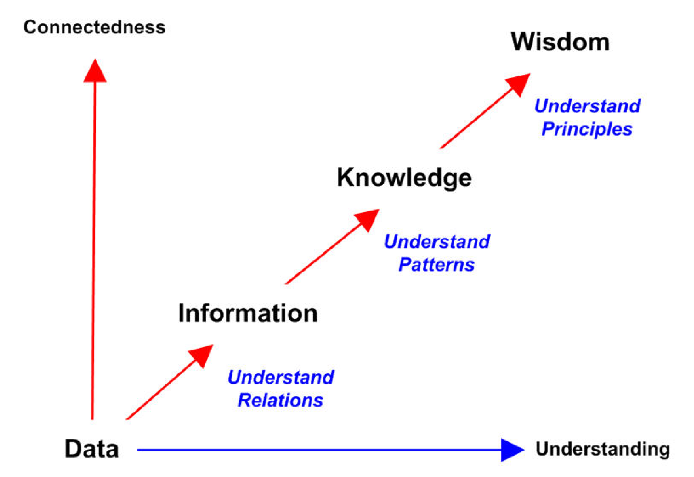

# Week1 Introduction to Information Systems

## 1 System

* A ‘system’ is set of inter-related components (parts) or subsystems.
* For **teleological** systems, a ‘system’ is made up of inter-related components that work together to achieve the overall objectives of the whole system

## 2 System Approach (System thinking)

* Definition

> The systems approach or systems thinking is a method of analysing or thinking about complex systems from the perspective of the total system, the goals of the overall system, the individual components or subsystems, and the inter- relationships and inter-dependencies between the components.

## 3 Systems Theory

* It is the transdisciplinary study of the abstract organization of complex phenomena, independent of their substance, type, or temporal scale of existence.

* It investigates both the principles common to all complex entities, and the models (usually mathematical) that can be used to represent them.

## 4 Structure of a system

* Overall objective represented as concrete measure(s) of performance
* Inputs and Resources
* Process(es)
* Feedback Mechanisms
* Outputs
* System Boundary
* System Environment

## 5 Data, Information, Knowledge, and Wisdom

* Data
  * Raw material
  * Representation of facts
  * Maybe numeric, text, etc.
  * Is usually pricessed further
  * Context free
* Information
  * Processed data
  * In a specific context. Contextual indications, such as a label, are needed to turn data into information
  * Meaningful and useful to the user
* Knowledge
  * Ability to understand information, form opinions, and make decisions or predictions
  * Knowledge is a body of governing procedures, such as guidelines or rules, that are used to organize or manipulate data to make it suitable for a given task.

## 6 Information Systems

> Information Systems **collects**, **processes**, **stores**, **analyzes**, and **disseminates** information for **a specific purpose**

* IS as a discipline
  * Combines the technical and behavioral approach
  * Social-technical system
* IS as a product
  * Seen from users’ point of view, e.g. Billing System, web auction system
  * Consists of different elements, e.g., IT, procedures, content

## 7 Components of Information Systems

* Hardware
  * A device such as a processor, monitor, keyboard, or printer
* Software
  * A program or collection of programs that enable the hardware to process data
* Database
  * A collection of related files or tables containing data
* Network
  * A connecting system that permits different computers to share resources
* Procedures
  * The set of instructions for combining the above components in order to process information and generate the desired output
* People
  * Individuals who use the hardware and software, interface with it, or utilize the output

## 8 Socio-technical systems

* Most ISs have a technical component and a social (human/organisational/societal) component which interact with each other in multiple ways.
* Optimising the technical component without improving the social component is known to produce poor outcomes and results.

## 9 Categories of Information Systems

* Management Support Systems
* Operations Support Systems

## 10 IS and Organisational levels

| Kind of IS  | Groups served|
| ----------- | ----------- |
| Strategic Level      | Senior Managers            |
| Management Level     | Middle Managers            |
| Knowledge Level      | Knowledge and Data Workers |
| Operational Level    | Operational Managers       |

## 11 Class Exercise

* Q1: An IS is a collection of (select all that apply from the list below) that are organised for a specific purpose or outcome in an organisational context.
  * Applications
  * Infrastructure
  * Processes
  * Policies
  * People
  * Database
  * Ideas

* Q2: Consider that you were hired as a strategist to suggest an IS strategy for the entirety of University of Sydney to help and enable the move to online classes throughout the university, what are the different Information Systems that you would recommend (and why)?
  * IS Security
  * Business Intelligence
  * E-Commerce
  * Knowledge management system
  * Collaboration system
  * Supply chain management system
  * Customer relationship management system
  * Content management system
