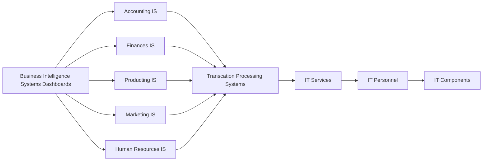
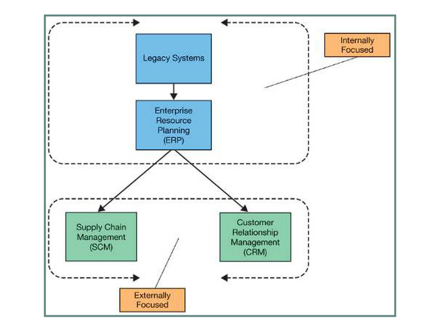
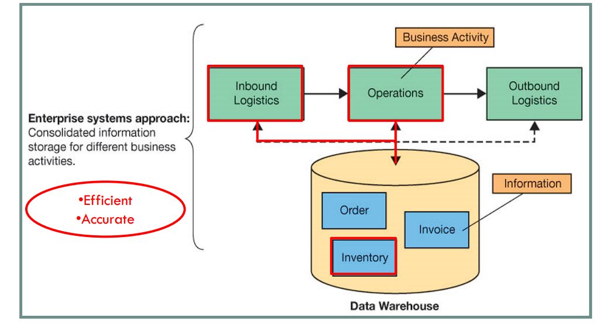
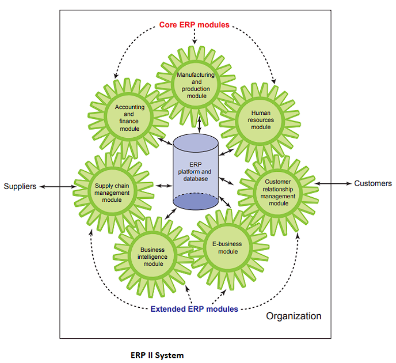
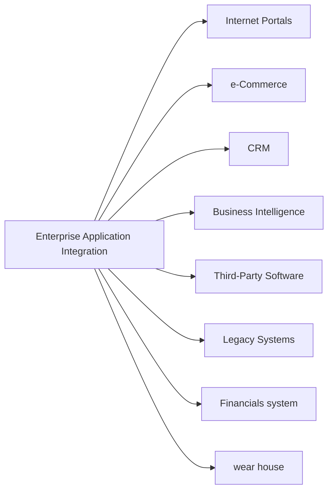
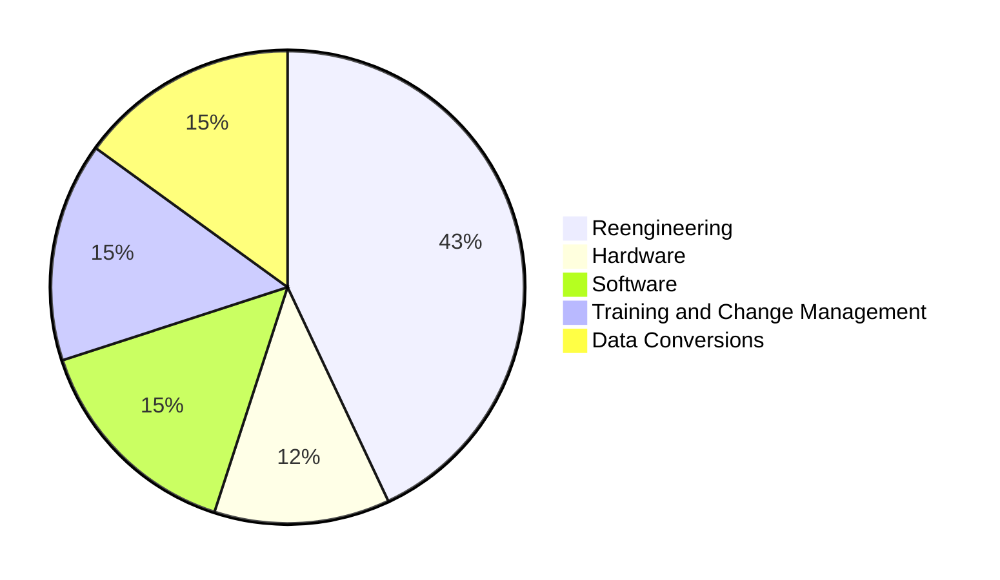

# Week 10 Enterprise Systems #

## 1. IS within an organisation ##

H, I, J are IT infrastructure.

Transcation Processing Systems:

- Supports the monitoring, collection, storage, and processing of data.

Functional Area IS(FAIS):

- Explain the purpose of transaction processing systems (TPS)
- Describe the types of support information systems can provide for each functional area of the organization.

Enterprise Resourse Planning(ERP) Systems:

- Core components
- Describe the business processes supported by ERP systems
- ERP implementation strategies
- Identify the benefits and drawbacks to businesses of implementing an ERP system.

Enterprise Approach:

- Business process management
- Business process improvement (BPI) and business process reengineering (BPR)

## 2. Transaction Processing Systems ##

**Q:** What is **Transaction Processing Systems**?

- TPS is an Information system that supports the monitoring, collection, storage, and processing of data from the organization’s basic business transactions, each of which generates data.
- The TPSs are inputs for the functional area information systems and business intelligence systems, as well as business operations such as customer relationship management, knowledge management, and e-commerce.

Key Function of TPS:

- Handle large volumes of data
- Avoid errors
- Handle large variations in volume (peak times)
- Avoid downtime
- Never lose results
- Maintain privacy and security

Two Basic Ways of Data Processing:

- Batch Processing
  Processes data in batches at fixed periodic intervals.
- Online Transaction Processing(OLTP)
  Processes data after transactions occur, frequently in real time.

## 3. Functional Area Information Systems ##

- Systems that provide information to managers (usually mid-level) in the functional areas in order to support managerial tasks of planning, organizing and controlling operations.
- Supports one particular area or department to increase internal effectiveness and efficiency.
  - HR systems
  - Accounting systems
  - Marketing systems
  - Production systems
- Developed independently of one another resulting in “information silos”
  - Do not communicate well with one another
  - Inefficiency in business processes that involve more than one functional area

## 4. Activities Suported by FAIS ##

- Accounting and Finance
- Marketing and Sales
- Production and Operations Management
- Human Resources Management

FAIS in Porter’s Value Chain Model

## 5. Enterprise Resource Planning Systems ##

ERP system is an Information System that takes a business process view of the overall organization to tightly integrate planning, management, and use of all of an organization’s resources, employing a common software platform and database.

Design to correct a lack of communication among FAIS:

- emphasis has since shifted from "resources" and "planning" to "enterprise".
- Allow accurate, up-to-date information to be shared throughout an organization.

**Objectives**:
Tightly integrate the functional areas of the organization and enable information to flow seamlessly across them:

- Change in one functional area are immediately reflected in all other pertinent functional areas.
- Provide the information necessary to control the business processes of the organisation.

Major ERP vendors:

- SAP
- Oracle
- Microsoft

**ERP II Systems**:

- ERP System
  - Originally developed to facilitate business processes associated with manufacturing.
  - Did not extend to other functional areas.

- ERP II System
  - Evolved to include administrative, sales, marketing and human resources processes.
  - Employ an enterprise-wide approach to ERP that uses the web and connects all facts of the value chain.

## 6. Evolution of Enterprise Systems ##

## 7. Legacy Systems Approach ##

Also called **Stand-Alone Systems Approach**.

- Systems that focus on the specific needs of individual departments.
- Not designed to communicate with other systems in the organisation.

Given that old stand-alone systems were not necessarily designed to communicate with other applications beyond departmental boundaries, they are typically either fast approaching or beyond the end of their useful life within the organization and are referred to as legacy systems.

Each department has its own system(s)

- Inefficient processes
- Potential for inaccuracies

## 8. Enterprise System Approach ##

Integrated suite of business applications for virtually every department, process, and industry, allowing companies to integrate information across operations on a company-wide basis using one large database.

## 9. ERP Core Components ##

- **Financial Management**
  - Support accounting, financial reporting, performance management, corporate governance.
- **Operations Management**
  - Simplify, standardize, and automate business processes for inbound/outbound logistics, product development, manufacturing, sales and service.
- **Human Resource Management**
  - Support employee recruitment, assignment tracking, performance reviews, payroll, regulatory requirements.

## 10. Core and Extended ERP Components ##

- Core Components: support internal activities
- Extended components: support external activities

## 11. Three Main Business Processes Supported by ERP ##

- **Production Process**
  - A cross-functional process in which a company produces physical goods.
  - Originates and ends in the warehouse department (need product and eception of finished goods), but involves the production department as well.

- **Procurement Process**
  - A cross-functional business process that originates when a company needs to acquire goods or services from external sources, and it concludes when the company receives and pays for them.
  - Originates in the warehouse department (need to buy) and ends in the accounting (send payment).

- **Order Fulfillment Process**
  - A cross-functional business process that originates when the company receives a customer order, and it concludes when it receives a payment from the customer.
  - Originates in the sales department (customer request to buy) and ends in the accounting department (receive payment).

## 12. Reports Generated by FAIS and ERP Systems ##

- **Routine reports**
  - Produced at scheduled intervals
  - Range from hourly quality control reports to daily reports on absenteeism rates

- **Ad-hoc (on-demand) reports**
  - Drill-down reports
    - Display a greater level of detail
  - Key indicator reports
    - Summarize the performance of critical activities
  - Comparative reports
    - Compare the performances of different business units or different times

- **Exception reports**
  - Include only information that falls outside certain threshold

## 13. Implementing ERP Systems ##

- **On-Premise ERP Implementation**
  - Vanilla approach
    - Implements a standard ERP package, using the package’s built-in configuration options
    - Quicker implementation
    - Limited adaptation to the organization’s specific processes
  - Custom Approach
    - Implements a more customized ERP system by developing ERP functions designed specifically for that firm
    - Conforms to the organization’s particular characteristics and processes
    - Expensive and risky
  - Best of Breed Approach
    - Mix and match core ERP modules (e.g. financial management, HRM) as well as other specialized software (e.g. manufacturing, warehousing, distribution) from different software providers to best fit the organization’s unique internal processes and value chains.
- **Packaged Software(Vanilla Approach)**
  - Written by third-party vendors
  - Used by many different organizations
  - Useful for standardized, repetitive tasks
  - Cost effective
- **Custom Software(Custom Approach)**
  - Developed exclusively for a specific organization
  - Designed for particular business needs
  - Higher development costs
- **SaaS (Software as a Service) ERP Implementation**
  - Utilizes software-as-a-service (SaaS) to acquire cloud-based ERP systems
  - Rents the software from ERP vendor who offers its products over the Internet sing the SaaS model
  - The ERP cloud vendor is responsible for software updates, security, and availability
  - **Advantages**
    - Anywhere access
    - Avoid the initial hardware and software investment
    - Solutions are scalable
  - **Disadvantages**
    - Security
    - Reliability and availability
    - Loss of control over strategic IT resources

## 14. Enterprise Application Integration System ##

**Enterprise Application Integration System**:s

- A system that integrates existing systems by providing layers of software (middleware) that connect applications together
- **Functions**
  - Data integration
    - Ensures that information in multiple applications is kept consistent
  - Communication between systems
    - Extracts and implements business policies or rules from applications
  - Access to system interfaces
    - Provides a single consistent interface to different applications
- Allows existing applications to communicate and share data
  - Enabling organizations to utilize existing applications
  - Eliminating many of the problems caused by isolated information systems (e.g. FAIS)
- Eliminating many of the problems caused by isolated information systems (e.g. FAIS)

## 15. Business Process Reengineering ##

<!-- create a graph which the Enterprise Application Integration can includes Internet Portals, e-Commerce, CRM, Business Intelligence, Third-Party Software, Financials system, wear house, Legacy Systems -->

## 16. Benefits of ERP Systems ##

Benefits:

- **Organizational flexibility and agility**
  - ERP systems integrate organizational resources, and make organizations more flexible, agile, and adaptive
  - Respond quickly to changing business conditions and capitalize on new business opportunities
- **Decision support**
  - ERP systems provide essential information on business performance across functional areas
  - Improves managers’ ability to make better and more timely decisions
- **Quality and efficiency**
  - ERP systems integrate organizational resources, resulting in significant improvements in production, distribution, customer service, and other business processes

Limitations of ERP Systems
**Limitations**:

- Business processes in ERP software are often predefined by the best practices that the ERP vendor has developed
  - High problem for companies with well-established procedures
- ERP systems can be extremely complex, expensive, and time-consuming to implement
  - Costs and risk of failure in implementing a new ERP system are substantial

**Cost of Implementing ERP**:

## 17. Case/Scenario Analysis - IoT and ERP Integration ##

https://itbrief.com.au/story/australian-uptake-of-enterprise-iot-is-on-the-rise

https://itbrief.com.au/story/australian-businesses-leading-the-way-for-iot

IFS Study: 84% of Industrial Companies Face Gap Between IoT and ERP
([prnewswire.com](https://www.prnewswire.com/news-releases/ifs-study-84-of-industrial-companies-face-gap-between-iot-and-erp-300526759.html))

Based on the information from the articles provided, here are the answers to your questions:

**Q1: What are the benefits of integrating IoT with ERP?**
Integrating IoT with ERP systems offers several benefits to businesses:

1. **Increased Efficiency and Productivity**: IoT devices generate a large amount of data, which, when integrated with ERP systems, can provide actionable insights that enhance efficiency and productivity. Vendors should demonstrate how IoT and their data analytics solution can improve a customer's efficiency and productivity, ideally with use cases.

2. **Improved Decision Making**: IoT data, when consumed in ERP software, can aid in strategic decision-making and operations. This data can be used for corporate business intelligence or to monitor performance against service level agreements.

3. **Enhanced Product or Service Lines**: IoT data can also be used to add new or enhanced product or service lines, increase enterprise agility, and realize the growth and revenue benefits of digital transformation.

4. **Condition-Based Maintenance**: One of the most common use cases for IoT in industrial settings is condition-based maintenance. This helps increase uptime, providing additional capacity for increased revenue, and avoids unplanned downtime that can interrupt production schedules causing missed shipment dates and customer satisfaction issues. When integrated with demand and scheduling systems in ERP, IoT becomes a revenue-enhancement tool improving the top line.

**Q2: What must companies do to realize benefits of integrating IoT and ERP?**
Companies need to address several factors to realize the benefits of integrating IoT with ERP:

1. **Address Security and Infrastructure Issues**: Companies must resolve wider issues around security and infrastructure to deploy commercial-scale IoT systems. This includes dealing with data integration issues and capturing enough data for the analytics to be meaningful.

2. **Focus on Specific Business Problems**: Companies should not deploy IoT technology for the sake of it. They should instead focus on how IoT solutions can improve productivity and efficiency to solve specific business problems.

3. **Ensure Robust Planning and Maintenance Systems**: Companies must have robust planning and maintenance systems capable of making real-time decisions using IoT-sourced data.

4. **Use of IoT-Enabled Enterprise Applications**: There is a need for more IoT-enabled enterprise applications designed to put data from networks of connected devices into the context of the business.

**Q3: What are the gaps between IoT and ERP integration?**
The main gap identified between IoT and ERP integration is the disconnect between data from connected devices and strategic decision-making and operations. The study found that only 16 percent of industrial companies in North America consume IoT data in ERP software, meaning 84 percent face a disconnect. This limits the digital transformation potential of IoT.

Another gap is that many existing planning and maintenance systems may not be robust enough to make real-time decisions using IoT-sourced data. Companies often find that their incumbent software is not able to administer and use IoT data to achieve the gains they want to realize.

Finally, the data suggests a need for more IoT-enabled enterprise applications designed to put data from networks of connected devices into the context of the business.

## 18. Best Practices-Based Software ##

Most enterprise system vendors build best practices into their applications:

- To provide guidelines for management to identify business processes in need of change.
- Implementations and future updates will be smoother if companies change their business processes to fit the enterprise system

Q: Is following the best practices always the best strategy?
A: If companies have competitive advantage from unique business processes, forcing best practices may actually hurt.

## 19. Business Process Management ##

**Business Process Management (BPM)**: A systematic, structured improvement approach by all or part of an organization whereby.

- People critically examine, rethink, and redesign business processes in order to achieve dramatic improvements in one or more performance measures such as quality, cycle time or cost.

BPM Steps:

1. Develop a vision for the organization that specifies business objectives.
2. Identify critical processes that are to be redesigned
3. Understand and measure existing processes as a baseline
4. Identify ways IS can be used for improvement
5. Design and implement a prototype of the new processes
