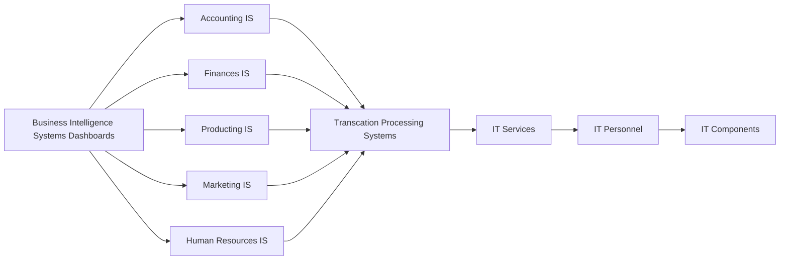
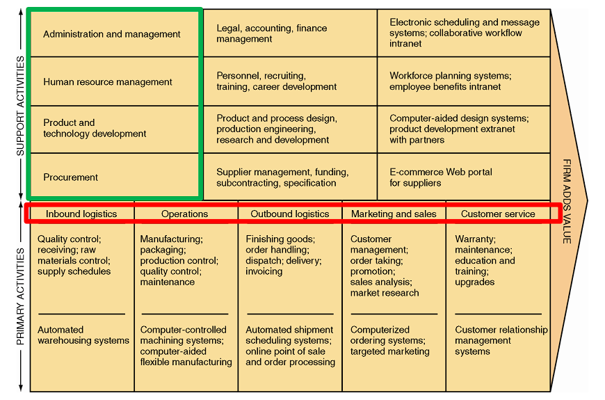

# Week 10 Enterprise Systems #

## 1. IS within an organisation ##

H, I, J are IT infrastructure.

Transcation Processing Systems:

- Supports the monitoring, collection, storage, and processing of data.

Functional Area IS(FAIS):

- Explain the purpose of transaction processing systems (TPS)
- Describe the types of support information systems can provide for each functional area of the organization.

Enterprise Resourse Planning(ERP) Systems:

- Core components
- Describe the business processes supported by ERP systems
- ERP implementation strategies
- Identify the benefits and drawbacks to businesses of implementing an ERP system.

Enterprise Approach:

- Business process management
- Business process improvement (BPI) and business process reengineering (BPR)

## 2. Transaction Processing Systems ##

**Q:** What is **Transaction Processing Systems**?

- TPS is an Information system that supports the monitoring, collection, storage, and processing of data from the organization’s basic business transactions, each of which generates data.
- The TPSs are inputs for the functional area information systems and business intelligence systems, as well as business operations such as customer relationship management, knowledge management, and e-commerce.

Key Function of TPS:

- Handle large volumes of data
- Avoid errors
- Handle large variations in volume (peak times)
- Avoid downtime
- Never lose results
- Maintain privacy and security

Two Basic Ways of Data Processing:

- Batch Processing
  Processes data in batches at fixed periodic intervals.
- Online Transaction Processing(OLTP)
  Processes data after transactions occur, frequently in real time.

## 3. Functional Area Information Systems ##

- Systems that provide information to managers (usually mid-level) in the functional areas in order to support managerial tasks of planning, organizing and controlling operations.
- Supports one particular area or department to increase internal effectiveness and efficiency.
  - HR systems
  - Accounting systems
  - Marketing systems
  - Production systems
- Developed independently of one another resulting in “information silos”
  - Do not communicate well with one another
  - Inefficiency in business processes that involve more than one functional area

## 4. Activities Suported by FAIS ##

- Accounting and Finance
- Marketing and Sales
- Production and Operations Management
- Human Resources Management

FAIS in Porter’s Value Chain Model

## 5. Enterprise Resource Planning Systems ##

ERP system is an Information System that takes a business process view of the overall organization to tightly integrate planning, management, and use of all of an organization’s resources, employing a common software platform and database.

Design to correct a lack of communication among FAIS:

- emphasis has since shifted from "resources" and "planning" to "enterprise".
- Allow accurate, up-to-date information to be shared throughout an organization.

**Objectives**:
Tightly integrate the functional areas of the organization and enable information to flow seamlessly across them:

- Change in one functional area are immediately reflected in all other pertinent functional areas.
- Provide the information necessary to control the business processes of the organisation.

Major ERP vendors:

- SAP
- Oracle
- Microsoft