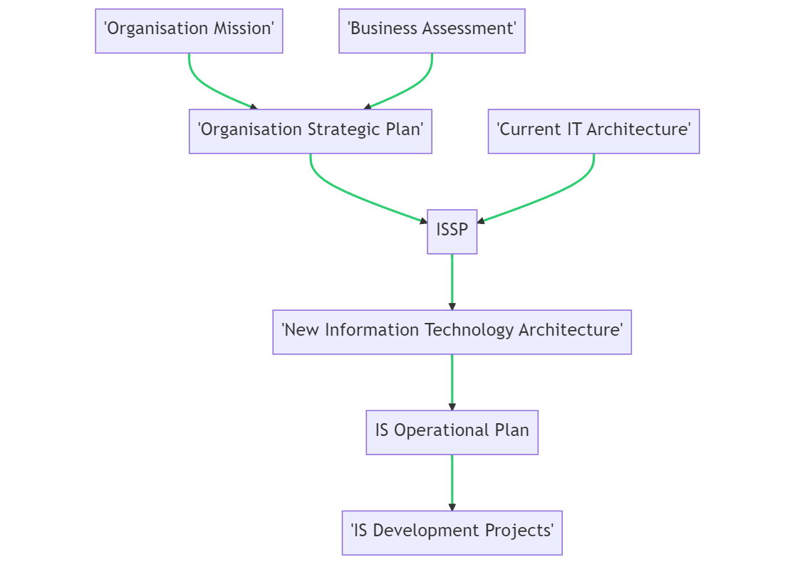
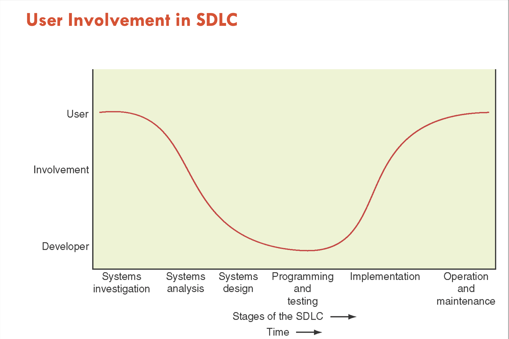
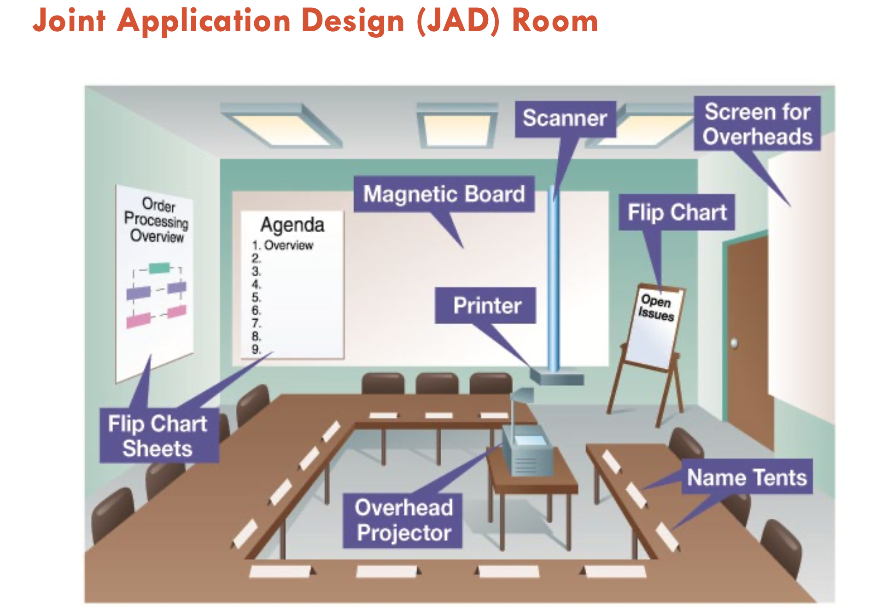
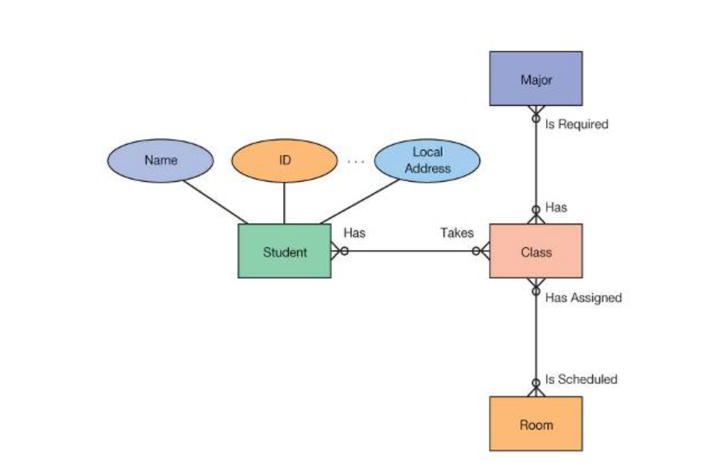
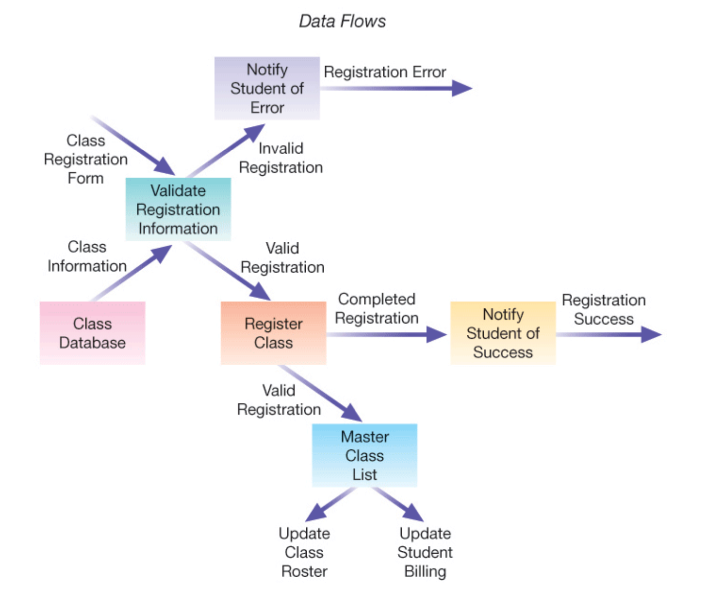
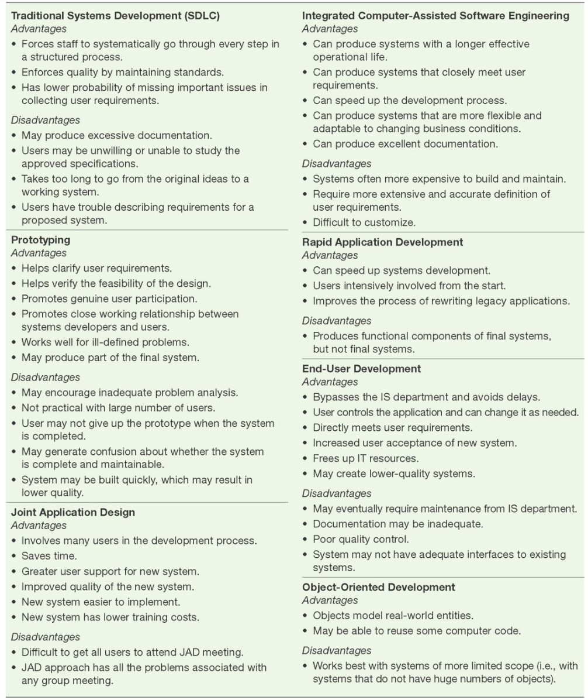
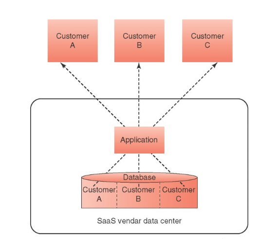
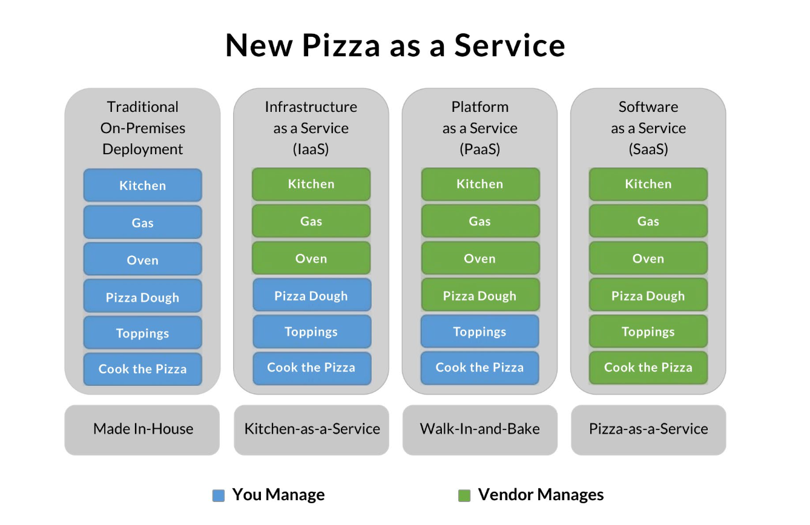

# Week 11 #

## 1. IS Planning Process ##

**Orgainsational Strategic Plan**:

- Identifies the firm's overall mission, goals, and objectives that follow from that mission, and the broad steps required to reach these goals.

**IT Architecture**:

- Outlines the way an organisation should utilize its information resources to accomplish its mission.

- Technical aspects encompassed
  - Hardware and Operating Systems, networks, databases, applications, and programming languages, data management systems, and application software.

- Managerial aspects encompassed
  - How IT department will be managed
  - How the functional area managers will be involved in the IT decision making process
  - How IT decisions will be made and prioritized among competing demands for resources.

## 2. IS Planning ##

**IT Stragetic Plan**:

- A set of long-range goals that describe the IT infrastructure and identify the major IT initiatives needed to achieve the organization’s goals.
- A good IT strategic plan must meet three **objectives**:
  - Aligns with the business strategic plan
  - Provides for an IT architecture that seamlessly networks users, applications, and databases
  - Allocates IS development resources efficiently among competing projects. So the projects can be completed on time and within budget and still have the required functionality.

- **IT Steering Committee**
  - Comprised of group of managers and staff representing various organisational units
    - To establish IT priorities
    - To ensure that the IS function is meeting the needs of the enterprise.

**IS Operational Plan**:

Consists of a clear set of projects that the IS department and the functional area managers will execute in support of the IT strategic plan.

- Mission: the mission of the IS function
- IS Environment: the summary of information needs of the functional areas and of the organisation as a whole
- Objectives of IS Function: The best current estimate of the goals of the IS function.
- Constraints: Technological, financial, personnel, and other resource limitations on the IS function.
- Applications Portfolio: A prioritized inventory of present applications and a detailed plan of projects to be developed or continued during the current year.
- Resource Allocation and Project Management: A listing of how, when and who is going to do that.
  
## 3. Decision Structure and Systems ##

- **Nature of Decisions**:
  - Operational: Executing specific tasks efficiently and effectively.
  - Managerial: Acquiring and allocating resources efficiently and effectively in accomplishing organisational goals.
  - Strategic: Long-term goals and policies for growth and resource allocation.

## 4. Making the Business Case for an IS ##

Making the business case for an IS:

- Faith.
- Fear.
- Facts.
  
## 5. Justifying IT Investments ##

- An IS must be implemented in order to gain or sustain a competitive advantage over rivals, or simply to stay in business.
- Based on Faith:
  - Arguments based on beliefs about organizational strategy competitive advantage, industry forces, customer perceptions, market share, and so on.
- Based on Fear:
  - Arguments based on the notion that if the system is not implemented, the firm will lose out to the competition, or, worse, go out of business.
- Based on Facts:
  - Arguments based on data, quantitative analysis, and/or indisputable factors.

## 6. Cost-Benefit Analysis ##

Assessing the Costs:

- Challenging in allocating fixed costs among different IT projects:
  - Costs that remain the same regardless of any change in the company’s activity level.
  - Include infrastructure costs and costs associated with IT services and IT management (e.g., salary of IT director).
- Challenge in anticipating costs for maintaining, debugging, and improving systems after installed.

Assessing the Benefits:

- Difficulty in quantifying intangible benefits (e.g., improved customer or partner relations, improved decision making, etc.).

Methods:

- Net Present Value (NPV)
  - Convert future values of benefits to their present-value equivalent by “discounting” them at the organization’s costs of funds.
  - Compare the present value of the future benefits to the cost required to achieve those benefits to determine whether the benefits exceed the costs.

- Return on Investment (ROI)
  - Measures management’s effectiveness in generating profits with its available assets.
  - Divide the net income generated by the average assets invested.
  - The high the percentage the better.
- Break-Even Analysis
  - Determine the point at which the cumulative dollar value of the benefits equals the investment made.

## 7. IS Development and Acquisition Decisions ##

- How much computer code does the company want to write?
  - Use a totally prewritten application (write no code)
  - Customize a prewritten application (write some code)
  - Customize an entire application (write all new code)
- How will the company pay for the application?
  - Prewritten applications: buy or lease
  - Totally custom applications: internal funding
- Where will the application run?
  - Run the application on its own platform
  - Run the application on someone else’s platform (e.g., SaaS vendor)
- Where will the application originate?
  - Prewritten applications: open source or proprietary
  - Custom applications: in-house or outsource

## 8. IS Development and Acquisition Strategy ##

In-house development:

- System Development Life Cycle(SDLC)
  - A structured framework for developing new systems or changing existing systems.
  - A set of activities used to build an information system.
  - A set of techniques and tools to aid in the development process.
  - A guide to help the project manager and team plan, schedule, and control the project.

External Acquisition:

- Off-the-shelf (proprietary) software
- Open source software
- Application Service Provider (ASP) and Software as a Service (SaaS)
- Outsourcing

## 9. In-House Development ##

Traditional Method:

- System Development Life Cycle(SDLC)

Alternative Methods and Tools:

- Prototyping
- End-user development
- Joint Application Development (JAD)
- Integrated Computer-Assisted Software Engineering (CASE) Tools
- Rapid Application Development (RAD)
- Object-Oriented Development

## 10. SDLC ##

- The traditional systems development method that organizations use for large-scale IT projects.
- A structured framework that consists of sequential processes by which information systems are developed.
  - System Investigation
  - System Analysis
  - System Design
  - System implementation
  - System Maintenance

## 11. User Involvement in SDLC ##

- User involvement is critical to the success of an information system.

## 12. System Investigation ##

- Address the business problem or opportunity that the new system will address by means of the feasibility study.
- Tasks:
  - Technical Feasibility
    - Whether the company can develop and/or acquire the hardware, software, and communications components needed to solve the business problem.
    - Whether the organisation can use its existing technology to achieve the project's performances objectives.
  - Economic Feasibility
    - Whether the project is an acceptable financial risk.
    - Whether the organisation has the necessary time and money to successfully complete the project.
  - Behavior Feasibility
    - Human issues of the systems development project.
- Deliverables:
  - Feasibility Report
- "Go/No-Go" Decision by the steering committee or top management.
  - Do nothing and continue to use the existing system unchanged
  - Modify or enhance the existing sysem
  - Develop a new system

## 13. System Analysis ##

Examines the business problem that the organization plans to solve with an information system.

Tasks:

- Gathers information about the existing system in order to determine the requirements for the proposed system
  - Interviews, questionnaires, observation, document analysis, etc.
  - Document analysis
  - Joint Application Design (JAD)
  - Modeling Data(current system)
    - Entity Relationship Diagram (ERD)
  - Modeling processes and logic(current system)
    - Data Flow Diagram (DFD)

- Deliverables:
  - System Requirements Document(functional requirements)
  - System Proposal
  
## 14. Joint Application Design (JAD) ##

## 15.Data Model ##

## 16. Process Model ##

## 17. Examples of System Requirement ##

- User Interface Requirements
  - Automatic entry of product data and easy-to-use data entry screens for Web customers.
- Processing Requirements
  - Fast, automatic calculation sales totals and shipping costs
- Storage Requirements
  - Fast retrieval and update of data from product, pricing, and customer databases.
- Control Requirements
  - Signals for data entry errors and quick e-mails confirming orders.

## 18. System Design ##

- Describe how the systems will resolve the business problem
- Tasks:
  - System outputs, inputs, user interfaces.
  - Hardware, software, databases, telecommunications, etc.
  - Data and process models(new system)
- Deliverables:
  - Technical system specifications.

## 19. Example of System Specification ##

| System Specification | Examples |
| :---: | :---: |
| User interface specification | Use personalized screens that welcome repeat Web customers and that make product recommendations. |
| Database Specifications | Develop databases that use object/relational database management software to organize access to all customer and inventory data and to multimedia product information. |
| Software specifications | Acquire an e-commerce software engine to process all e-commerce transactions with fast responses, i.e., retrieve necessary product data and compute all sales amounts in less than one second. |
| Hardware and network specifications | Install redundant networked Web servers and sufficient high-bandwidth telecommunications lines to host the company e-commerce website. |
| Personnel specifications | Hire an e-commerce manager and specialists and a webmaster and Web designer to plan, develop, and manage e-commerce operations. |

## 20. Testing Type ##

| Testing Type | Focus | Performed By |
| :---: | :---: | :---: |
| Developmental | Testing the correctness of individual modules and the integration of multiple modules | Programmer |
| Alpha | Testing of oerall system to see whether it meets design requirements | Software Tester |
| Beta | Testing of the capabilities of the system in the user environment with actual data | Actual system users |

## 21. Systems Implementation ##

- Transforms the system design into a working information system.
- Tasks:
  - Programming and testing
    - Translates the design specifications into computer code.
    - Checks to see if the computer code will produce the expected and desired results and detects errors.
  - System Conversion
    - Converts from the old system to the new system.
  - Documentation
    - User and reference guides
    - User training manuals and tutorials
    - Installation procedures and troubleshooting suggestions
  - Training and support
    - Different types of training and support require different levels of investment by the organisation.
- Deliverables:
  - Operational system

## 22. Conversion Strategies ##

(a) Parallel: old and new systems are used at same time.
(b) Direct: Old systems is discontinued and new system is used.
(c) Phased: New system is implemented in phases.
(d) Pilot (Single Location): Entire system is used in one location.

## 23. Training Options ##

Least expensive : self-paced training and tutorials.
Most expensive : classroom training and one-on-one training.

|Training Option|Description|
|:---:|:---:|
|Tutorial|One person taught at one time by a trainer or by paper-based exercises|
|Course|Several people taught at one time by a trainer|
|Computer-aided instruction| One people taught at one time by a computer|
| Interactive training manual| Combination of tutorial and computer-aided instruction|
|Resident expert| Expert on call to assist users as needed|
|Software help components| Built-in system components designed to train users and trouble-shoot problems|
|External training| Training provided by outside vendors or consultants|

## 24. System Maintenance ##

Maintaining the system and adding new functions when needed.
Maintenance process parallels the process used for the initial development of the information system.

- Obtain maintenance request
  - Debugging, updating existing functions,
adding new functions
- Transform requests into changes
- Design changes
- Implement changes

The largest part of the system development effort occurs.
Deliverables:

- Updated system

## 25. Maintaince Types ##

| Maintenance Type | Description |
| :---: | :---: |
| Corrective | Making changes to an information system to repair flaws in the design, coding or implementation. |
| Adaptive | Making changes to an information system to evolve its functionality to accommodate changing business needs or to migrate it to a different operating environment. |
| Perfective | Making enhancements to improve processing performance or interface usability or adding desired but not necessarily required system features(in other words, "bells and whistles"). |
| Preventive | Making changes to reduce the chance of future system failure. |

## 26. System Development Life Cycle (SDLC) ##

Advantages:

- Forces staff to systematically go through every step in a structured process
- Enforcesqualitybymaintaining standards
- Has lower probability of missing important issues in collecting user requirements.

Disadvantages:

- May produce excessive documentation
- Users may be unwilling or unable to studytheapprovedspecifications
- Takes too long to go from the original ideas to a working system
- Users have trouble describing requirements for a proposed system

## 27. Alternative Methods and Tools ##

- Joint Application Design (JAD)
  - A group-based tool for collecting user requirements and creating system designs
- Prototyping
  - An approach that defines an initial list of user requirements,builds a model (prototype) of the system, and then refines the systems in several iterations based on users’ feedback.
- Computer Aided Software Engineering (CASE)
  - A group of tools that automate many of the tasks in the SDLC.
    - Upper CASE tools: Automate early stages of SDLC
    - Lower CASE tools: Automate later stages of SDLC
    - Integrated CASE tools: provide links between upper CASE and lower CASE tools.
- RAD (Rapid Application Development)
  - A method that combines JAD, prototyping, and integrated CASE tools to compress the time required to design and implement information systems.
- Agile Development
  - A software development methodology that delivers functionality in rapid iterations, measured in weeks, requiring frequent communication, development, testing, and delivery.
- End-User Development
  - An approach in which the organisation's end users develop their own applications with assistance from the IT department.
- Object-Oriented Development
  - A software development methodology that begins with aspects of the real world that must be modelled to perform a task and that organises work around the data, or objects, rather than the processes.

## 28. Steps in External Acquisition ##

- Systems investigation
- System Analysis
- Development of RFP (Request for Proposal)
  - A document that is used to tell vendors what your requirements are and to invite them to to provide information about how they might be able to meet those requirements.
- Proposal Evaluation
- Vendor Selection

## 29. Off-the-Shelf Software ##

- Advantages
  - Many different types of off-the-shelf software are available.
  - Software can be tried out before purchase.
  - The compnay can save much time by purchasing off-the-shelf software rather than developing its own.
  - The company can know what it is getting before it invests in the software.
  - The company is not the first and only user of the software.
  - Purchased software may eliminate the need to hire and train new employees.
- Disadvantages
  - Software may not meet all of the company's needs.
  - Software may be difficult to integrate with existing systems, or it may require huge business process changes.
  - The company will not have control over software improvements.
  - Purchased software can be difficult to integrate with existing systems.
  - Vendors may discontinue support for the software.
  - Software is controlled by another company with its own priorities and goals.
  - Intimate knowledge in the purchasing company is lacking about how the software works.

## 30. Leasing Application Software ##

Application Service Provider (ASP)

- A vendor who assembles the software needed by enterprises and then packages it with services such as development tools, database management, backup, security, and maintenance.

Software as a Service (SaaS)

- A method of delivery software in which a vendor hosts the application and provides it as a service to customers over a network, typically the Internet.

**Leasing Options..?**

- Infrastructure as a Service (IaaS)
  - e.g. Amazon Web Services (AWS)
  - e.g. Microsoft Azure
  - e.g. Google Cloud Platform (GCP)
  - e.g. IBM Cloud
  - e.g. Oracle Cloud Infrastructure (OCI)
- Platform as a Service (PaaS)
  - e.g. AWS Elastic Beanstalk
  - e.g. AWS Lambda
  - e.g. Google App Engine

***You Manage vs Other Manages***
| Service | On-Premises | IaaS | PaaS | SaaS |
| :---: | :---: | :---: | :---: | :---: |
| Application| You Manage | You Manage | You Manage | Other Manages |
| Data| You Manage | You Manage | You Manage | Other Manages |
| Runtime| You Manage | You Manage | Other Manages | Other Manages |
| Middleware| You Manage | You Manage | Other Manages | Other Manages |
| O/S| You Manage | You Manage | Other Manages | Other Manages |
| Virtualization| You Manage | Other Manages | Other Manages | Other Manages |
| Servers| You Manage | Other Manages | Other Manages | Other Manages |
| Storage| You Manage | Other Manages | Other Manages | Other Manages |
| Networking| You Manage | Other Manages | Other Manages | Other Manages |

New Pizza as a Service (PaaS) Model

## 31. Outsourcing ##

Outsourcing:

- Use of outside contractors or external organisations to acquire IT services.
- Contracting out a business process(e.g. software development, call center operations) to a third-party service provider.

Off-shoring:

- Relocation of business processes to lower-cost locations overseas.

**Why Outsourcing?**