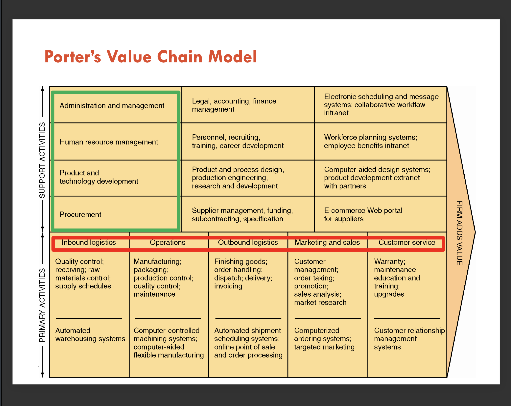
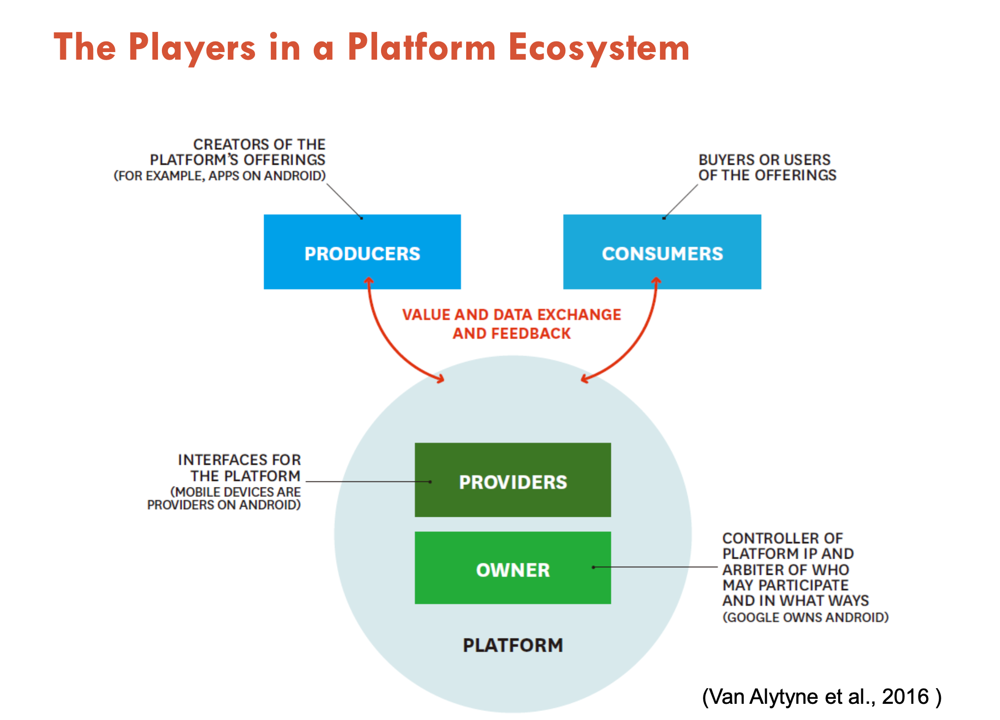

# Week2 Competitive Advantage

## 1 Definition

* An edge over competitors in attracting customers and defending against
competitive forces
* An advantage can be in terms of cost, quality, or speed; leads to control of
a market and to larger-than-average profits
* Questions
  * Q1: How long can you have competitive advantage/s?
  * Q2: How many competitive advantages do you need for your business?\
  * Q3: How can you make competitive advantage/s sustainable?
  * Q4: How can IS help you gain sustainable competitive advantage/s? (e.g., strategic IS and alignment?)

## 2 Information systems can be used in three ways to add value to an organisation

* Automating
  * Task can be completed faster, cheaper, more accurately, with greater consistency
* Learning
  * Learn about processes
  * Improve processes
* Strategising
  * Enable firm to gain or sustain competitive advantage

## 3 Five General Organizational (Competitive) Strategies

* Cost Leadership
  * Offer the best prices on goods and/or services
* Differentiation
  * Provide better products and/or services than competitors
* Broad Market
  * Aim broadly at many different types of customers
* Niche Market
  * Focus on a particular segment of consumers
* Best-Cost Provider
  * Offer products or services of reasonably good quality at competitive prices

## 4 Industry Analysis

## 5 Porter’s Five Forces Model

Five forces that shape competition and strategy

* Threat of new entrants
* Bargaining power of suppliers
* Bargaining power of buyers
* Threat of substitutes
* Rivalry among existing competitors

## 6 Threat of New Entrants

* The threat that new competitors will enter your market is high when entry is easy and low when there are significant barriers to entry.
* There are many types of **entry barriers**. Consider, for example, legal requirements such as admission to the bar to practice law or a license to serve liquor, where only a certain number of licenses are available.

### 6.1 Creating Barriers to Entry

* Supply-side economies of scale
* Network effects (Demand-side economies of scale)
* Customer switching costs
* Capital requirements
* Unequal access to distribution channels
* Restrictive government policy

## 7 Bargaining power of suppliers

* Supplier power is high when buyers have few choices from whom to buy and low when buyers have many choices.

## 8 Bargaining power of buyers

* Buyer power is high when buyers have many choices from whom to buy and low when buyers have few choices.
* For example, in the past, there were few locations where students could purchase textbooks (typically, one or two campus bookstores). In this situation, students had low buyer power. Today, the Web provides students with access to a multitude of potential suppliers as well as detailed information about textbooks. As a result, student buyer power has increased dramatically.

## 9 Rivalry Among Existing Competitors

* Rivalry takes many different forms:
  * Price discount
  * New product introduction
  * Advertising
  * Service improvement
* The threat from rivalry is high when there is intense competition among many firms in an industry. The threat is low when the competition is among fewer firms and is not as intense.

## 10 Case Study

 This part use Qantas Airline as an example:

 * What are the potential new entrants?
   * Foreign Carriers
   * Regional carrier start-ups
 * What is the bargaining power of suppliers?
   * Aircraft manufacturers(e.g. Boeing, Aribus).
   * Labour Unions
   * Food service companies
   * Fuel Companies
   * Airports
   * ...
 * What is the bargaining power of buyers?
   * Travel Agents
   * Business Travelers
   * Pleasure Travelers
   * Cargo and Mail
 * What are the substitute products of services?
   * Alternate Travel Services
     * Fast Trains 
     * Boats
   * Private Transportation
   * Video conderencing
 * What are the rivalries?
   * Low-cost regional airlines (Jetstar Airways)
   * Low-cost international airlines
   * Airlines providing better services

## 11 Use of IS to Combat Competitive Forces

|Competitive Force|Implication for Firm|Potential Use of Information Systems|
|-----------------|--------------------|------------------------------------|
|Rivals within your industry|Competition in price, product, distribution, service|Reduce cost, use the internet to increase service|
|New entrants|Reduced prices and market share|Inventory control to manage excess capacity, Internet to differentiate products|
|Customers' bargaining power|Reduced prices, demand for better quality and service|CRM to improve service, Computer-Aided Design/Computer-Aided Manufacturing (CAD/CAM)|
|Suppliers' bargaining power|Increased costs and reduced quality|Use internet to work with new distant suppliers|
|Threat of substitue products|Decreased market share, customer loss|Better assess customer needs, use CAD to design better products|

## 12 Porter’s Value Chain Model
  
* Firm Analysis
  * Analyzes the activities of a firm and identify how information systems can be used to develop a competitive advantage
  * Strategy execution(**how to compete**)
* Value Chain
  * A sequence of activities(processes) through which the organization's inputs are transformed into more valuable outputs.

### 12.1 Inbound Logistics

* Activities
  * Quality control
  * receiving
  * raw material control
  * supply schedules
* IS
  * Automated warehousing systems

### 12.2 Operations

* Activities
  * Manufacturing
  * packaging
  * production control
  * quality control
  * maintenance
* IS
  * Computer-controlled machining systems
  * Computer-aided flexible manufacturing

### 12.3 Outbound Logistics

* Activities
  * Finishing goods
  * order handling
  * dispatch
  * delivery
  * invoicing
* IS
  * Automated shipment
  * Scheduling systems
  * Online point of sale and order processing

### 12.4 Marketing and sales

* Activities
  * Customer management
  * Order taking
  * Promotion
  * Sales Analysis
  * Market research
* IS
  * Computerized ordering systems
  * targeted marketing

### 12.5 Customer service

* Activities
  * Warranty
  * Maintenance
  * Education and training
  * Upgrades
* IS
  * Customer relationship management system

## 13 IS and the Value Chain

* The value chain provides a useful framework to perform high-level analysis of a firm from the perspective of competitive strategy
* Draw a generic value chain for the firm and identify individual activities that add value
* Evaluate the contribution of each activity to the value of the product/servcice

Q: Can IS used to add value?
A: IS can be used to revamp the value chain:

* Reengineer core business processes, e.g., digitise the product or process, bypass the middleman
* Concentrate on core competencies by establishing alliances with partners, e.g., use logistic company for transport

## 14 IS and Platform Business

- Platform is used to characterise product, services, firm or institutions that mediate transaction between two or more group of agents
- A platform is a business model that creates value by facilitating exchanges between two or more interdependent groups, usually consumers and producers.
  - Value is appreciated by interaction

### A Digital Platform
Video Creators --- Youtube.com --- Video Viewers

Drivers --- Uber --- Riders

## 15 The Move from Product to Platform

* From internal optimisation to external interaction
* From a focus on customer value to a focus on ecosystem value

|Product|Platform|
|-------|--------|
|Value is created upstream|Value is co-created on the spot|
|Customers are acquired|Users can become customers|
|Products are designed to meet specifications|Products emerge through interaction|
|Value is given by consumption|Value is appreciated by interaction|

* Goal shifts from control, entry barriers, and differentiation to more creating and facilitating valuable market exchanges

## 16 Competitive Threats for Platform Business

* An established platform with superior network effects that uses its relationships with customers to enter your industry.
* A competitors may target the customers who repeatedly purchase goods/ services from a business with a distinctive new offering that leverages network effects.

## 17 Impact of Internet on industry structures

* **Dampens bargaining power of channels**
  * Internet provides companies with new, more direct avenues to customers
* **Boosts an industry's effciency in various ways**
  * expanding the overall size of market by improving its position relative to traditional substitutes
* **Increases buyer bargaining power**
  * internet provides buyers with easier access to information about products and services
* **Reduces barriers to entry**
  * mitigates the need for fixed investments such as established sales force and channels
* **Create new substitutes**
  * enables new approaches to meeting needs
* **Intensifies rivalry among competitors**
  * expands geographic reach
* **Reconfiguring of existing industries**
  * information and communciation intensive industries
  * distance learning, catalog retailers
* **Impacts will vary on industries**
  * depends on existing industry structure
  * can't draw general conclusions about the impact of the internet on long-term industry profitability
