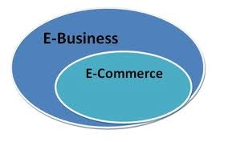

# Week4 E-business and e-commerce

## 1 The Internet

* is the global system of interconnected computer networks that use the Internet protocol suite (TCP/IP) to link devices worldwide.
* Physical connection of millions of networks, computers, network devices, and related infrastructures
* The WWW (World Wide Web)
  * Content: Consists of Websites and Web pages

## 2 E-Commerce vs. E-Business

### 2.1 Electronic Business (E-Business)

* A much broader concept than e-commerce
* Also includes internal processes: production, inventory management, risk management, knowledge management, etc.

### 2.2 Electronic Commerce (E-Commerce)

* Conducting business electronically
  * Sharing business information
  * Maintaining business relationships
  * Performing business transactions
* Outward-facing processes

### 2.3 Unique Features of E-Commerce

|EC Features|Description|Example|
|-----------|-----------|-------|
|Global Reach|Products and services can be marketed over vast distances|Almost anyone can access Amazon.com|
|Integration|Web sites can be linked to corporate databases to provide real-time access to personalized information|Customers can check account balances at commonwealth netbank|
|Mass customization|Firms can tailor their products and services to meet a customer’s particular needs.|Customers can build their own PC on www.dell.com|
|Interactive communication|Companies can communicate with customers, improving the image of responsiveness.|Customers can receive real-time online support (e.g. Apple.com)|
|Universal Standards|The technical standards for conducting e-commerce are the universal standards (Internet Standards).|
|Richness|Video, audio, text, etc|
|Information Density|Reduces information costs and raise quality|
|Disintermediation|Cutting out the “middleman” and reaching customers more directly and efficiently|Customers can purchase shoes from Adidas website directly instead of going to retail stores|

#### 2.3.1 Integration

* Realtime
* Personalized

#### 2.3.2 Disintermediation

* Cutting out the middlemen and reaching customers more directly and efficiently
* Costs:
  * Developing quality website
  * Maintaining product information
  * Marketing Expenses
  * Competing with the rest of the providers for customer’s attention

#### 2.3.3 Reintermediation

* Reintroducing middlemen in order to reduce the chaos brought on by disintermediation
* Example: Amazon.com, Ebay.com
* Benefits: (from GPT-4)
  1. **Improved customer service**: Reintermediation can help e-commerce businesses deliver better customer service by providing personalized assistance, such as through product recommendations or guided shopping experiences. This added value can improve customer satisfaction and potentially increase sales.
  2. **Enhanced trust and credibility**: By working with reputable intermediaries, e-commerce businesses can improve their credibility and trustworthiness. Intermediaries may offer additional security measures, authentication services, or dispute resolution options, which can help reduce fraud and create a safer environment for online transactions.
  3. **Expertise and specialization**: Intermediaries can bring domain-specific expertise and specialized services to the e-commerce ecosystem. This can help e-commerce businesses streamline their operations, access new markets, or improve their marketing and sales strategies.
  4. **Reduced complexity**: E-commerce businesses may rely on intermediaries to simplify complex processes, such as international shipping, customs clearance, or tax compliance. By outsourcing these tasks, businesses can focus on their core competencies and enhance their overall efficiency.
  5. **Better market segmentation and targeting**: Intermediaries can help e-commerce businesses segment their markets more effectively and tailor their offerings to specific customer groups. This can lead to better-targeted marketing efforts and increased sales conversions.
  6. **Greater price transparency**: Intermediaries, such as price comparison websites or online marketplaces, can contribute to greater price transparency in the e-commerce industry. This can help consumers make informed purchasing decisions and foster healthy competition among online retailers.
  7. **Enhanced product discovery**: Reintermediation can make it easier for consumers to discover new products and services. By aggregating offerings from various sellers, intermediaries can create a more convenient and efficient shopping experience.
  8. **Risk management**: Intermediaries can help manage risk for e-commerce businesses by providing services like payment processing, fraud detection, and insurance. This can improve the overall stability and security of the e-commerce ecosystem.

## 3 Forms of E-Commerce

* Dimensions
  * Product
  * Process
  * Delivery Method
* Forms
  * Traditional Commerce
  * Partial E-Commerce
  * Pure E-Commerce
* Scenarios:
  * Purchasing a book from Amazon?
  * Purchasing an e-book from Amazon?

### 3.1 Forms of E-Commerce Options for Business

* Brick-and-mortar business
  * Only physical presence
  * Choose not to perform any e-commerce functions
* Click-and-mortar business
  * Both physical presence and Web presence
  * E-Commerce functions
  * E.g., Coles Click & Collect
  * Shoppers can return products locally
* Click-and-order business/Pure play
  * Only interact with customers over the Internet
  * E.g., Amazon

## 4 Most Common Types of E-Commerce

* Business-to-consumer (B2C)
  * Example: Amazon.com
* Business-to-business (B2B)
  * Example: MyBoeingFleet, ChemConnect
* Consumer-to-consumer (C2C)
  * Example: eBay
* E-Governement / Government-to-citizens (G2C)
  * Example: Centrelink
* M-Commerce

## 5 EC Revenue Models

|Revenue Type|Description|Who is Doing This?|
|------------|-----------|------------------|
|Traditional sales|A consumer buys a product/service from the Web site|Chemistwarehouse.com, iTunes.com|
|Web advertising|Fees are generated from advertisers in exchange for advertisement|Facebook. com, Answers.com|
|Affiliate marketing|Paying businesses that bring or refer customers to another business|Amazon.com’s Associates Program|
|Subscription|Users pay a monthly or yearly recurring fee for the product/service|Netflix.com, World of Warcraft, Linkedin Premium|
|Licensing|Users pay a fee for using protected intellectual property|Symantec, Norton|
|Transaction fees/Brokerage|A commission is paid to the business for aiding in the transaction|PayPal.com, eBay.com, Groupon.com|

## 6 B2C E-Commerce

### 6.1 Stages of B2C E-Commerce

* E-information
  * dissemination of promotional and marketing material
  * global customers can access timely information, 24/7/365
  * reduces cost and time needed to disseminate printed materials
  * no transactional capabilities
* E-integration
  * Customers can access dynamic customised information (such as bank statements)
  * no transactional capabilities
* E-transaction
  * Customers get real-time access to information about products and services
  * Customers can make purchases and payments and conduct banking or investment transactions

### 6.2 Definitions

* Retailers: A sales intermediary that operates between manufacturers and customers
* E-tailers: Retailers that sell over the Internet
* Retailers and e-tailers implies sales of products/ services to individual customers (i.e. B2C EC) as opposed to corporate customers (i.e. B2B EC) although many e-tailers now sell to both markets.
* Why do manufacturers need retailers? (Class Discussion 1) Answer from GPT-4:
  1. Access to customers: Retailers serve as the primary point of contact between manufacturers and end consumers. They provide manufacturers with access to a broad customer base, ensuring their products reach the intended audience.
  2. Market coverage: Retailers have an established presence in various geographical locations, allowing manufacturers to distribute their products more widely. This market coverage helps manufacturers reach more customers and expand their business.
  3. Customer experience: Retailers are experienced in providing a positive customer experience, including product presentation, customer service, and after-sales support. This can be crucial in building brand loyalty and ensuring customer satisfaction.
  4. Inventory management: Retailers manage inventory, ensuring that products are stocked and available for consumers to purchase. This relieves manufacturers of the burden of managing stock levels and allows them to focus on production.
  5. Marketing and promotion: Retailers often engage in marketing and promotional activities that help create awareness and demand for the products they carry. This can include in-store displays, advertising, and special promotions, which ultimately benefit the manufacturers as well.
  6. Risk sharing: By working with retailers, manufacturers can share some of the risks associated with selling products, such as inventory obsolescence, price fluctuations, and demand variability. This can help manufacturers mitigate potential losses and maintain stability.
  7. Feedback and market insights: Retailers have direct contact with customers, allowing them to gather valuable feedback and market insights. They can share this information with manufacturers, who can then use it to improve their products or develop new offerings based on customer preferences and trends.
  8. Value-added services: Retailers often provide value-added services, such as product assembly, installation, and warranties, which can enhance the overall customer experience and increase the likelihood of repeat purchases.
  
### 6.3 Benefits of e-tailing

* Product: With no store size and shelf space restrictions, companies can sell a far wider variety of goods.
* Place: Internet storefronts are available on almost every computer connected to the Internet.
* Price: The efficiency of online retailers, with high volumes and low overhead allow for very competitive pricing.

### 6.4 Drawbacks of e-tailing

* Product delivery: Additional time for products to be delivered
* Direct product experience: Lack of sensory information

### 6.5 Some innovative e-tailing models

* Auction: Prices are determined dynamically by competitive bidding
* Name Your Own Price (e.g. Priceline)
  * A special type of reverse auction originally pioneered by Priceline
  * A buyer specifies a price and a product or service, and sellers accept bids
  * Sellers' brands are not revealed to customers prior to the consummation of a transaction
  * Enables sellers to sell products and services at discounted prices without cannibalizing  their own retail sales and without competing with their own distributors
* Group Buying (e.g. Groupon)

## 7 Long Tail Strategy

* Cater to niche markets in addition to (or instead of) purely selling mainstream products

爆款产品走量，小众定制产品高利润

## 8 Attracting and Retaining Online Customers

* The website should offer something unique
* The website must motivate people to visit, to stay and to return
  * Reviews
  * Community
  * Recommendation
* You must advertise your presence on the web
  * Website address
  * QR codes
* You should learn from your website: Web analytics
  * E.g the length of the visits, page views, common entry and exit pages and etc.
* Why do you re-visit the e-commerce website? (Answer from GPT-4)
  1. **User experience**: A well-designed, user-friendly website that offers seamless navigation, quick load times, and intuitive search functionality can encourage customers to revisit the site.
  2. **Product variety and availability**: Offering a wide range of products and maintaining consistent stock levels can attract customers to return, knowing they will find what they are looking for.
  3. **Personalization**: Tailored product recommendations, personalized offers, and customized content based on user preferences and browsing history can create a more engaging shopping experience, leading to repeat visits.
  4. **Competitive pricing**: Attractive prices, discounts, and special promotions can entice customers to revisit an e-commerce website for potential savings and deals.
  5. **Customer service**: Prompt and efficient customer support, including easy returns and refunds, can foster trust and encourage customers to come back for future purchases.
  6. **Loyalty programs**: Offering rewards and incentives through loyalty programs can encourage repeat visits as customers seek to accumulate points or redeem rewards.
  7. **Exclusive or unique products**: E-commerce websites that offer exclusive items or niche products not readily available elsewhere can attract a loyal customer base interested in those specific items.
  8. **Quality content**: Providing useful and engaging content, such as product reviews, expert advice, or informative blog posts, can keep customers coming back for more information and advice.
  9. **Trust and security**: Ensuring that customers feel safe and secure when shopping on an e-commerce website can increase the likelihood of them returning. This includes secure payment processing, protection of personal information, and a clear privacy policy.
  10. **Easy checkout process**: A simple, streamlined checkout process that minimizes friction and offers multiple payment options can encourage customers to complete their purchases and return for future transactions.
  11. **Timely and reliable shipping**: Fast, reliable, and affordable shipping options can increase customer satisfaction and encourage repeat visits.
  12. **Social proof and testimonials**: Positive reviews, ratings, and testimonials can build trust and credibility, leading to customers revisiting the e-commerce website based on the positive experiences of others.

## 9 Business-to-Business(B2B) E-Commerce

* Transactions conducted between different businesses, not involving the end consumer
* Both the sellers and the buyers are business organizations
  * Companies attempt to electronically automate trading or communication processes in order to improve them
  * B2B transactions require proprietary information (such as orders for parts) to be communicated to an organization's business partners
* Electronic Marketplaces (E-Marketplaces)
  * Online markets in which buyers and sellers exchange goods or services electronically
  * Private E-Marketplaces
    * Sell-side e-marketplace
    * Buy-side e-marketplace
  * Public E-Marketplaces (Exchanges)
    * Many sellers and many buyers
    * Vertical exchanges
    * Horizontal exchanges
    * Functional exchanges
* Key Drivers
  * Aavailability of secure broadband Internet platform and private and public B2B e-marketplaces
  * Need for collaborations between suppliers and buyers
  * Ability to save money, reduce delays and improve collaborations
  * Emergence of effective technologies for intra- and inter- organizational integration
* Class Exercise 2:
  * E-commerce has been rapidly growing over the years. In your opinion, what can be the most significant reason?
  * Answer: (GPT-4)
    1. The COVID-19 pandemic: The global pandemic has significantly accelerated the growth of e-commerce, as lockdowns and social distancing measures have forced people to rely on online shopping for their needs. This shift in consumer behavior is likely to have lasting effects, even as the pandemic subsides.
    2. Internet penetration and accessibility: The widespread adoption of the internet and the increase in the number of people with access to it have played a crucial role in e-commerce growth. As more people come online, the potential customer base for e-commerce businesses expands.
    3. Technology advancements: Innovations in technology, including smartphones, mobile applications, and high-speed internet, have made it easier for people to shop online anytime and anywhere. These advancements have created a more convenient and accessible shopping experience for consumers.
    4. Improved payment options: The introduction of secure online payment methods, digital wallets, and easy-to-use payment gateways have simplified the process of making transactions online, thus encouraging more people to shop on e-commerce platforms.
    5. Convenience and time-saving: Online shopping provides a level of convenience unmatched by brick-and-mortar stores, as customers can browse and shop from the comfort of their homes or on-the-go, without having to visit physical stores or deal with crowds.
    6. Price comparison and competitive pricing: E-commerce platforms enable customers to easily compare prices and find the best deals, often leading to lower prices and better value for money. This has been a significant factor in attracting customers to shop online.
    7. Wide product selection and availability: Online shopping platforms offer a vast range of products, often surpassing the selection available in physical stores. This allows customers to find niche products or items that may not be available locally, further driving the growth of e-commerce.

## 10 Class Exercise 3 - Scenario Analysis

* Millions of online customers changing their behavior at the same time to opt for more time saving and convenience puts a considerable strain on e-commerce and online retailers today.
* How they choose to react will define the future of e-commerce. Many are choosing to remove the friction that stands in the way of turning occasional customers into the most loyal. And they're starting with securing online identities and protecting accounts from takeover control.
* Once state by state stay at home orders are lifted, e-commerce sales may stabilize at a lower growth rate than they are today.
* Yet, the behavioral changes are already in motion to completely change the retailing landscape and commerce overall for years to come.
* What can be the e-commerce challenges in the brief scenario provided, and how would your business contribute to it?

Answer (GPT-4 and Google Doc)

https://docs.google.com/document/d/1SGgB2n-WGYO8eVuXbrVmZUgXiI8R_fo0k2vuVs9jrT4/edit

* Challenges:

  * **Scalability**: The sudden increase in online customers seeking time-saving and convenience puts pressure on e-commerce platforms to scale up their operations, including website infrastructure, logistics, and customer support.

  * **Security**: As more customers shop online, the risk of cyberattacks and account takeovers increases, necessitating stronger security measures to protect user data and maintain trust.

  * **Customer retention**: With increased competition in the e-commerce space, retaining customers and building loyalty becomes more critical.

  * **Omnichannel experience**: As the retail landscape changes, customers expect a seamless shopping experience across both online and offline channels.

  * **Personalization**: Catering to the diverse needs and preferences of millions of customers requires advanced personalization strategies and technologies.

  * **Last-mile delivery**: Ensuring timely and cost-effective delivery to customers while maintaining service quality can be challenging due to the increased demand for online shopping.

* How would your business contribute to it:

  * **Invest in infrastructure**: Strengthen and scale the website, order management, and logistics infrastructure to handle the surge in customer traffic and demand efficiently.

  * **Enhance security measures**: Implement robust security protocols, such as multi-factor authentication, data encryption, and continuous monitoring, to protect user accounts and sensitive data from cyberattacks and account takeovers.

  * **Develop customer loyalty programs**: Offer incentives, personalized promotions, and exclusive deals to encourage repeat purchases and build long-term customer relationships.

  * **Create an omnichannel strategy**: Integrate online and offline channels to provide a seamless and consistent shopping experience for customers, including options for in-store pickup, returns, and exchanges.

  * **Leverage AI and data analytics**: Utilize customer data and advanced algorithms to provide personalized product recommendations, offers, and content, enhancing the customer experience and driving engagement.

  * **Optimize last-mile delivery**: Partner with reliable and efficient delivery providers or invest in building a robust in-house delivery network. Explore options for delivery automation, such as drones or autonomous vehicles, to improve efficiency and reduce costs.

  * **Focus on customer service**: Provide responsive and empathetic customer support to address concerns, inquiries, and issues promptly. Implement self-service options and chatbots to handle common queries and improve overall support efficiency.
